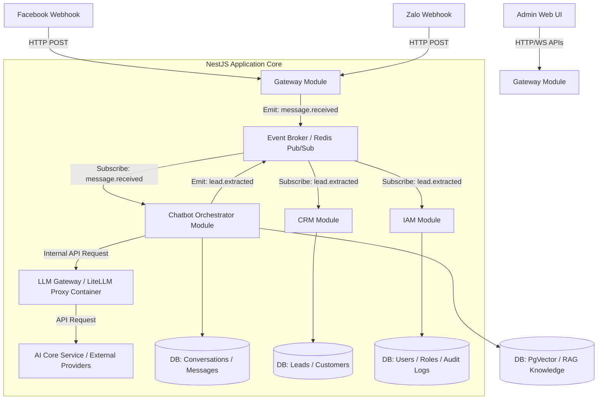
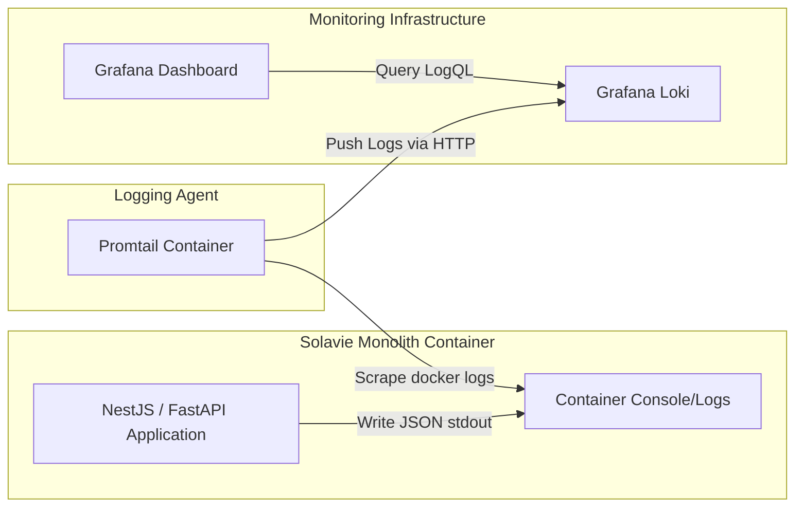

# SYSTEM ARCHITECTURE DESIGN
## Hệ Thống Solavie Platform (Phase 1: Omnichannel Chat, AI & Solar CRM)

| Tài liệu | System Architecture Design |
| --- | --- |
| Dự án | Hệ thống AI Chatbot kết hợp CRM & O&M cho Năng lượng mặt trời Solavie |
| Phiên bản | 1.1.0 (Cập nhật Log & Đa Kênh) |
| Ngày cập nhật | 2026-06-15 |
| Trạng thái | Chờ duyệt |

---

## 1. Nguyên Tắc Thiết Kế Định Hướng Microservices

Để đảm bảo hệ thống có thể dễ dàng tách nhỏ thành các Microservices độc lập ở các phase sau mà không cần viết lại toàn bộ mã nguồn, kiến trúc **Modular Monolith** của Solavie Platform được xây dựng dựa trên các nguyên tắc thiết kế tối thượng sau:

### 1.1. Cô Lập Dữ Liệu Tuyệt Đối (Database Isolation per Module)
* Mỗi module nghiệp vụ chỉ được phép đọc và ghi vào các bảng cơ sở dữ liệu (Database Tables) do chính module đó sở hữu.
* **CẤM JOIN CHÉO**: Không thực hiện các truy vấn SQL `JOIN` chéo giữa các bảng thuộc quyền sở hữu của các module khác nhau.
* Khi một module cần dữ liệu từ module khác, nó bắt buộc phải gọi thông qua API nội bộ (Internal Service / Interface) hoặc thông qua cơ chế Event-Driven.

### 1.2. Giao Tiếp Lỏng Qua Sự Kiện (Event-Driven Architecture)
* Các Module tương tác với nhau chủ yếu bằng cách phát và nhận sự kiện (Publish/Subscribe) bất đồng bộ.
* Trong Phase 1, giao tiếp nội bộ sẽ sử dụng **NestJS EventEmitter** (InMemory Event Loop) hoặc **Redis Pub/Sub** để trung chuyển tin nhắn. Khi chuyển sang Microservices, ta chỉ cần thay thế bằng một Message Broker thực thụ (như RabbitMQ hoặc Kafka) mà không cần cấu trúc lại Business Logic.

### 1.3. Clean Architecture bên trong từng Module
* Mỗi module được cấu trúc thành các lớp rõ ràng:
  - **Controller / Resolver**: Tiếp nhận request bên ngoài (HTTP/WebSocket/Webhook).
  - **Service / Domain Logic**: Xử lý logic nghiệp vụ thuần túy, độc lập với framework.
  - **Repository / Infrastructure**: Tương tác với Database sở hữu của module đó.

---

## 2. Bản Vẽ Kiến Trúc & Luồng Dữ Liệu (System Architecture Diagram)

Dưới đây là sơ đồ kiến trúc Modular Monolith được thiết kế cô lập, sẵn sàng chuyển đổi thành Microservices:



---

## 3. Chi Tiết Các Module & Ranh Giới Nghiệp Vụ (Bounded Contexts)

### 3.1. Gateway & Omnichannel Module
* **Vai trò**: Tiếp nhận, xác thực và chuẩn hóa tất cả các yêu cầu từ bên ngoài (Facebook Webhook, Zalo Webhook, API Admin Dashboard).
* **Cơ chế Kết nối Đa Kênh (Developer Mode)**:
  - Hệ thống sử dụng mô hình kết hợp thủ công cho doanh nghiệp. Admin sẽ cấu hình trực tiếp các thông số kết nối vào trang quản trị:
    - *Facebook*: Fanpage ID, Page Access Token, App Secret, và Webhook Verify Token.
    - *Zalo*: OA ID, OA Access Token, Secret Key, và Webhook URL.
  - Gateway Module sẽ lưu các thông số này vào bảng `gw_channel_configurations` và dùng chúng để ký xác thực chữ ký (Signature Verification) trên các webhook nhận được và gửi lại tin nhắn thông qua API của Facebook/Zalo.
* **Database sở hữu**: `gw_channel_configurations`, `gw_llm_models`.

### 3.2. Chatbot Orchestrator Module
* **Vai trò**: Quản lý phiên hội thoại (Session), kiểm soát luồng phản hồi tự động của AI Chatbot, cơ chế chuyển đổi sang nhân viên (Hybrid Chat) và trích xuất thông tin khách hàng từ AI để phát sự kiện gộp.
* **Database sở hữu**: `chat_conversations`, `chat_messages`.

### 3.3. CRM Module
* **Vai trò**: Quản lý thông tin khách hàng tiềm năng (Leads), thông tin khách hàng chính thức (Customers) và nhu cầu chi tiết. Tích hợp bộ công cụ tính toán ROI tự động của Solar và thuật toán gộp hồ sơ trùng SĐT.
* **Database sở hữu**: `crm_leads`, `crm_customers`.

### 3.4. Identity & Access Management (IAM) Module
* **Vai trò**: Xác thực người dùng (Authentication) và phân quyền động (Dynamic Permissions Guard). Lưu trữ Audit Log JSON cho các thao tác đổi quyền.
* **Database sở hữu**: `iam_users`, `iam_roles`, `iam_permissions`, `iam_policies`, `iam_role_audit_logs`.

---

## 4. Tối Ưu Hiệu Năng AI (Performance & Resource Management)

Để đảm bảo hệ thống có thể đáp ứng mượt mà trải nghiệm Chat (đặc biệt khi áp dụng luồng ReAct Agent đòi hỏi LLM suy nghĩ nhiều bước), hệ thống áp dụng các kỹ thuật hạ tầng sau:

### 4.1. LLM Gateway & Connection Pooling (Định tuyến & Failover Động)
* **Triển khai**: Sử dụng **LiteLLM Proxy** chạy dưới dạng một Docker Container độc lập, đóng vai trò là một universal pass-through adapter.
* **Tối ưu Network**: LiteLLM duy trì kết nối mạng mở (**HTTP Keep-Alive**) liên tục với các nhà cung cấp như OpenAI, Google Gemini, Anthropic. Backend NestJS chỉ cần gọi API đến local Gateway qua mạng nội bộ mà không phải chịu độ trễ bắt tay TCP/SSL (tiết kiệm 200-300ms cho mỗi lượt chat).
* **Cơ chế API Key Động (Pass-through)**: Core Backend NestJS không lưu key trong file cấu hình tĩnh của LiteLLM. Khi gọi LLM, NestJS sẽ lấy API Key mã hóa từ bảng `gw_llm_providers` trong Database, truyền qua Header HTTP (`Authorization: Bearer <API_KEY>`) lên LiteLLM. LiteLLM sẽ lấy key này để xác thực trực tiếp với hãng AI.
* **Định Tuyến & Failover Động (DB-Driven)**: 
  - Khi một usecase cần dùng LLM (ví dụ: Chatbot ReAct đòi hỏi tier `LARGE`), hệ thống sẽ query danh sách provider từ database, sắp xếp theo `priority` tăng dần.
  - Nếu provider ưu tiên 1 bị hết tiền (`insufficient_quota`), Backend bắt lỗi này, tự động cập nhật trạng thái provider trong CSDL thành `OUT_OF_CREDIT`, và lập tức định tuyến yêu cầu sang provider ưu tiên 2 (Failover) mà không cần can thiệp thủ công.
* **Cron Job Tự Động Đồng Bộ Model**:
  - Hệ thống chạy Cron Job hàng ngày gửi request tới endpoint `/public/litellm_model_cost_map` của LiteLLM.
  - Tự động bóc tách thông tin model, context window (`max_tokens`), chi phí đầu vào/đầu ra (`input_cost_per_token`, `output_cost_per_token`), và lưu toàn bộ JSON thô vào `raw_metadata` của bảng `gw_llm_provider_models`.
  - Phân loại `model_tier` tự động bằng Heuristics: Tên chứa `mini`, `flash`, `haiku`, `lite`... -> `SMALL` (mức phí rẻ, tốc độ nhanh); ngược lại -> `LARGE` (thông minh, xử lý ReAct).

### 4.2. Prompt Caching Thích Ứng Theo Hãng LLM (Prompt Caching Adaptation)
Hệ thống thiết lập chiến lược Prompt Caching khác nhau cho từng adapter để giảm chi phí đầu vào lên đến 80-90%:
* **Anthropic Adapter**: Bật header `anthropic-beta: prompt-caching-2024-07-31` và gán thuộc tính `"cache_control": {"type": "ephemeral"}` cho System Prompt tĩnh và định nghĩa Tools tĩnh khi độ dài vượt ngưỡng 1024 tokens.
* **OpenAI Adapter**: Sắp xếp System Prompt và định nghĩa Tools tĩnh lên đầu mảng `messages` để tự động kích hoạt Zero-code Prefix Caching của OpenAI.
* **Gemini Adapter**: Sử dụng Context Caching API `/v1beta/cachedContents` để tạo resource cache tĩnh cho các tài liệu Solar dung lượng lớn (trên 32,768 tokens) rồi đính kèm `cachedContent` ID vào cuộc gọi.

### 4.3. Streaming Response (SSE)
* Quá trình suy nghĩ (Thought) của ReAct Agent được thực thi ngầm. Tuy nhiên, sau khi ra được kết quả cuối cùng, dữ liệu phải được trả về Client (Zalo/Facebook/Web) thông qua **Server-Sent Events (SSE) Streaming**. Khách hàng sẽ thấy tin nhắn gõ ra từng chữ ngay lập tức thay vì phải chờ AI gen xong cả đoạn văn.

### 4.4. Tính Toán & Ghi Nhận Chi Phí AI Bất Đồng Bộ (Async Cost Metrics)
Để không làm tăng thời gian phản hồi của Chatbot, luồng ghi nhận chi phí vào Database được tách biệt bất đồng bộ:
1. **Response Immediate:** Backend NestJS thực hiện streaming kết quả cho người dùng ngay khi nhận được dữ liệu từ LiteLLM.
2. **Emit Event:** Khi kết thúc API call, Backend bắn sự kiện nội bộ `llm.metrics.created` chứa: prompt_tokens, completion_tokens, cached_tokens, và model.
3. **Background Worker:** Một Event Listener lắng nghe sự kiện này, đối chiếu giá của model trong bảng `gw_llm_provider_models`, tính toán chi phí (giảm 50% cho cached tokens) và ghi vào bảng `gw_llm_metrics`.
4. **Structured JSON Log:** Đồng thời, hệ thống in một dòng log JSON ra `stdout` chứa toàn bộ dữ liệu chi phí và metadata để Promtail thu thập và chuyển tiếp tới Grafana Loki.

### 4.5. Khóa Đồng Thời & Hàng Đợi Bằng Redis (Redis Concurrency Lock)
Để giải quyết tình trạng người dùng gửi tin nhắn dồn dập (double-texting) khi Agent AI đang trong luồng suy nghĩ (chưa trả lời xong):
* **Cơ chế Khóa**: Áp dụng phân phối khóa (Distributed Lock) bằng Redis với key `lock:conversation:<id>`.
* **Xếp Hàng Tin Nhắn (Queuing)**: Nếu có tin nhắn mới đến trong lúc khóa đang giữ, tin nhắn sẽ được đẩy vào Redis List `queue:conversation:<id>`.
* **Tự động tiêu thụ**: Khi Agent hoàn thành lượt xử lý hiện tại, hệ thống sẽ tự động `RPOP` tin nhắn từ hàng đợi ra để xử lý tiếp theo thứ tự thời gian. Nếu hàng đợi vượt quá 2 tin nhắn, hệ thống sẽ từ chối để tránh spam tài nguyên LLM.


---

## 5. Kiến Trúc Giám Sát Log Tập Trung (Promtail + Grafana Loki)

Để thu thập và giám sát toàn bộ hoạt động của hệ thống một cách hiệu quả và cô lập, Solavie áp dụng mô hình thu thập log tập trung sử dụng **Promtail** (Log shipper) và **Grafana Loki** (Log aggregator).



### 4.1. Định Dạng Log Chuẩn Hóa (Structured Logging)
Tất cả các module trong ứng dụng bắt buộc phải ghi log ra console (stdout/stderr) dưới dạng một dòng **JSON duy nhất** (Structured Log) thay vì dạng text thô. Cấu trúc log chuẩn:
```json
{
  "timestamp": "2026-06-15T15:00:00.123Z",
  "level": "error",
  "module": "CRM",
  "context": "Lead_ROI_Calculation",
  "message": "Không thể tính toán ROI do dữ liệu diện tích mái bằng 0",
  "traceId": "req_5543219_trace",
  "metadata": {
    "lead_id": "usr_uuid_77263",
    "location": "Đồng Nai",
    "error_details": "Division by zero in roi_calc.ts:L45"
  }
}
```

### 4.2. Cấu Hình Thu Thập Của Promtail (`promtail-config.yml`)
Promtail chạy dưới dạng một container độc lập, tự động đọc luồng log từ Docker và thực hiện parse JSON để trích xuất các label đánh chỉ mục cho Loki:
* **Labels được trích xuất**: `app_name`, `level`, `module`, `context`.
* Cấu hình pipeline chính:
```yaml
pipeline_stages:
  - json:
      expressions:
        timestamp: timestamp
        level: level
        module: module
        context: context
        message: message
  - labels:
      level:
      module:
      context:
```

### 4.3. Giám Sát Và Cảnh Báo Trên Grafana
* Nhân viên vận hành sử dụng Grafana để xem Log thời gian thực của từng module qua LogQL: `{app="solavie-backend", module="AI_Core", level="error"}`.
* Thiết lập các Rule cảnh báo (Alert rules) tự động gửi tin nhắn Telegram/Discord nếu phát hiện lỗi hệ thống (`level="error"`) xảy ra quá 5 lần trong vòng 1 phút.
