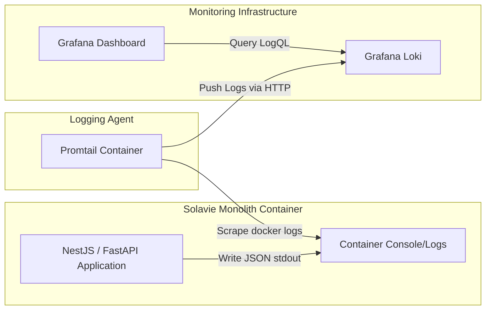
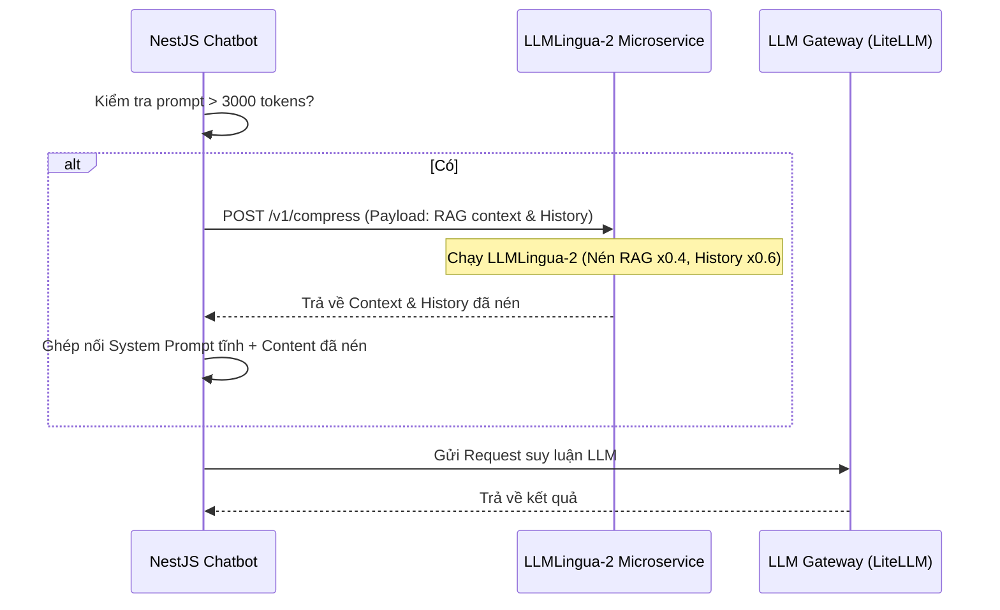

# SYSTEM ARCHITECTURE DESIGN
## Hệ Thống Solavie Platform (Phase 1: Omnichannel Chat, AI & Solar CRM)

| Tài liệu | System Architecture Design |
| --- | --- |
| Dự án | Hệ thống AI Chatbot kết hợp CRM & O&M cho Năng lượng mặt trời Solavie |
| Phiên bản | 1.1.0 (Cập nhật Log & Đa Kênh) |
| Ngày cập nhật | 2026-06-15 |
| Trạng thái | Chờ duyệt |

---

## 1. Nguyên Tắc Thiết Kế Định Hướng Microservices

Để đảm bảo hệ thống có thể dễ dàng tách nhỏ thành các Microservices độc lập ở các phase sau mà không cần viết lại toàn bộ mã nguồn, kiến trúc **Modular Monolith** của Solavie Platform được xây dựng dựa trên các nguyên tắc thiết kế tối thượng sau:

### 1.1. Cô Lập Dữ Liệu Tuyệt Đối (Database Isolation per Module)
* Mỗi module nghiệp vụ chỉ được phép đọc và ghi vào các bảng cơ sở dữ liệu (Database Tables) do chính module đó sở hữu.
* **CẤM JOIN CHÉO**: Không thực hiện các truy vấn SQL `JOIN` chéo giữa các bảng thuộc quyền sở hữu của các module khác nhau.
* Khi một module cần dữ liệu từ module khác, nó bắt buộc phải gọi thông qua API nội bộ (Internal Service / Interface) hoặc thông qua cơ chế Event-Driven.

### 1.2. Giao Tiếp Lỏng Qua Sự Kiện (Event-Driven Architecture)
* Các Module tương tác với nhau chủ yếu bằng cách phát và nhận sự kiện (Publish/Subscribe) bất đồng bộ.
* Trong Phase 1, giao tiếp nội bộ sẽ sử dụng **NestJS EventEmitter** (InMemory Event Loop) hoặc **Redis Pub/Sub** để trung chuyển tin nhắn. Khi chuyển sang Microservices, ta chỉ cần thay thế bằng một Message Broker thực thụ (như RabbitMQ hoặc Kafka) mà không cần cấu trúc lại Business Logic.

### 1.3. Clean Architecture bên trong từng Module
* Mỗi module được cấu trúc thành các lớp rõ ràng:
  - **Controller / Resolver**: Tiếp nhận request bên ngoài (HTTP/WebSocket/Webhook).
  - **Service / Domain Logic**: Xử lý logic nghiệp vụ thuần túy, độc lập với framework.
  - **Repository / Infrastructure**: Tương tác với Database sở hữu của module đó.

---

## 2. Bản Vẽ Kiến Trúc & Luồng Dữ Liệu (System Architecture Diagram)

Dưới đây là sơ đồ kiến trúc Modular Monolith được thiết kế cô lập, thể hiện sự phối hợp giữa kịch bản tĩnh (Flow Executor), AI Agent Engine, hàng đợi BullMQ cho Broadcasting/Sequence và ZaloTokenSyncWorker:

```mermaid
graph TD
    %% Clients & Gateways
    FB[Facebook Webhook] -->|HTTP POST| GW[Gateway Module]
    ZL[Zalo Webhook] -->|HTTP POST| GW
    Admin[Admin Web UI] -->|HTTP/WS APIs| GatewayAPI[Gateway Module]

    subgraph Solavie Modular Monolith [NestJS Application Core]
        %% Gateway Workers
        subgraph Gateway Module Context
            GW
            ZTSW[ZaloTokenSyncWorker] -->|Refresh Token 20h| DB_GW_Conf[(DB: gw_channel_configurations)]
        end

        %% Event Broker
        GW -->|Emit: message.received| EventBroker[Event Broker / Redis Pub/Sub]
        
        %% Chatbot Module Context
        subgraph Chatbot Module Context
            CB[Chatbot Orchestrator Service]
            
            %% Sub-Engines
            FEE[Flow Executor Engine]
            AAE[AI Agent Engine]
            KWM[Keyword Matcher]
            
            CB --> KWM
            KWM -->|Match Found| FEE
            KWM -->|No Match / Fallback| AAE
            
            FEE -->|Read Script| DB_Chat_Flow[(DB: chat_flows / chat_nodes)]
            AAE -->|Query Knowledge| DB_Vector[(DB: PgVector / RAG Knowledge)]
        end
        
        EventBroker -->|Subscribe: message.received| CB
        EventBroker -->|Subscribe: message.received| IB[Agent Inbox Module]
        
        AAE -->|Internal API Request| GatewayLLM[LLM Gateway / LiteLLM Proxy Container]
        GatewayLLM -->|API Request| AI_Adapter[AI Core Service / External Providers]
        
        CB -->|Emit: lead.extracted| EventBroker
        CB -->|Emit: chat.handover_requested| EventBroker
        CB -->|Tool Call / Query slots| BK[Booking Module]
        
        IB -->|Emit: inbox.agent_mentioned| EventBroker
        
        EventBroker -->|Subscribe: lead.extracted| CRM[CRM Module]
        EventBroker -->|Subscribe: lead.extracted| IAM[IAM Module]
        EventBroker -->|Subscribe: appointment.confirmed| CRM
        
        %% CRM Merge Profile
        subgraph CRM Module Context
            CRM
            MPS[MergeProfileService] -->|Lock: lock:merge:phone| DB_CRM[(DB: Leads / Customers)]
        end
        
        CRM -->|Emit: lead.assigned / lead.score_hot| EventBroker
        BK  -->|Emit: appointment.confirmed / cancelled| EventBroker
        IAM -->|Emit: permission.changed / auth.login_new_device| EventBroker
        
        %% Notification Module
        EventBroker -->|Subscribe: ALL notification events| NF[Notification Module]
        NF -->|WebSocket: In-App| Admin
        NF -->|BullMQ Jobs| NF_Q[(Redis Queue Port 6380 - Notification Queues)]
        
        IB -->|WebSockets| Admin
        
        %% Chatbot Queues & Worker
        CB -->|Dispatch Sequence/Debounce| CB_Q[(Redis Queue Port 6380 - Chatbot Queues)]
        CB_Q -->|Process Jobs| CB_Worker[Chatbot & Broadcasting Worker]
        CB_Worker -->|Send Broadcast / Message| GW
        
        %% Database Isolations
        CB ----> DB_Chat[(DB: chat_conversations / chat_messages)]
        IB ----> DB_Inbox[(DB: Quick Replies / Comments)]
        IAM ----> DB_IAM[(DB: Users / Roles / Audit Logs)]
        BK ----> DB_Booking[(DB: Event Types / Availabilities / Appointments)]
        NF ----> DB_Notif[(DB: Notif Logs / Templates)]
    end

    %% External & Services
    BK -->|Query Busy Slots| GCal[Google Calendar API]
    NF_Q -->|Email delivery| SES[AWS SES / SMTP]
    NF_Q -->|ZNS delivery| ZALO_API[Zalo ZNS API]
```



---

## 3. Chi Tiết Các Module & Ranh Giới Nghiệp Vụ (Bounded Contexts)

### 3.1. Gateway & Omnichannel Module
* **Vai trò**: Tiếp nhận, xác thực và chuẩn hóa tất cả các yêu cầu từ bên ngoài (Facebook Webhook, Zalo Webhook, API Admin Dashboard).
* **Cơ chế Kết nối Đa Kênh (Developer Mode)**:
  - Hệ thống sử dụng mô hình kết hợp thủ công cho doanh nghiệp. Admin sẽ cấu hình trực tiếp các thông số kết nối vào trang quản trị:
    - *Facebook*: Fanpage ID, Page Access Token, App Secret, và Webhook Verify Token.
    - *Zalo*: OA ID, OA Access Token, Secret Key, và Webhook URL.
  - Gateway Module sẽ lưu các thông số này vào bảng `gw_channel_configurations` và dùng chúng để ký xác thực chữ ký (Signature Verification) trên các webhook nhận được và gửi lại tin nhắn thông qua API của Facebook/Zalo.
* **Database sở hữu**: `gw_channel_configurations`, `gw_llm_models`.

### 3.2. Chatbot Orchestrator Module
* **Vai trò**: Quản lý phiên hội thoại (Session), kiểm soát luồng phản hồi tự động của AI Chatbot, cơ chế chuyển đổi sang nhân viên (Hybrid Chat) và trích xuất thông tin khách hàng từ AI để phát sự kiện gộp.
* **Database sở hữu**: `chat_conversations`, `chat_messages`.

### 3.3. CRM Module
* **Vai trò**: Quản lý thông tin khách hàng tiềm năng (Leads), thông tin khách hàng chính thức (Customers) và nhu cầu chi tiết. Tích hợp bộ công cụ tính toán ROI tự động của Solar và thuật toán gộp hồ sơ trùng SĐT.
* **Database sở hữu**: `crm_leads`, `crm_customers`.

### 3.4. Identity & Access Management (IAM) Module
* **Vai trò**: Xác thực người dùng (Authentication) và phân quyền động (Dynamic Permissions Guard). Lưu trữ Audit Log JSON cho các thao tác đổi quyền.
* **Database sở hữu**: `iam_users`, `iam_roles`, `iam_permissions`, `iam_policies`, `iam_role_audit_logs`.

### 3.5. Agent Inbox Module (Sales Chat Portal)
* **Vai trò**: Cung cấp giao diện hộp thư tập trung (Unified Inbox Feed) cho nhân viên Sales, kết nối WebSockets thời gian thực, quản lý phân chia cuộc chat (Round-Robin/Claim), chống đụng độ phản hồi (Collision Detection), và thảo luận nội bộ (Internal Comments).
* **Database sở hữu**: `inbox_quick_replies`, `inbox_internal_comments` (Soft link liên kết mềm sang `chat_conversations`).

### 3.6. Booking Module (Đặt Lịch Hẹn)
* **Vai trò**: Quản lý lịch biểu của nhân viên Sales, tính toán giờ trống khả dụng thông qua màng lọc thụ động Google Calendar, phân phối lịch hẹn xoay vòng Round-Robin qua Redis, tự động đồng bộ CRM và **phát sự kiện** (`appointment.confirmed`, `appointment.cancelled`) để Notification Module xử lý nhắc nhở.
* **Database sở hữu**: `booking_event_types`, `booking_availabilities`, `booking_appointments` (Soft link liên kết mềm sang `iam_users` và `crm_customers`).

### 3.7. Notification Module (Thông Báo Đa Kênh)
* **Vai trò**: Tiêu thụ sự kiện từ tất cả module nội bộ (Event Consumer Only) và phân phối thông báo đến đúng người nhận qua đúng kênh: In-App WebSocket (Sales Portal), Email (AWS SES), và Zalo OA ZNS (Khách hàng). Module không bao giờ truy vấn DB của module khác — hoạt động hoàn toàn dựa trên payload event.
* **3 tầng ưu tiên**: Tier 1 CRITICAL (In-App trực tiếp < 500ms), Tier 2 TRANSACTIONAL (BullMQ jobs), Tier 3 SCHEDULED (BullMQ delayed jobs).
* **Database sở hữu**: `notification_preferences`, `notification_templates`, `notification_logs`.

---

## 4. Tối Ưu Hiệu Năng AI (Performance & Resource Management)

Để đảm bảo hệ thống có thể đáp ứng mượt mà trải nghiệm Chat (đặc biệt khi áp dụng luồng ReAct Agent đòi hỏi LLM suy nghĩ nhiều bước), hệ thống áp dụng các kỹ thuật hạ tầng sau:

### 4.1. LLM Gateway & Connection Pooling (Định tuyến & Failover Động)
* **Triển khai**: Sử dụng **LiteLLM Proxy** chạy dưới dạng một Docker Container độc lập, đóng vai trò là một universal pass-through adapter.
* **Tối ưu Network**: LiteLLM duy trì kết nối mạng mở (**HTTP Keep-Alive**) liên tục với các nhà cung cấp như OpenAI, Google Gemini, Anthropic. Backend NestJS chỉ cần gọi API đến local Gateway qua mạng nội bộ mà không phải chịu độ trễ bắt tay TCP/SSL (tiết kiệm 200-300ms cho mỗi lượt chat).
* **Cơ chế API Key Động (Pass-through)**: Core Backend NestJS không lưu key trong file cấu hình tĩnh của LiteLLM. Khi gọi LLM, NestJS sẽ lấy API Key mã hóa từ bảng `gw_llm_providers` trong Database, truyền qua Header HTTP (`Authorization: Bearer <API_KEY>`) lên LiteLLM. LiteLLM sẽ lấy key này để xác thực trực tiếp với hãng AI.
* **Định Tuyến & Failover Động (DB-Driven)**: 
  - Khi một usecase cần dùng LLM (ví dụ: Chatbot ReAct đòi hỏi tier `LARGE`), hệ thống sẽ query danh sách provider từ database, sắp xếp theo `priority` tăng dần.
  - Nếu provider ưu tiên 1 bị hết tiền (`insufficient_quota`), Backend bắt lỗi này, tự động cập nhật trạng thái provider trong CSDL thành `OUT_OF_CREDIT`, và lập tức định tuyến yêu cầu sang provider ưu tiên 2 (Failover) mà không cần can thiệp thủ công.
* **Cron Job Tự Động Đồng Bộ Model**:
  - Hệ thống chạy Cron Job hàng ngày gửi request tới endpoint `/public/litellm_model_cost_map` của LiteLLM.
  - Tự động bóc tách thông tin model, context window (`max_tokens`), chi phí đầu vào/đầu ra (`input_cost_per_token`, `output_cost_per_token`), và lưu toàn bộ JSON thô vào `raw_metadata` của bảng `gw_llm_provider_models`.
  - Phân loại `model_tier` tự động bằng Heuristics: Tên chứa `mini`, `flash`, `haiku`, `lite`... -> `SMALL` (mức phí rẻ, tốc độ nhanh); ngược lại -> `LARGE` (thông minh, xử lý ReAct).

### 4.2. Prompt Caching Thích Ứng Theo Hãng LLM (Prompt Caching Adaptation)
Hệ thống thiết lập chiến lược Prompt Caching khác nhau cho từng adapter tương ứng với 17 providers, chia làm 4 nhóm cơ chế xử lý chính để giảm chi phí đầu vào lên đến 80-90%:
* **Nhóm 1: Cache Tiền Tố Tự Động (Automatic Prefix Caching - APC)**
  - *Áp dụng:* `openai`, `deepseek`, `groq`, `mistral`, `azure`, `xai` (Grok), `together_ai`, `qwen`, `replicate`.
  - *Cơ chế:* Tự động cache KV tensors của tiền tố tĩnh trùng khớp hoàn toàn.
  - *Tối ưu:* Sắp xếp System Prompt và Tools tĩnh lên đầu mảng `messages`, không chèn các biến động (thời gian, RAG, history) trước phần tĩnh, phần tĩnh đạt tối thiểu 1024 tokens.
* **Nhóm 2: Khai Báo Cache Tường Minh (Explicit Caching Flags)**
  - *Áp dụng:* `anthropic` (Claude), `openrouter` (khi định tuyến qua Anthropic), `bedrock` (Amazon Bedrock Converse API).
  - *Cơ chế:* Gửi cờ cache và headers đặc thù.
  - *Tối ưu:* 
    - Với `anthropic`/`openrouter`: Thêm header `anthropic-beta: prompt-caching-2024-07-31` và cờ `"cache_control": {"type": "ephemeral"}` ở system prompt và tool block cuối cùng.
    - Với `bedrock`: Đính kèm block `"cachePoint": {"type": "default"}` vào Converse API params cho system prompt và tools config.
* **Nhóm 3: Tạo Tài Nguyên Cache Độc Lập (Context Caching API)**
  - *Áp dụng:* `google` (Gemini API), `vertex_ai` (Google Cloud Vertex AI).
  - *Cơ chế:* Tạo cache resource độc lập cho ngữ cảnh tĩnh siêu lớn.
  - *Tối ưu:* Khi ngữ cảnh vượt quá 32,768 tokens, backend gọi API `/v1beta/cachedContents` để tạo cache tĩnh trước rồi truyền ID `cachedContent` vào request body.
* **Nhóm 4: Cấu Hình Tối Ưu Hóa Khác (Custom Optimizations)**
  - *Áp dụng:* `cohere`, `perplexity`, `voyage`.
  - *Cơ chế:* Tối ưu hóa truy vấn/cache local.
  - *Tối ưu:* Cohere tự động tối ưu hóa RAG cục bộ; Perplexity khống chế chặt chẽ token đầu vào; Voyage caching local cho embeddings trong Database.

### 4.3. Streaming Response (SSE)
* Quá trình suy nghĩ (Thought) của ReAct Agent được thực thi ngầm. Tuy nhiên, sau khi ra được kết quả cuối cùng, dữ liệu phải được trả về Client (Zalo/Facebook/Web) thông qua **Server-Sent Events (SSE) Streaming**. Khách hàng sẽ thấy tin nhắn gõ ra từng chữ ngay lập tức thay vì phải chờ AI gen xong cả đoạn văn.

### 4.4. Tính Toán & Ghi Nhận Chi Phí AI Bất Đồng Bộ (Async Cost Metrics)
Để không làm tăng thời gian phản hồi của Chatbot, luồng ghi nhận chi phí vào Database được tách biệt bất đồng bộ:
1. **Response Immediate:** Backend NestJS thực hiện streaming kết quả cho người dùng ngay khi nhận được dữ liệu từ LiteLLM.
2. **Emit Event:** Khi kết thúc API call, Backend bắn sự kiện nội bộ `llm.metrics.created` chứa: prompt_tokens, completion_tokens, cached_tokens, và model.
3. **Background Worker:** Một Event Listener lắng nghe sự kiện này, đối chiếu giá của model trong bảng `gw_llm_provider_models`, tính toán chi phí (giảm 50% cho cached tokens) và ghi vào bảng `gw_llm_metrics`.
4. **Structured JSON Log:** Đồng thời, hệ thống in một dòng log JSON ra `stdout` chứa toàn bộ dữ liệu chi phí và metadata để Promtail thu thập và chuyển tiếp tới Grafana Loki.

### 4.5. Khóa Đồng Thời & Hàng Đợi Bằng Redis (Redis Concurrency Lock)
Để giải quyết tình trạng người dùng gửi tin nhắn dồn dập (double-texting) khi Agent AI đang trong luồng suy nghĩ (chưa trả lời xong):
* **Cơ chế Khóa**: Áp dụng phân phối khóa (Distributed Lock) bằng Redis với key `lock:conversation:<id>`.
* **Xếp Hàng Tin Nhắn (Queuing)**: Nếu có tin nhắn mới đến trong lúc khóa đang giữ, tin nhắn sẽ được đẩy vào Redis List `queue:conversation:<id>`.
* **Tự động tiêu thụ**: Khi Agent hoàn thành lượt xử lý hiện tại, hệ thống sẽ tự động `RPOP` tin nhắn từ hàng đợi ra để xử lý tiếp theo thứ tự thời gian. Nếu hàng đợi vượt quá 2 tin nhắn, hệ thống sẽ từ chối để tránh spam tài nguyên LLM.

### 4.6. Phân Phối Lưu Trữ & API Providers
Để quản lý danh sách LLM Providers một cách hiệu quả và an toàn, hệ thống phân tách thành hai tầng quản lý rõ rệt:
* **Tầng Supported Providers (Tĩnh)**:
  - *Lưu trữ:* Định nghĩa tĩnh trong Codebase dưới dạng một TypeScript Enum hoặc Constant.
  - *Mục đích:* Chỉ liệt kê các hãng LLM mà hệ thống đã xây dựng sẵn Adapter tích hợp và tối ưu Prompt Caching tương ứng. Tránh việc tự ý cấu hình các hãng chưa được lập trình, giảm tải truy vấn DB và tăng hiệu năng phản hồi (`GET /api/v1/gateway/providers/supported` trả về dữ liệu tĩnh trực tiếp từ memory với độ trễ ~0ms).
* **Tầng Configured Providers (Động)**:
  - *Lưu trữ:* Lưu trữ động trong bảng `gw_llm_providers` (PostgreSQL) chứa các API key (được mã hóa AES-256-GCM), URL cơ sở `api_base`, độ ưu tiên `priority`, và trạng thái hoạt động `status`.
  - *Mục đích:* Cho phép Admin cập nhật credentials tại runtime mà không cần restart backend. Đồng thời cho phép thay đổi trạng thái động (`status = 'OUT_OF_CREDIT'` hoặc cooldown 15 phút) khi gặp lỗi cạn ví hoặc sự cố mạng.
  - *Bảo mật & Hiệu năng:* API `GET /api/v1/gateway/providers/configured` được che giấu (mask) API key nhạy cảm và được cache vào Redis (`REDIS_CACHE_URL`) với TTL **5 phút** để bảo vệ hiệu năng định tuyến. Cache sẽ tự động bị invalidated khi có thay đổi cấu hình hoặc kích hoạt failover.

---

## 5. Kiến Trúc Giám Sát Log Tập Trung (Promtail + Grafana Loki)

Để thu thập và giám sát toàn bộ hoạt động của hệ thống một cách hiệu quả và cô lập, Solavie áp dụng mô hình thu thập log tập trung sử dụng **Promtail** (Log shipper) và **Grafana Loki** (Log aggregator).



### 5.1. Định Dạng Log Chuẩn Hóa (Structured Logging)
Tất cả các module trong ứng dụng bắt buộc phải ghi log ra console (stdout/stderr) dưới dạng một dòng **JSON duy nhất** (Structured Log) thay vì dạng text thô. Cấu trúc log chuẩn:
```json
{
  "timestamp": "2026-06-15T15:00:00.123Z",
  "level": "error",
  "module": "CRM",
  "context": "Lead_ROI_Calculation",
  "message": "Không thể tính toán ROI do dữ liệu diện tích mái bằng 0",
  "traceId": "req_5543219_trace",
  "metadata": {
    "lead_id": "usr_uuid_77263",
    "location": "Đồng Nai",
    "error_details": "Division by zero in roi_calc.ts:L45"
  }
}
```

### 5.2. Cấu Hình Thu Thập Của Promtail (`promtail-config.yml`)
Promtail chạy dưới dạng một container độc lập, tự động đọc luồng log từ Docker và thực hiện parse JSON để trích xuất các label đánh chỉ mục cho Loki:
* **Labels được trích xuất**: `app_name`, `level`, `module`, `context`.
* Cấu hình pipeline chính:
```yaml
pipeline_stages:
  - json:
      expressions:
        timestamp: timestamp
        level: level
        module: module
        context: context
        message: message
  - labels:
      level:
      module:
      context:
```

### 5.3. Giám Sát Và Cảnh Báo Trên Grafana
* Nhân viên vận hành sử dụng Grafana để xem Log thời gian thực của từng module qua LogQL: `{app="solavie-backend", module="AI_Core", level="error"}`.
* Thiết lập các Rule cảnh báo (Alert rules) tự động gửi tin nhắn Telegram/Discord nếu phát hiện lỗi hệ thống (`level="error"`) xảy ra quá 5 lần trong vòng 1 phút.

---

## 6. Kiến Trúc Tối Ưu Prompt Nâng Cao

Để tối ưu hóa chi phí token, giảm độ trễ (latency), và hỗ trợ phản hồi đa ngôn ngữ linh động theo khách hàng, Solavie áp dụng hệ thống tối ưu hóa prompt nâng cao tích hợp:

### 6.1. Hybrid Prompting & Language Caching
Hệ thống chia prompt làm 2 phần chính dựa trên cơ chế Prompt Caching của các API Providers:
*   **System Core Prompt & Tool Schemas (100% Tiếng Anh):** Quy định các luật ReAct Agent, hướng dẫn an toàn, định nghĩa tool schemas. Phần này chiếm ~85% dung lượng prompt và được đặt ở đầu tiên để được **Prompt Caching** vĩnh viễn, giảm tới 80% chi phí token đầu vào. Việc viết bằng tiếng Anh giúp tối ưu hóa tokenizer (ít token hơn tiếng Việt gấp 3 lần) và cải thiện độ chính xác khi Agent gọi tool.
*   **Dynamic Variables & Context (Đa Ngôn Ngữ):** Bao gồm lịch sử hội thoại, RAG context, và các biến cấu hình của Admin (hotline, khuyến mãi). Các biến động được bọc trong chỉ thị tiếng Anh và được ghép nối vào **sau điểm ngắt cache (Cache Breakpoint)**.

### 6.2. Dynamic Multilingual Response Router (Thích Ứng Ngôn Ngữ Động)
Để hỗ trợ tư vấn đa ngôn ngữ tự động cho khách hàng Việt Nam và người nước ngoài:
1.  **Nhận Diện Ngôn Ngữ Tự Động (Offline):**
    *   Gateway sử dụng thư viện offline siêu nhẹ (`languagedetect` hoặc `franc` - thời gian xử lý ~0.5ms trên Node.js, tiêu thụ 0 token API) để xác định mã ISO ngôn ngữ khách hàng (`vi`, `en`, `zh`...) dựa trên tin nhắn đầu vào.
2.  **Định Tuyến & Phản Hồi:**
    *   **Đối với tin nhắn tĩnh hệ thống (Handover, OOD, Error):** Bỏ qua hoàn toàn LLM, backend NestJS truy vấn trực tiếp file JSON i18n (`vi.json`, `en.json`...) để trả phản hồi bản địa hóa ngay lập tức. Tiết kiệm 100% chi phí token và giảm latency xuống ~0ms.
    *   **Đối với tin nhắn AI Chatbot:** Tận dụng mô hình nhúng đa ngôn ngữ (Multilingual Embeddings) để truy vấn tài liệu RAG. Đồng thời, backend chèn một chỉ thị ngôn ngữ ngắn ở cuối prompt sau điểm ngắt cache:
        `Respond to the user in the detected language (ISO: ${user_lang}). Translate the retrieved context chunks if necessary.`
        Mô hình LLM sẽ tự động dịch tài liệu RAG tiếng Việt sang ngôn ngữ của khách hàng khi tạo ra câu trả lời cuối cùng (`Final Answer`).

### 6.3. Tích Hợp LLMLingua-2 Microservice (Nén Prompt Động)
Khi lịch sử hội thoại dài và context RAG nhiều tài liệu khiến tổng tokens của prompt vượt quá **3,000 tokens**, backend NestJS sẽ gọi một microservice chạy **LLMLingua-2** để nén prompt động:



### 6.4. Kiến Trúc Evals Engine (LLM-as-a-Judge)
Xây dựng hệ thống tự động kiểm soát chất lượng prompt ngoại tuyến (offline evaluation) sử dụng mô hình lớn làm Judge:
*   Mô hình Judge được định tuyến động thông qua LLM Gateway dưới khóa kịch bản `EVALS_JUDGE` (thường trỏ tới `gpt-4o` hoặc `claude-3-5-sonnet` để đảm bảo độ chính xác logic cao nhất).
*   **Quy trình đánh giá:**
    1.  Evals Engine đọc tập câu hỏi mẫu từ bảng `chat_eval_datasets` (Golden Dataset).
    2.  Chạy thử qua Chatbot để lấy câu trả lời thực tế (`actual_output`).
    3.  Gửi câu hỏi, context, câu trả lời mẫu chuẩn (ground-truth) và câu trả lời thực tế lên LLM Judge.
    4.  LLM Judge thực hiện chấm điểm dựa trên 2 tiêu chí chính:
        *   **Grounding Score (1-5):** Đánh giá tính trung thực chống ảo giác (faithfulness) so với RAG context.
        *   **Relevance Score (1-5):** Đánh giá mức độ trả lời đúng trọng tâm câu hỏi.
    5.  Lưu trữ kết quả chi tiết và feedback của Judge vào bảng `chat_eval_results` để theo dõi chất lượng prompt qua các phiên bản.

---

## 7. Cơ Chế Xác Thực & Quản Lý Phiên Đăng Nhập (Authentication & Session Management)

Hệ thống Solavie áp dụng mô hình xác thực phân lớp kết hợp **Access Token** ngắn hạn và **Refresh Token** dài hạn, tuân thủ các quy tắc bảo mật cao nhất của tiêu chuẩn an toàn OWASP:

### 7.1. Nguyên Tắc Phân Loại & Lưu Trữ Token
*   **Access Token (JWT - JSON Web Token):**
    *   *Ký thuật toán:* `HS256`, thời hạn hết hạn **15 phút**.
    *   *Nơi lưu trữ ở Client:* Lưu trực tiếp trong **Memory (State/Variable)** của ứng dụng React Frontend. Tuyệt đối không lưu vào `localStorage` hay `sessionStorage` để triệt tiêu lỗ hổng đánh cắp token qua XSS.
    *   *Payload:* Chứa `userId`, `email`, và mảng danh sách `permissions` tĩnh của nhân viên. API Gateway/Guard sử dụng payload này để check quyền truy cập trong thời gian < 1ms mà không cần query DB PostgreSQL.
*   **Refresh Token (Secure Random Token):**
    *   *Cấu trúc:* Chuỗi ngẫu nhiên bảo mật dài 32 bytes (sinh bởi `crypto.randomBytes`).
    *   *Nơi lưu trữ ở Client:* Trả về thông qua **HTTP-Only, Secure, SameSite=Strict Cookie** với tên `refresh_token`. JavaScript phía Client không thể đọc cookie này, ngăn chặn hoàn toàn nguy cơ bị XSS thu thập.
    *   *Nơi lưu trữ ở Backend:* Lưu trữ trong **Redis Cache** (Port `6379`) dưới định dạng key: `iam:refresh_token:${refreshToken}` với thời gian sống **TTL = 7 ngày**. Giá trị lưu trữ gồm: `{ userId, ipAddress, userAgent, expiresAt }`.

### 7.2. Cơ Chế Quay Vòng Token (Refresh Token Rotation)
Để chống lại hình thức tấn công phát lại (Replay Attacks) khi token bị nghe lén hoặc rò rỉ:
1.  Mỗi lần client gửi yêu cầu lấy Access Token mới qua API `/auth/refresh`, hệ thống sẽ kiểm tra tính hợp lệ của Refresh Token cũ trong Redis.
2.  Nếu hợp lệ:
    *   Hệ thống sinh một cặp Access Token mới và Refresh Token mới.
    *   **Xóa ngay lập tức** Refresh Token cũ khỏi Redis.
    *   Đặt lại cookie `refresh_token` mới và trả về Access Token mới cho client.
3.  **Phòng chống gian lận (Breach Detection):** Nếu hệ thống nhận được yêu cầu sử dụng một Refresh Token cũ đã bị xóa (do hacker phát lại), backend lập tức coi đây là dấu hiệu xâm nhập an ninh $\rightarrow$ Hủy bỏ toàn bộ tất cả Refresh Tokens đang hoạt động của người dùng đó trên toàn hệ thống để ép buộc đăng xuất trên mọi thiết bị.

### 7.3. Cơ Chế Đăng Xuất & Hủy Phiên Đồng Thời (Global Sign-out)
*   Khi người dùng gọi API `/auth/logout` hoặc thực hiện **Đổi mật khẩu thành công**, backend sẽ thực hiện:
    1.  Xóa bản ghi Refresh Token hiện tại (hoặc tất cả bản ghi đối với đổi mật khẩu) khỏi Redis.
    2.  Xóa key Redis lưu cache phân quyền của user: `user:permissions:${userId}`.
    3.  Thiết lập cookie `refresh_token` hết hạn ngay lập tức trên trình duyệt.
