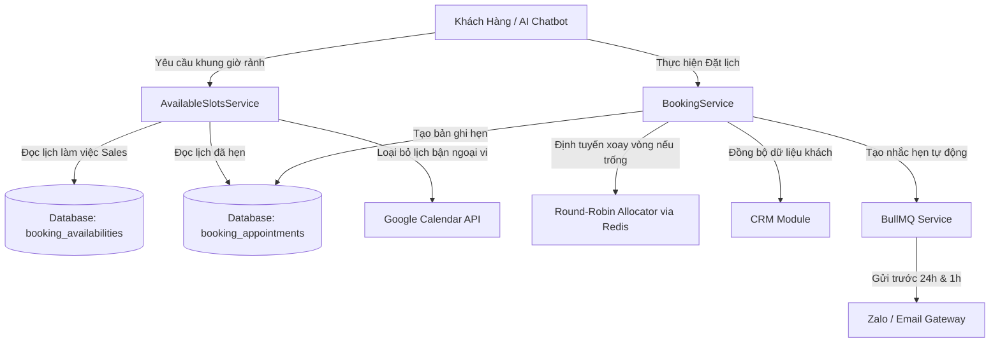

# Kế Hoạch Triển Khai & Danh Sách Task: Module Đặt Lịch Hẹn (Scheduling Module)

Tài liệu này trình bày chi tiết kế hoạch triển khai (Implementation Plan) và danh sách nhiệm vụ phân rã (Task List) cho **Module Đặt Lịch Hẹn (Scheduling Module)** thuộc hệ thống Solavie Platform.

---

## 1. Tổng Quan Kiến Trúc & Luồng Nghiệp Vụ

Module Đặt Lịch Hẹn được thiết kế là một Bounded Context độc lập trong kiến trúc Modular Monolith của Solavie, sẵn sàng tách thành Microservice khi cần thiết.



### Các Thành Phần Cốt Lõi:
1.  **Available Slots Generator**: Thuật toán tính toán thời gian trống của nhân viên Sales dựa trên cấu hình tuần tuần tự, trừ đi các cuộc hẹn đã có trong DB, lịch bận đồng bộ từ Google Calendar API của Sales, đảm bảo Buffer Time 15 phút giữa các ca và Min Notice 2 tiếng trước cuộc hẹn.
2.  **Round-Robin Host Allocator**: Cơ chế phân phối cuộc hẹn tự động cho nhân viên Sales đang trống lịch dựa trên con trỏ Redis xoay vòng (`pointer:booking:round_robin:${eventTypeId}`).
3.  **CRM Synchronizer**: Tự động liên kết khách hàng qua `crm_customers`, gán `assignee_id` cho Sales host, và tạo sự kiện lịch sử `APPOINTMENT_SCHEDULED` trong `crm_activities`.
4.  **BullMQ Scheduler**: Đăng ký các Job nhắc lịch tự động trước 24h và 1h qua hàng đợi Redis (`booking-reminders`), hỗ trợ tự động hủy/lên lịch lại khi cuộc hẹn bị hủy (`CANCELLED`) hoặc dời lịch (`RESCHEDULED`).

---

## 2. Đặc Tả Lược Đồ Cơ Sở Dữ Liệu

Đặc tả chi tiết lược đồ cơ sở dữ liệu đã được cập nhật tại [database_schema.md](file:///d:/workspace/project/solavie/docs/database_schema.md#L648-L689). Dưới đây là tóm tắt các thực thể:
-   `booking_event_types`: Định nghĩa loại cuộc hẹn mẫu (ví dụ: Tư vấn online - 30 phút, Khảo sát thực địa - 60 phút).
-   `booking_availabilities`: Cấu hình khung thời gian rảnh cố định hàng tuần của từng nhân viên Sales.
-   `booking_appointments`: Lưu thông tin chi tiết cuộc hẹn đã đặt giữa khách hàng và nhân viên phụ trách (Host).

---

## 3. Danh Sách Nhiệm Vụ Chi Tiết (Task List)

Kế hoạch triển khai được phân rã thành 6 Phase tuần tự để đảm bảo tính ổn định và bao phủ kiểm thử đầy đủ:

### Phase 1: Database & Schema Integration
- [ ] **Task 1.1: Database Migration**: Tạo file migration khởi tạo 3 bảng dữ liệu `booking_event_types`, `booking_availabilities` và `booking_appointments`.
- [ ] **Task 1.2: NestJS Entities Definition**: Khai báo và cấu hình các Class Entity tương ứng sử dụng TypeORM/Prisma trong module `src/booking/entities/`.
- [ ] **Task 1.3: Soft Relationship Definition**: Định nghĩa các liên kết mềm (soft-links) sang bảng `iam_users` và `crm_customers` tại tầng service layer (không dùng khóa ngoại cứng).

### Phase 2: Core Scheduling APIs & Business Logic
- [ ] **Task 2.1: Booking Event Types CRUD API**:
  - Viết endpoints: `GET`, `POST`, `PUT`, `DELETE` tại `/api/v1/booking/event-types`.
  - Khai báo DTOs validation đầu vào cho admin quản lý.
- [ ] **Task 2.2: Sales Availability Management API**:
  - Viết endpoints: `GET`, `POST` tại `/api/v1/booking/availabilities` để Sales tự cấu hình lịch rảnh theo tuần.
- [ ] **Task 2.3: Available Slots Calculation Engine**:
  - Phát triển `AvailableSlotsService.generateSlots(userId, eventTypeId, date)` xử lý logic:
    - Đọc lịch làm việc mặc định trong ngày của Sales.
    - Trừ các ca đã bận trong bảng `booking_appointments` và lịch Google Calendar.
    - Áp dụng các tham số ràng buộc: Buffer Time (15p), Min Notice (2h).
- [ ] **Task 2.4: Slots Query Public API**:
  - Viết endpoint `GET /api/v1/booking/slots?event_type_id=...&date=...` phục vụ giao diện đặt lịch công khai và AI Chatbot.

### Phase 3: Booking & CRM Integration
- [ ] **Task 3.1: Booking Appointment API**:
  - Triển khai endpoint `POST /api/v1/booking/appointments` nhận thông tin đặt lịch của khách hàng.
- [ ] **Task 3.2: Round-Robin Allocator Service**:
  - Phát triển module phân bổ Sales tự động qua Redis transaction (sử dụng lệnh `INCR` và khóa xoay vòng để tránh xung đột concurrency).
- [ ] **Task 3.3: CRM Sync Logic**:
  - Tự động kiểm tra khách hàng tồn tại qua SĐT/Email. Nếu chưa có, tạo mới `crm_customers`.
  - Gán `assignee_id` của khách hàng cho Sales host nhận lịch.
- [ ] **Task 3.4: CRM Activity Timeline Logging**:
  - Ghi nhận một sự kiện `APPOINTMENT_SCHEDULED` vào bảng `crm_activities` kèm thông tin thời gian, loại cuộc hẹn và link họp trực tuyến.
- [ ] **Task 3.5: Cancel & Reschedule APIs**:
  - Phát triển các endpoints cập nhật trạng thái lịch hẹn: `POST /api/v1/booking/appointments/:id/cancel` và `POST /api/v1/booking/appointments/:id/reschedule`.

### Phase 4: BullMQ Automation Reminders
- [ ] **Task 4.1: Queue Configuration**:
  - Thiết lập hàng đợi BullMQ `booking-reminders` sử dụng cổng Redis cô lập vật lý dành riêng cho Queue (Port `6380` - NoEviction).
- [ ] **Task 4.2: Reminder Jobs Scheduler**:
  - Viết service tự động tính toán delay time để đẩy 2 jobs gửi tin nhắn nhắc nhở (24h và 1h trước giờ hẹn) vào BullMQ.
- [ ] **Task 4.3: Job Cleanup Logic**:
  - Hiện thực hóa hàm tự động tìm kiếm và xóa bỏ các jobs nhắc hẹn cũ trên Redis khi lịch hẹn bị `CANCELLED` hoặc `RESCHEDULED`.

### Phase 5: AI Chatbot Integration Tools
- [ ] **Task 5.1: Slots Lookup Tool for AI**:
  - Xây dựng công cụ `get_booking_slots` tích hợp vào ReAct Agent của AI Chatbot để AI tự động tra cứu giờ trống và phản hồi khách hàng.
- [ ] **Task 5.2: Booking Creation Tool for AI**:
  - Xây dựng công cụ `create_appointment` cho phép AI Chatbot tự tạo lịch hẹn sau khi khách hàng đã chọn xong khung giờ phù hợp ngay trong hội thoại chat.

### Phase 6: Testing & Verification
- [ ] **Task 6.1: Unit & Integration Tests**:
  - Viết test suite kiểm thử thuật toán sinh khung giờ rảnh dưới áp lực lịch bận đa nguồn.
  - Viết test suite giả lập concurrency khi nhiều khách hàng đồng thời đặt trùng một slot giờ của một Sales Rep.
- [ ] **Task 6.2: End-to-End Flow Validation**:
  - Viết các test script E2E tích hợp từ luồng Chatbot nhận diện nhu cầu -> Gọi Tool đặt lịch -> Ghi nhận CRM -> Tạo Job BullMQ thành công.

---

## 4. Kế Hoạch Xác Minh (Verification Plan)

### Kiểm Thử Tự Động (Automated Testing)
Các test case mẫu được mô tả tại [design.md](file:///d:/workspace/project/solavie/specs/booking/design.md) và [business_logic.md](file:///d:/workspace/project/solavie/specs/booking/business_logic.md) cần được chạy và đạt độ bao phủ (coverage) tối thiểu 90% logic xử lý:
```bash
# Chạy Unit Tests cho Module Booking
npm run test src/booking

# Chạy Integration Tests kiểm tra đồng bộ CRM & BullMQ
npm run test:e2e test/booking-integration.e2e-spec.ts
```

### Kiểm Thử Thủ Công (Manual Testing)
1.  **Kiểm tra Slot khả dụng**: Cấu hình lịch làm việc của Sales Rep A rảnh thứ Hai từ 8h00 đến 12h00. Tạo một lịch hẹn thủ công lúc 9h00. Gọi API `GET /api/v1/booking/slots` và đảm bảo khung giờ `09:00 - 09:30` và `09:30 - 10:00` (nếu duration là 30p và buffer là 15p) biến mất khỏi danh sách.
2.  **Kiểm tra Round-Robin**: Giả lập 2 cuộc hẹn public không chỉ định Sales Rep. Xác nhận hệ thống gán đều cho 2 Sales Rep khác nhau có cùng lịch rảnh.
3.  **Kiểm tra Hủy & Đồng bộ BullMQ**: Tạo lịch hẹn mới, dùng redis-cli kiểm tra sự xuất hiện của 2 jobs tương ứng trong Redis DB 1. Thực hiện Hủy lịch hẹn qua API và kiểm tra xem các jobs trên Redis có bị xóa sạch hay không.
