# DATABASE SCHEMA DESIGN
## Hệ Thống Solavie Platform (Phase 1: Omnichannel Chat, AI & Solar CRM)

| Tài liệu | Database Schema Design |
| --- | --- |
| Dự án | Hệ thống AI Chatbot kết hợp CRM & O&M cho Năng lượng mặt trời Solavie |
| Phiên bản | 1.2.0 (Gộp bảng Lead & Customer & Phân quyền động) |
| Ngày cập nhật | 2026-06-15 |
| Trạng thái | Chờ duyệt |

---

## 1. Nguyên Tắc Thiết Kế Cơ Sở Dữ Liệu Microservices-Ready

Để đảm bảo khả năng tách cơ sở dữ liệu thành các database vật lý độc lập cho từng microservice trong tương lai, thiết kế database của Solavie tuân thủ các quy tắc sau:
1. **Không sử dụng Khóa ngoại Cứng (No Cross-Module Foreign Keys)**: Giữa các bảng thuộc hai module khác nhau (ví dụ: bảng `conversations` thuộc Chatbot Module và bảng `crm_customers` thuộc CRM Module), không khai báo ràng buộc khóa ngoại cứng (`FOREIGN KEY`). Thay vào đó, sử dụng **Liên kết mềm qua UUID** (Soft Link) và kiểm tra tính toàn vẹn dữ liệu ở tầng application logic.
2. **Khóa chính đồng nhất**: Tất cả các bảng sử dụng khóa chính dạng `UUID` để tránh xung đột định danh khi gộp/tách dữ liệu.
3. **Phân tách Schema rõ ràng**: Tổ chức các bảng theo tiền tố module để dễ quản lý và phân tách sau này (ví dụ: `iam_`, `chat_`, `crm_`, `gw_`).

---

## 2. Chi Tiết Các Bảng Dữ Liệu Theo Module

```mermaid
erDiagram
    %% IAM Module
    iam_users ||--o{ iam_user_roles : has
    iam_roles ||--o{ iam_user_roles : assigned
    iam_roles ||--o{ iam_role_permissions : owns
    iam_permissions ||--o{ iam_role_permissions : mapped
    iam_role_audit_logs {
        uuid id PK
        uuid actor_id
        string action
        jsonb old_state
        jsonb new_state
        timestamp created_at
    }
    iam_outbox_events {
        uuid id PK
        string event_type
        jsonb payload
        string status
        integer retry_count
        timestamp created_at
        timestamp updated_at
    }

    %% Chatbot Module
    chat_conversations ||--o{ chat_messages : contains
    chat_flows ||--o{ chat_nodes : owns
    chat_flows ||--o{ chat_keywords : triggered_by
    chat_sequences ||--o{ chat_sequence_steps : defines
    chat_sequences ||--o{ chat_sequence_subscribers : tracks
    chat_sequence_steps ||--o{ chat_sequence_subscribers : active_at
    crm_customers ||--o{ chat_sequence_subscribers : subscribes
    chat_flows ||--o{ chat_growth_tools : triggers
    chat_flows ||--o{ chat_broadcast_campaigns : executes
    chat_broadcast_campaigns ||--o{ chat_broadcast_logs : logs
    crm_customers ||--o{ chat_broadcast_logs : targeted
    iam_users ||--o{ chat_flows : creates
    iam_users ||--o{ chat_broadcast_campaigns : creates
    chat_conversations {
        uuid id PK
        string channel
        string sender_id
        string state
        uuid assignee_id
        uuid customer_id FK
        timestamp created_at
    }
    chat_messages {
        uuid id PK
        uuid conversation_id FK
        string sender_type
        string content
        timestamp created_at
    }
    chat_flows {
        uuid id PK
        string name
        text description
        boolean is_active
        uuid created_by FK
        timestamp created_at
        timestamp updated_at
    }
    chat_nodes {
        uuid id PK
        uuid flow_id FK
        string type
        jsonb content
        uuid next_node_id FK
        timestamp created_at
    }
    chat_keywords {
        uuid id PK
        string keyword UK
        string match_type
        uuid flow_id FK
        boolean is_active
        timestamp created_at
        timestamp updated_at
    }
    chat_sequences {
        uuid id PK
        string name
        boolean is_active
        timestamp created_at
        timestamp updated_at
    }
    chat_sequence_steps {
        uuid id PK
        uuid sequence_id FK
        integer delay_seconds
        uuid flow_id FK
        integer sort_order
        timestamp created_at
    }
    chat_sequence_subscribers {
        uuid id PK
        uuid sequence_id FK
        uuid customer_id FK
        uuid current_step_id FK
        string status
        timestamp next_execution_at
        timestamp created_at
        timestamp updated_at
    }
    chat_growth_tools {
        uuid id PK
        string name
        string type
        uuid flow_id FK
        string ref_parameter UK
        jsonb payload
        timestamp created_at
        timestamp updated_at
    }
    chat_broadcast_campaigns {
        uuid id PK
        string name
        string channel
        uuid flow_id FK
        jsonb target_filters
        timestamp scheduled_at
        string status
        integer total_targets
        integer sent_count
        integer failed_count
        uuid uploader_id FK
        timestamp created_at
        timestamp updated_at
    }
    chat_broadcast_logs {
        uuid id PK
        uuid campaign_id FK
        uuid customer_id FK
        string status
        text error_message
        timestamp sent_at
        timestamp created_at
    }
    rag_documents {
        uuid id PK
        uuid parent_id FK
        string chunk_type
        string title
        text content_chunk
        vector embedding
        timestamp created_at
    }
    chat_outbox_events {
        uuid id PK
        string event_type
        jsonb payload
        string status
        integer retry_count
        timestamp created_at
        timestamp updated_at
    }

    %% CRM Module (Đã gộp bảng & Bổ sung Cấu hình Động)
    crm_customers ||--o{ crm_activities : logs
    crm_stages ||--o{ crm_customers : classifies
    crm_field_definitions {
        uuid id PK
        string field_key
        string label
        string data_type
        boolean is_required
        string validation_rule
        jsonb options
    }
    crm_stages {
        uuid id PK
        string code
        string name
        integer progress_percentage
        integer sort_order
        boolean is_system
    }
    crm_scoring_rules {
        uuid id PK
        string criteria_key
        string operator
        string comparison_value
        integer score_weight
        boolean is_active
    }
    crm_customers {
        uuid id PK
        string full_name
        string phone_number
        string email
        uuid stage_id FK
        string location
        uuid assignee_id
        integer lead_score
        string lead_temperature
        jsonb custom_fields
        jsonb roi_estimation
        string facebook_psid
        string zalo_user_id
        timestamp created_at
    }
    crm_activities {
        uuid id PK
        uuid customer_id FK
        uuid actor_id
        string activity_type
        text description
        jsonb payload
        timestamp created_at
    }
    crm_customer_notes {
        uuid id PK
        uuid customer_id FK
        uuid created_by FK
        text content
        boolean is_pinned
        timestamp created_at
        timestamp updated_at
    }
    crm_audit_logs {
        uuid id PK
        string table_name
        uuid record_id
        string action
        jsonb old_values
        jsonb new_values
        uuid actor_id
        uuid trace_id
        timestamp created_at
    }
    crm_outbox_events {
        uuid id PK
        string event_type
        jsonb payload
        string status
        integer retry_count
        timestamp created_at
        timestamp updated_at
    }

    %% Booking Module
    booking_calendar_credentials {
        uuid id PK
        uuid user_id FK
        text refresh_token
        string sync_token
        string channel_id
        timestamp channel_expiration
        string status
        timestamp created_at
    }
    booking_event_types {
        uuid id PK
        string title
        string slug UK
        integer duration
        string location_type
        text description
        boolean is_active
        timestamp created_at
    }
    booking_availabilities {
        uuid id PK
        uuid user_id FK
        integer day_of_week
        time start_time
        time end_time
    }
    booking_appointments {
        uuid id PK
        uuid event_type_id FK
        uuid host_id FK
        uuid customer_id FK
        string customer_name
        string customer_email
        string customer_phone
        timestamp start_time
        timestamp end_time
        string status
        string meeting_link
        text notes
        timestamp created_at
        timestamp updated_at
    }
    booking_outbox_events {
        uuid id PK
        string event_type
        jsonb payload
        string status
        integer retry_count
        timestamp created_at
        timestamp updated_at
    }


    %% Gateway Module
    gw_llm_providers ||--o{ gw_llm_provider_models : has
    gw_llm_provider_models ||--o{ gw_llm_usecases : mapped
    gw_llm_providers ||--o{ gw_llm_metrics : logs
    gw_channel_configurations {
        uuid id PK
        string channel_type
        text credentials
        string encryption_iv
        string encryption_tag
        timestamp updated_at
    }
    gw_incoming_events {
        uuid id PK
        string channel
        jsonb payload
        string status
        integer retry_count
        timestamp created_at
        timestamp updated_at
    }
    gw_llm_providers {
        uuid id PK
        string name
        string provider_type
        text api_key
        string api_base
        integer priority
        string status
        timestamp updated_at
    }
    gw_llm_provider_models {
        uuid id PK
        uuid provider_id FK
        string model_name
        string model_tier
        integer max_tokens
        integer max_input_tokens
        integer max_output_tokens
        numeric input_cost_per_token
        numeric output_cost_per_token
        boolean is_active
        jsonb raw_metadata
        timestamp updated_at
    }
    gw_llm_usecases {
        uuid id PK
        string usecase_key UK
        string usecase_name
        string required_tier
        uuid provider_model_id FK
    }
    gw_llm_metrics {
        uuid id PK
        uuid conversation_id
        string usecase_key
        uuid provider_id FK
        string model_name
        integer prompt_tokens
        integer completion_tokens
        integer cached_tokens
        numeric input_cost
        numeric output_cost
        numeric total_cost
        integer latency_ms
        timestamp created_at
    }

    %% Storage Module
    storage_files {
        uuid id PK
        string bucket_name
        string object_key
        string original_name
        string mime_type
        integer size_bytes
        uuid uploader_id
        boolean is_confirmed
        timestamp created_at
    }

    gw_prompt_variables {
        uuid id PK
        string variable_key UK
        text variable_value
        string description
        timestamp created_at
        timestamp updated_at
        uuid updater_id
    }

    chat_eval_datasets {
        uuid id PK
        text query
        text expected_context
        text expected_output
        timestamp created_at
        timestamp updated_at
    }

    chat_eval_results {
        uuid id PK
        uuid eval_run_id
        uuid dataset_id FK
        text actual_output
        numeric grounding_score
        numeric relevance_score
        text evaluator_feedback
        integer latency_ms
        timestamp created_at
    }

    inbox_quick_replies {
        uuid id PK
        string shortcut UK
        text content
        timestamp created_at
    }

    inbox_internal_comments {
        uuid id PK
        uuid conversation_id FK
        uuid sender_id FK
        text content
        timestamp created_at
    }

    iam_users ||--o{ gw_prompt_variables : updates
    chat_eval_datasets ||--o{ chat_eval_results : evaluated
    chat_conversations ||--o{ inbox_internal_comments : has
    iam_users ||--o{ inbox_internal_comments : writes
    crm_customers ||--o{ crm_customer_notes : has
    iam_users ||--o{ crm_customer_notes : writes
    booking_event_types ||--o{ booking_appointments : defines
    crm_customers ||--o{ booking_appointments : books
    iam_users ||--o{ booking_appointments : hosts
    iam_users ||--o{ booking_availabilities : defines
```

---

### 2.1. Module IAM (Identity & Access Management)

#### Bảng `iam_users` (Nhân viên hệ thống)
| Tên Trường | Kiểu Dữ Liệu | Thuộc Tính | Mô Tả |
| --- | --- | --- | --- |
| `id` | UUID | PRIMARY KEY, Default gen_random_uuid() | Định danh nhân viên |
| `email` | VARCHAR(255) | UNIQUE, NOT NULL | Email đăng nhập |
| `password_hash` | VARCHAR(255) | NOT NULL | Mật khẩu băm |
| `full_name` | VARCHAR(255) | NOT NULL | Tên nhân viên |
| `avatar_url` | VARCHAR(550) | NULLABLE | Đường dẫn ảnh đại diện (được lưu tại bucket public user-media) |
| `is_active` | BOOLEAN | Default TRUE | Trạng thái tài khoản |
| `created_at` | TIMESTAMP | Default NOW() | Thời gian tạo |

#### Bảng `iam_roles` (Vai trò)
| Tên Trường | Kiểu Dữ Liệu | Thuộc Tính | Mô Tả |
| --- | --- | --- | --- |
| `id` | UUID | PRIMARY KEY | Định danh vai trò |
| `name` | VARCHAR(50) | UNIQUE, NOT NULL | Tên vai trò (`ADMIN`, `SALES`...) |
| `description` | TEXT | | Mô tả vai trò |

#### Bảng `iam_permissions` (Quyền hạn chi tiết)
| Tên Trường | Kiểu Dữ Liệu | Thuộc Tính | Mô Tả |
| --- | --- | --- | --- |
| `id` | UUID | PRIMARY KEY | Định danh quyền |
| `action` | VARCHAR(100) | UNIQUE, NOT NULL | Mã quyền (ví dụ: `crm.customer.read`, `crm.customer.write`) |
| `description` | TEXT | | Mô tả chức năng của quyền |

#### Bảng `iam_policies` (ABAC Rules - Quy tắc thuộc tính động)
| Tên Trường | Kiểu Dữ Liệu | Thuộc Tính | Mô Tả |
| --- | --- | --- | --- |
| `id` | UUID | PRIMARY KEY | Định danh quy tắc |
| `name` | VARCHAR(100) | NOT NULL | Tên quy tắc (ví dụ: `owner_only`) |
| `rule_expression`| TEXT | NOT NULL | Biểu thức đánh giá (ví dụ: `user.id == resource.assignee_id`) |

#### Bảng `iam_role_audit_logs` (Nhật ký thay đổi quyền JSON)
| Tên Trường | Kiểu Dữ Liệu | Thuộc Tính | Mô Tả |
| --- | --- | --- | --- |
| `id` | UUID | PRIMARY KEY, Default gen_random_uuid() | Định danh log |
| `actor_id` | UUID | NOT NULL | Người thực hiện (Soft link `iam_users.id`) |
| `target_id` | UUID | NOT NULL | Vai trò hoặc User bị tác động |
| `action` | VARCHAR(50) | NOT NULL | Hành động (`ROLE_ASSIGN`, `PERMISSION_GRANT`...) |
| `old_state` | JSONB | | Trạng thái cũ trước khi thay đổi |
| `new_state` | JSONB | | Trạng thái mới sau khi thay đổi |
| `created_at` | TIMESTAMP | Default NOW() | Thời gian thay đổi |

#### Bảng `iam_outbox_events` (Đệm sự kiện Outbox Pattern)
| Tên Trường | Kiểu Dữ Liệu | Thuộc Tính | Mô Tả |
| --- | --- | --- | --- |
| `id` | UUID | PRIMARY KEY, gen_random_uuid() | Định danh sự kiện |
| `event_type` | VARCHAR(100) | NOT NULL | Loại sự kiện (`auth.user_created`, `permission.changed`...) |
| `payload` | JSONB | NOT NULL | Dữ liệu sự kiện sẽ publish |
| `status` | VARCHAR(20) | Default 'PENDING' | Trạng thái: `PENDING`, `PROCESSED`, `FAILED` |
| `retry_count` | INTEGER | Default 0 | Số lần thử đẩy lại vào Redis/BullMQ |
| `created_at` | TIMESTAMP | Default NOW() | Thời điểm sinh sự kiện |
| `updated_at` | TIMESTAMP | Default NOW() | Thời điểm cập nhật trạng thái |

---

### 2.2. Module Chatbot (Chatbot Orchestrator)

#### Bảng `chat_conversations` (Phiên hội thoại)
| Tên Trường | Kiểu Dữ Liệu | Thuộc Tính | Mô Tả |
| --- | --- | --- | --- |
| `id` | UUID | PRIMARY KEY, Default gen_random_uuid() | Định danh phiên chat |
| `channel` | VARCHAR(50) | NOT NULL | Kênh chat (`FACEBOOK`, `ZALO`) |
| `sender_id` | VARCHAR(255) | NOT NULL | ID người gửi trên MXH (PSID, Zalo User ID) |
| `state` | VARCHAR(50) | Default 'AUTOMATIC' | Trạng thái chat (`AUTOMATIC` / `MANUAL`) |
| `assignee_id` | UUID | NULLABLE | Nhân viên tiếp quản (Soft link `iam_users.id`) |
| `customer_id` | UUID | NULLABLE | Khách hàng sở hữu cuộc hội thoại (Soft link `crm_customers.id`) |
| `last_message_at` | TIMESTAMP | NULLABLE | Thời điểm tin nhắn cuối cùng được gửi (bất kỳ ai gửi) |
| `last_customer_message_at` | TIMESTAMP | NULLABLE | Thời điểm tin nhắn cuối cùng của khách hàng |
| `followup_status` | VARCHAR(20) | Default 'PENDING' | Trạng thái nhắc nhở (`PENDING`, `SENT`, `SKIPPED`) |
| `created_at` | TIMESTAMP | Default NOW() | Thời gian bắt đầu hội thoại |

#### Bảng `chat_messages` (Tin nhắn chi tiết)
| Tên Trường | Kiểu Dữ Liệu | Thuộc Tính | Mô Tả |
| --- | --- | --- | --- |
| `id` | UUID | PRIMARY KEY, Default gen_random_uuid() | Định danh tin nhắn |
| `conversation_id`| UUID | FOREIGN KEY (chat_conversations.id) | Thuộc phiên chat nào |
| `sender_type` | VARCHAR(50) | NOT NULL | Người gửi (`CUSTOMER`, `AI`, `HUMAN_AGENT`) |
| `content` | TEXT | NOT NULL | Nội dung tin nhắn |
| `created_at` | TIMESTAMP | Default NOW() | Thời gian nhắn |

#### Bảng `rag_documents` (Vector DB - Knowledge Base)
Hỗ trợ kiến trúc **Hierarchical Chunking** thông qua khóa ngoại tự tham chiếu `parent_id` và tìm kiếm FTS tối ưu hóa qua cột sinh `tsv_content`.
| Tên Trường | Kiểu Dữ Liệu | Thuộc Tính | Mô Tả |
| --- | --- | --- | --- |
| `id` | UUID | PRIMARY KEY, Default gen_random_uuid() | Định danh chunk |
| `parent_id` | UUID | FOREIGN KEY (rag_documents.id) | Khóa ngoại trỏ về Document/Chunk cha (nếu có) |
| `chunk_type` | VARCHAR(20) | NOT NULL | Loại chunk (`DOCUMENT`, `PARENT`, `CHILD`) |
| `title` | VARCHAR(255) | | Tiêu đề hoặc nguồn tài liệu |
| `content_chunk` | TEXT | NOT NULL | Nội dung text của chunk |
| `tsv_content` | TSVECTOR | GENERATED ALWAYS AS (to_tsvector('simple', content_chunk)) STORED | Dữ liệu FTS được tách từ và tính toán sẵn |
| `embedding` | VECTOR(1536) | NULLABLE | Vector nhúng phục vụ Semantic Search (độ dài linh hoạt tùy thuộc model, ví dụ: 1536 cho OpenAI text-embedding-3, 768 cho Gemini embedding) |
| `created_at` | TIMESTAMP | Default NOW() | Thời gian tạo |

*Đánh chỉ mục (Index) trên bảng:*
- Cột `embedding` đánh index loại `HNSW` với hàm khoảng cách `cosine` (chỉ trên bản ghi `CHILD` chunk).
- Cột `tsv_content` đánh index loại `GIN` để hỗ trợ Full-Text Search siêu tốc.

#### Bảng `chat_eval_datasets` (Tập câu hỏi và câu trả lời mẫu chuẩn)
| Tên Trường | Kiểu Dữ Liệu | Thuộc Tính | Mô Tả |
| --- | --- | --- | --- |
| `id` | UUID | PRIMARY KEY, gen_random_uuid() | Định danh test case |
| `query` | TEXT | NOT NULL | Câu hỏi của khách hàng giả định |
| `expected_context`| TEXT | | Đoạn tài liệu RAG chuẩn tương ứng |
| `expected_output` | TEXT | NOT NULL | Câu trả lời mẫu kỳ vọng (Ground-truth) |
| `created_at` | TIMESTAMP | Default NOW() | Thời điểm tạo |
| `updated_at` | TIMESTAMP | Default NOW() | Thời điểm cập nhật |

#### Bảng `chat_eval_results` (Nhật ký kết quả chạy Evals)
| Tên Trường | Kiểu Dữ Liệu | Thuộc Tính | Mô Tả |
| --- | --- | --- | --- |
| `id` | UUID | PRIMARY KEY, gen_random_uuid() | Định danh kết quả |
| `eval_run_id` | UUID | NOT NULL | Mã định danh lượt chạy (Group Run UUID) |
| `dataset_id` | UUID | NOT NULL, Soft link `chat_eval_datasets.id` | Trỏ về test case nào |
| `actual_output` | TEXT | NOT NULL | Câu trả lời thực tế sinh ra bởi chatbot |
| `grounding_score` | NUMERIC(3,2)| NOT NULL | Điểm trung thực chống ảo giác (1.00 - 5.00) |
| `relevance_score` | NUMERIC(3,2)| NOT NULL | Điểm liên quan câu hỏi (1.00 - 5.00) |
| `evaluator_feedback`| TEXT | | Nhận xét chi tiết từ LLM Judge |
| `latency_ms` | INTEGER | NOT NULL | Thời gian phản hồi |
| `created_at` | TIMESTAMP | Default NOW() | Thời điểm ghi nhận kết quả |

#### Bảng `chat_flows` (Kịch bản luồng tin nhắn tự do)
| Tên Trường | Kiểu Dữ Liệu | Thuộc Tính | Mô Tả |
| --- | --- | --- | --- |
| `id` | UUID | PRIMARY KEY, Default gen_random_uuid() | Định danh kịch bản |
| `name` | VARCHAR(255) | NOT NULL | Tên kịch bản (VD: "Tư vấn Solar VIP") |
| `description` | TEXT | | Mô tả luồng |
| `is_active` | BOOLEAN | Default TRUE | Trạng thái hoạt động |
| `created_by` | UUID | NULLABLE | Người tạo kịch bản (Soft link `iam_users.id`) |
| `created_at` | TIMESTAMP | Default NOW() | Thời gian tạo |
| `updated_at` | TIMESTAMP | Default NOW() | Thời gian cập nhật gần nhất |

#### Bảng `chat_nodes` (Các node trong luồng kịch bản)
| Tên Trường | Kiểu Dữ Liệu | Thuộc Tính | Mô Tả |
| --- | --- | --- | --- |
| `id` | UUID | PRIMARY KEY, Default gen_random_uuid() | Định danh node trong luồng |
| `flow_id` | UUID | FOREIGN KEY (chat_flows.id) ON DELETE CASCADE | Thuộc kịch bản nào |
| `type` | VARCHAR(50) | NOT NULL | Loại node (`MESSAGE`, `CAROUSEL`, `ACTION`, `CONDITION`) |
| `content` | JSONB | NOT NULL | Dữ liệu cấu trúc của node (Văn bản, nút bấm, tags cần gắn, key CRM cần gán, v.v.) |
| `next_node_id` | UUID | NULLABLE | Node tiếp theo (Soft link `chat_nodes.id` tự trỏ) |
| `created_at` | TIMESTAMP | Default NOW() | Thời gian tạo |

#### Bảng `chat_keywords` (Từ khóa kích hoạt kịch bản)
| Tên Trường | Kiểu Dữ Liệu | Thuộc Tính | Mô Tả |
| --- | --- | --- | --- |
| `id` | UUID | PRIMARY KEY, Default gen_random_uuid() | Định danh cấu hình từ khóa |
| `keyword` | VARCHAR(255) | UNIQUE, NOT NULL | Từ khóa cần so khớp (VD: "baogia", "tu van") |
| `match_type` | VARCHAR(50) | NOT NULL | Cơ chế khớp (`EXACT`, `CONTAINS`, `STARTS_WITH`) |
| `flow_id` | UUID | Soft link `chat_flows.id`, NOT NULL | Kích hoạt kịch bản nào |
| `is_active` | BOOLEAN | Default TRUE | Bật/tắt so khớp |
| `created_at` | TIMESTAMP | Default NOW() | Thời điểm tạo |
| `updated_at` | TIMESTAMP | Default NOW() | Thời điểm cập nhật |

#### Bảng `chat_sequences` (Chiến dịch chuỗi chăm sóc bám đuổi)
| Tên Trường | Kiểu Dữ Liệu | Thuộc Tính | Mô Tả |
| --- | --- | --- | --- |
| `id` | UUID | PRIMARY KEY, Default gen_random_uuid() | Định danh chuỗi chăm sóc |
| `name` | VARCHAR(255) | NOT NULL | Tên chuỗi (VD: "Bám đuổi Lead đăng ký Solar 7 ngày") |
| `is_active` | BOOLEAN | Default TRUE | Trạng thái hoạt động |
| `created_at` | TIMESTAMP | Default NOW() | Thời gian tạo |
| `updated_at` | TIMESTAMP | Default NOW() | Thời gian cập nhật |

#### Bảng `chat_sequence_steps` (Các bước gửi tin trong chuỗi chăm sóc)
| Tên Trường | Kiểu Dữ Liệu | Thuộc Tính | Mô Tả |
| --- | --- | --- | --- |
| `id` | UUID | PRIMARY KEY, Default gen_random_uuid() | Định danh bước chăm sóc |
| `sequence_id` | UUID | FOREIGN KEY (chat_sequences.id) ON DELETE CASCADE | Thuộc chuỗi nào |
| `delay_seconds` | INTEGER | NOT NULL | Thời gian chờ từ bước trước (hoặc từ khi vào chuỗi nếu là bước 1) |
| `flow_id` | UUID | Soft link `chat_flows.id`, NOT NULL | Kịch bản kịch hoạt cho bước này |
| `sort_order` | INTEGER | NOT NULL | Thứ tự thực thi của bước |
| `created_at` | TIMESTAMP | Default NOW() | Thời điểm tạo |

#### Bảng `chat_sequence_subscribers` (Danh sách khách hàng nhận chuỗi chăm sóc)
| Tên Trường | Kiểu Dữ Liệu | Thuộc Tính | Mô Tả |
| --- | --- | --- | --- |
| `id` | UUID | PRIMARY KEY, Default gen_random_uuid() | Định danh đăng ký |
| `sequence_id` | UUID | Soft link `chat_sequences.id`, NOT NULL | Đăng ký chuỗi nào |
| `customer_id` | UUID | Soft link `crm_customers.id`, NOT NULL | Khách hàng đăng ký |
| `current_step_id`| UUID | Soft link `chat_sequence_steps.id`, NULLABLE | Bước hiện tại hoặc bước tiếp theo đang chờ |
| `status` | VARCHAR(50) | Default 'ACTIVE' | Trạng thái (`ACTIVE`, `COMPLETED`, `UNSUBSCRIBED`) |
| `next_execution_at`| TIMESTAMP| NULLABLE | Thời điểm BullMQ sẽ kích hoạt bước tiếp theo |
| `created_at` | TIMESTAMP | Default NOW() | Thời gian vào chuỗi |
| `updated_at` | TIMESTAMP | Default NOW() | Thời gian cập nhật gần nhất |
| **UNIQUE** | | `(sequence_id, customer_id)` | Mỗi khách hàng chỉ đăng ký một chuỗi 1 lần |

#### Bảng `chat_growth_tools` (Công cụ tăng trưởng)
| Tên Trường | Kiểu Dữ Liệu | Thuộc Tính | Mô Tả |
| --- | --- | --- | --- |
| `id` | UUID | PRIMARY KEY, Default gen_random_uuid() | Định danh công cụ tăng trưởng |
| `name` | VARCHAR(255) | NOT NULL | Tên công cụ (VD: "Link Ref Banner Facebook") |
| `type` | VARCHAR(50) | NOT NULL | Phân loại (`QR_CODE`, `REF_LINK`) |
| `flow_id` | UUID | Soft link `chat_flows.id` | Kịch bản sẽ kích hoạt khi khách quét/click |
| `ref_parameter` | VARCHAR(100) | UNIQUE, NOT NULL | Tham số ref định danh (VD: `fb_ads_june`) |
| `payload` | JSONB | Default '{}' | Metadata chứa link ảnh QR, thống kê click... |
| `created_at` | TIMESTAMP | Default NOW() | Thời điểm tạo |
| `updated_at` | TIMESTAMP | Default NOW() | Thời điểm cập nhật |

#### Bảng `chat_broadcast_campaigns` (Chiến dịch gửi tin hàng loạt)
| Tên Trường | Kiểu Dữ Liệu | Thuộc Tính | Mô Tả |
| --- | --- | --- | --- |
| `id` | UUID | PRIMARY KEY, Default gen_random_uuid() | Định danh chiến dịch |
| `name` | VARCHAR(255) | NOT NULL | Tên chiến dịch (VD: "Khuyến mãi pin solar Đồng Nai") |
| `channel` | VARCHAR(50) | NOT NULL | Kênh gửi (`FACEBOOK`, `ZALO`) |
| `flow_id` | UUID | Soft link `chat_flows.id`, NOT NULL | Kịch bản gửi hàng loạt |
| `target_filters` | JSONB | Default '{}' | JSON bộ lọc khách hàng từ CRM (VD: `{ "location": "Dong Nai" }`) |
| `scheduled_at` | TIMESTAMP | NULLABLE | Lịch gửi. Nếu NULL tức là gửi ngay |
| `status` | VARCHAR(50) | Default 'PENDING' | Trạng thái chiến dịch (`PENDING`, `PROCESSING`, `COMPLETED`, `PAUSED`, `FAILED`) |
| `total_targets` | INTEGER | Default 0 | Tổng số khách hàng mục tiêu thỏa mãn bộ lọc |
| `sent_count` | INTEGER | Default 0 | Số tin gửi thành công |
| `failed_count` | INTEGER | Default 0 | Số tin gửi thất bại |
| `uploader_id` | UUID | Soft link `iam_users.id` | Quản trị viên lên chiến dịch |
| `created_at` | TIMESTAMP | Default NOW() | Thời điểm tạo |
| `updated_at` | TIMESTAMP | Default NOW() | Thời điểm cập nhật trạng thái |

#### Bảng `chat_broadcast_logs` (Nhật ký gửi tin chiến dịch)
| Tên Trường | Kiểu Dữ Liệu | Thuộc Tính | Mô Tả |
| --- | --- | --- | --- |
| `id` | UUID | PRIMARY KEY, Default gen_random_uuid() | Định danh log |
| `campaign_id` | UUID | Soft link `chat_broadcast_campaigns.id`, NOT NULL | Thuộc chiến dịch nào |
| `customer_id` | UUID | Soft link `crm_customers.id`, NOT NULL | Khách hàng mục tiêu nhận tin |
| `status` | VARCHAR(50) | NOT NULL | Trạng thái gửi (`SENT`, `FAILED`, `SKIPPED`) |
| `error_message` | TEXT | | Lý do lỗi chi tiết nếu thất bại |
| `sent_at` | TIMESTAMP | NULLABLE | Thời điểm gửi thực tế |
| `created_at` | TIMESTAMP | Default NOW() | Thời điểm ghi nhận log |

---

### 2.3. Module CRM (Customer Relationship Management)

#### Bảng `crm_field_definitions` (Định nghĩa thuộc tính động)
| Tên Trường | Kiểu Dữ Liệu | Thuộc Tính | Mô Tả |
| --- | --- | --- | --- |
| `id` | UUID | PRIMARY KEY | Định danh trường |
| `field_key` | VARCHAR(50) | UNIQUE, NOT NULL | Khóa kỹ thuật (ví dụ: `roof_area`, `monthly_bill`) |
| `label` | VARCHAR(100) | NOT NULL | Nhãn hiển thị trên giao diện |
| `data_type` | VARCHAR(30) | NOT NULL | Kiểu dữ liệu (`TEXT`, `NUMBER`, `SELECT`, `DATE`) |
| `is_required` | BOOLEAN | Default FALSE | Bắt buộc nhập hay không |
| `validation_rule`| VARCHAR(255) | | Regex kiểm tra dữ liệu |
| `options` | JSONB | | Mảng danh sách lựa chọn nếu là kiểu `SELECT` |

#### Bảng `crm_stages` (Quản lý trạng thái & tiến độ động)
| Tên Trường | Kiểu Dữ Liệu | Thuộc Tính | Mô Tả |
| --- | --- | --- | --- |
| `id` | UUID | PRIMARY KEY | Định danh trạng thái |
| `code` | VARCHAR(50) | UNIQUE, NOT NULL | Mã trạng thái (`NEW`, `AI_QUALIFIED`, `WON`...) |
| `name` | VARCHAR(100) | NOT NULL | Tên hiển thị (Ví dụ: "AI Đã Xác Thực") |
| `progress_percentage`| INTEGER | NOT NULL | Tiến độ hoàn thành tương ứng (từ 0 đến 100) |
| `sort_order` | INTEGER | NOT NULL | Thứ tự hiển thị trên Kanban Board |
| `is_system` | BOOLEAN | Default FALSE | TRUE: Trạng thái do AI/hệ thống gán; FALSE: Sales tự chuyển đổi. |

#### Bảng `crm_scoring_rules` (Luật tính điểm tiềm năng động)
| Tên Trường | Kiểu Dữ Liệu | Thuộc Tính | Mô Tả |
| --- | --- | --- | --- |
| `id` | UUID | PRIMARY KEY | Định danh quy tắc |
| `criteria_key` | VARCHAR(50) | NOT NULL | Thuộc tính so sánh (`monthly_bill`, `location`...) |
| `operator` | VARCHAR(30) | NOT NULL | Toán tử so sánh (`GREATER_THAN`, `NOT_EMPTY`...) |
| `comparison_value`| VARCHAR(255) | | Giá trị so sánh đối chiếu |
| `score_weight` | INTEGER | NOT NULL | Số điểm cộng/trừ khi thỏa mãn điều kiện |
| `is_active` | BOOLEAN | Default TRUE | Kích hoạt quy tắc hay không |

#### Bảng `crm_customers` (Hồ sơ Khách hàng & Lead hợp nhất)
| Tên Trường | Kiểu Dữ Liệu | Thuộc Tính | Mô Tả |
| --- | --- | --- | --- |
| `id` | UUID | PRIMARY KEY, Default gen_random_uuid() | Định danh khách hàng/lead duy nhất |
| `full_name` | VARCHAR(255) | | Họ tên khách hàng |
| `phone_number` | VARCHAR(50) | | Số điện thoại |
| `email` | VARCHAR(255) | | Địa chỉ email |
| `stage_id` | UUID | FOREIGN KEY (crm_stages.id) | Trạng thái hiện tại trong Pipeline |
| `location` | VARCHAR(100) | | Tỉnh/Thành phố lắp đặt |
| `assignee_id` | UUID | | Sales phụ trách (Soft link `iam_users.id`) |
| `lead_score` | INTEGER | Default 0 | Điểm tiềm năng tính toán động |
| `lead_temperature`| VARCHAR(20) | Default 'COLD' | Phân nhóm tiềm năng (`COLD`, `WARM`, `HOT`) |
| `custom_fields` | JSONB | Default '{}' | Các thông số nhu cầu Solar động (`monthly_bill`, `roof_area`...) |
| `roi_estimation` | JSONB | Default '{}' | Ước tính sản lượng, công suất, và hoàn vốn tài chính |
| `facebook_psid` | VARCHAR(255) | | Liên kết với định danh Messenger |
| `zalo_user_id` | VARCHAR(255) | | Liên kết với định danh Zalo |
| `created_at` | TIMESTAMP | Default NOW() | Thời gian khởi tạo hồ sơ |

#### Bảng `crm_activities` (Dòng thời gian hoạt động - Customer 360)
| Tên Trường | Kiểu Dữ Liệu | Thuộc Tính | Mô Tả |
| --- | --- | --- | --- |
| `id` | UUID | PRIMARY KEY, Default gen_random_uuid() | Định danh log |
| `customer_id` | UUID | FOREIGN KEY (crm_customers.id) | Thuộc Khách hàng nào |
| `actor_id` | UUID | | Người thực hiện (Soft link `iam_users.id` hoặc NULL nếu là hệ thống) |
| `activity_type` | VARCHAR(50) | NOT NULL | Kiểu hoạt động (`STAGE_CHANGE`, `CHAT_MESSAGE`, `CALL_LOG`, `ROI_CALC`, `NOTE_ADDED`) |
| `description` | TEXT | NOT NULL | Nội dung mô tả sự kiện |
| `payload` | JSONB | | Chi tiết sự kiện lưu dạng JSON |
| `created_at` | TIMESTAMP | Default NOW() | Thời gian thực hiện |

#### Bảng `crm_audit_logs` (Nhật ký thay đổi & hoàn tác - CRM Undo Log)
| Tên Trường | Kiểu Dữ Liệu | Thuộc Tính | Mô Tả |
| --- | --- | --- | --- |
| `id` | UUID | PRIMARY KEY, Default gen_random_uuid() | Định danh log |
| `table_name` | VARCHAR(100) | NOT NULL | Tên bảng bị thay đổi (VD: `crm_customers`) |
| `record_id` | UUID | NOT NULL | ID bản ghi bị thay đổi |
| `action` | VARCHAR(20) | NOT NULL | Hành động (`INSERT`, `UPDATE`, `DELETE`, `UNDO`) |
| `old_values` | JSONB | | Snapshot dữ liệu cũ (khi UPDATE hoặc DELETE) |
| `new_values` | JSONB | | Snapshot dữ liệu mới (khi INSERT hoặc UPDATE) |
| `actor_id` | UUID | | Người thực hiện hành động (Soft link `iam_users.id`) |
| `trace_id` | UUID | | Trace ID để theo dấu logs Loki |
| `created_at` | TIMESTAMP | Default NOW() | Thời gian tạo bản ghi |

#### Bảng `crm_customer_notes` (Ghi chú chi tiết về khách hàng)
| Tên Trường | Kiểu Dữ Liệu | Thuộc Tính | Mô Tả |
| --- | --- | --- | --- |
| `id` | UUID | PRIMARY KEY, gen_random_uuid() | Định danh duy nhất ghi chú |
| `customer_id` | UUID | FOREIGN KEY (crm_customers.id) | Khách hàng được ghi chú (Soft link) |
| `created_by` | UUID | FOREIGN KEY (iam_users.id) | Sales Rep viết ghi chú (Soft link) |
| `content` | TEXT | NOT NULL | Nội dung ghi chú viết tay |
| `is_pinned` | BOOLEAN | Default FALSE | Trạng thái ghim lên đầu |
| `created_at` | TIMESTAMP | Default NOW() | Thời gian tạo |
| `updated_at` | TIMESTAMP | Default NOW() | Thời gian cập nhật gần nhất |

#### Bảng `crm_outbox_events` (Đệm sự kiện Outbox Pattern)
| Tên Trường | Kiểu Dữ Liệu | Thuộc Tính | Mô Tả |
| --- | --- | --- | --- |
| `id` | UUID | PRIMARY KEY, gen_random_uuid() | Định danh sự kiện |
| `event_type` | VARCHAR(100) | NOT NULL | Loại sự kiện (`lead.assigned`, `lead.score_hot`...) |
| `payload` | JSONB | NOT NULL | Dữ liệu sự kiện sẽ publish |
| `status` | VARCHAR(20) | Default 'PENDING' | Trạng thái: `PENDING`, `PROCESSED`, `FAILED` |
| `retry_count` | INTEGER | Default 0 | Số lần thử đẩy lại vào Event Bus |
| `created_at` | TIMESTAMP | Default NOW() | Thời điểm sinh sự kiện |
| `updated_at` | TIMESTAMP | Default NOW() | Thời điểm cập nhật trạng thái |

---

### 2.4. Module Gateway & Cấu Hình

#### Bảng `gw_channel_configurations` (Cấu hình Webhook các kênh)
| Tên Trường | Kiểu Dữ Liệu | Thuộc Tính | Mô Tả |
| --- | --- | --- | --- |
| `id` | UUID | PRIMARY KEY | Định danh cấu hình |
| `channel_type` | VARCHAR(50) | UNIQUE, NOT NULL | Kênh (`FACEBOOK`, `ZALO`) |
| `credentials` | TEXT | NOT NULL | JSON credentials nhạy cảm đã được mã hóa AES-256-GCM |
| `encryption_iv` | VARCHAR(50) | | Vector khởi tạo (Initialization Vector) dùng để giải mã |
| `encryption_tag`| VARCHAR(50) | | Thẻ xác thực (Auth Tag) bảo vệ toàn vẹn |
| `updated_at` | TIMESTAMP | Default NOW() | Thời gian cập nhật |

#### Bảng `gw_llm_providers` (Danh sách API Keys của hãng LLM)
| Tên Trường | Kiểu Dữ Liệu | Thuộc Tính | Mô Tả |
| --- | --- | --- | --- |
| `id` | UUID | PRIMARY KEY | Định danh cấu hình |
| `name` | VARCHAR(100) | NOT NULL | Tên gợi nhớ (VD: "OpenAI Chính", "Ollama Local") |
| `provider_type` | VARCHAR(50) | NOT NULL | Loại hãng (`openai`, `gemini`, `anthropic`, `deepseek`, `ollama`) |
| `api_key` | TEXT | NOT NULL | API Key (được mã hóa) |
| `api_base` | VARCHAR(255) | | Base URL thay thế (cho DeepSeek, Local Ollama) |
| `priority` | INTEGER | NOT NULL | Độ ưu tiên (1 là cao nhất, dùng để failover/routing mặc định) |
| `status` | VARCHAR(30) | Default 'ACTIVE' | Trạng thái (`ACTIVE`, `OUT_OF_CREDIT`, `INACTIVE`) |
| `updated_at` | TIMESTAMP | Default NOW() | |

#### Bảng `gw_llm_provider_models` (Chi tiết các Model đồng bộ từ LiteLLM)
| Tên Trường | Kiểu Dữ Liệu | Thuộc Tính | Mô Tả |
| --- | --- | --- | --- |
| `id` | UUID | PRIMARY KEY | Định danh model |
| `provider_id` | UUID | FOREIGN KEY (gw_llm_providers.id), NOT NULL | Thuộc API Key / Provider nào |
| `model_name` | VARCHAR(100) | NOT NULL | Tên model kỹ thuật (ví dụ: `gpt-4o-mini`, `gemini-1.5-flash`) |
| `model_tier` | VARCHAR(20) | NOT NULL | Phân lớp sức mạnh (`LARGE` hoặc `SMALL`) |
| `max_tokens` | INTEGER | | Tổng giới hạn token (Context Window) |
| `max_input_tokens` | INTEGER | | Giới hạn token đầu vào |
| `max_output_tokens`| INTEGER | | Giới hạn token đầu ra |
| `input_cost_per_token`| NUMERIC(15, 12)| | Chi phí trên mỗi token đầu vào (USD) |
| `output_cost_per_token`| NUMERIC(15, 12)| | Chi phí trên mỗi token đầu ra (USD) |
| `is_active` | BOOLEAN | Default TRUE | Trạng thái bật/tắt sử dụng |
| `raw_metadata` | JSONB | Default '{}' | Lưu toàn bộ JSON thô trả về từ LiteLLM |
| `updated_at` | TIMESTAMP | Default NOW() | |

*Ràng buộc:* `UNIQUE(provider_id, model_name)`.

#### Bảng `gw_llm_usecases` (Cấu hình Model cho từng tính năng AI)
| Tên Trường | Kiểu Dữ Liệu | Thuộc Tính | Mô Tả |
| --- | --- | --- | --- |
| `id` | UUID | PRIMARY KEY | Định danh cấu hình |
| `usecase_key` | VARCHAR(50) | UNIQUE, NOT NULL | Khóa kịch bản (`AGENT_CHAT`, `QUERY_REWRITE`, `CONVERSATION_SUMMARY`...) |
| `usecase_name` | VARCHAR(100) | NOT NULL | Tên hiển thị kịch bản |
| `required_tier` | VARCHAR(20) | NOT NULL | Tiêu chuẩn chất lượng khuyến nghị (`LARGE` / `SMALL`) |
| `provider_model_id`| UUID | FOREIGN KEY (gw_llm_provider_models.id), NULLABLE | Chỉ định Model cứng. Nếu NULL thì tự động định tuyến theo Provider ưu tiên 1 |

#### Bảng `gw_llm_metrics` (Nhật ký chi tiết các cuộc gọi và chi phí AI)
| Tên Trường | Kiểu Dữ Liệu | Thuộc Tính | Mô Tả |
| --- | --- | --- | --- |
| `id` | UUID | PRIMARY KEY, Default gen_random_uuid() | Định danh duy nhất bản ghi log |
| `conversation_id`| UUID | NULLABLE | Trỏ về phiên chat (Soft link, có thể null nếu không gọi từ chat) |
| `usecase_key` | VARCHAR(50) | NOT NULL | Khóa kịch bản (`AGENT_CHAT`, `QUERY_REWRITE`, `CONVERSATION_SUMMARY`...) |
| `provider_id` | UUID | FOREIGN KEY (gw_llm_providers.id), NOT NULL | Trỏ tới API Key / Provider nào đã gọi |
| `model_name` | VARCHAR(100) | NOT NULL | Tên model kỹ thuật thực tế sử dụng |
| `prompt_tokens` | INTEGER | NOT NULL, Default 0 | Số lượng token đầu vào |
| `completion_tokens`| INTEGER | NOT NULL, Default 0 | Số lượng token đầu ra |
| `cached_tokens` | INTEGER | NOT NULL, Default 0 | Số lượng token đầu vào được lấy từ cache |
| `input_cost` | NUMERIC(15, 12)| NOT NULL, Default 0 | Chi phí token đầu vào (USD) |
| `output_cost` | NUMERIC(15, 12)| NOT NULL, Default 0 | Chi phí token đầu ra (USD) |
| `total_cost` | NUMERIC(15, 12)| NOT NULL, Default 0 | Tổng chi phí thực tế (USD) |
| `latency_ms` | INTEGER | | Thời gian xử lý API (Mili giây) |
| `created_at` | TIMESTAMP | Default NOW() | Thời điểm thực hiện cuộc gọi |

#### Bảng `gw_incoming_events` (Đệm Outbox Webhook - Gateway Outbox)
| Tên Trường | Kiểu Dữ Liệu | Thuộc Tính | Mô Tả |
| --- | --- | --- | --- |
| `id` | UUID | PRIMARY KEY | Định danh sự kiện |
| `channel` | VARCHAR(50) | NOT NULL | Kênh nhận (`FACEBOOK`, `ZALO`) |
| `payload` | JSONB | NOT NULL | Webhook payload thô nhận từ đối tác |
| `status` | VARCHAR(20) | Default 'PENDING' | Trạng thái: `PENDING`, `PROCESSED`, `FAILED` |
| `retry_count` | INTEGER | Default 0 | Số lần thử đẩy lại vào hàng đợi |
| `created_at` | TIMESTAMP | Default NOW() | Thời điểm nhận webhook |
| `updated_at` | TIMESTAMP | Default NOW() | Thời điểm cập nhật gần nhất |

#### Bảng `gw_prompt_variables` (Quản lý biến prompt động của Admin)
| Tên Trường | Kiểu Dữ Liệu | Thuộc Tính | Mô Tả |
| --- | --- | --- | --- |
| `id` | UUID | PRIMARY KEY, gen_random_uuid() | Định danh biến |
| `variable_key` | VARCHAR(50) | UNIQUE, NOT NULL | Khóa kỹ thuật (VD: `promo_info`, `hotline_number`) |
| `variable_value` | TEXT | NOT NULL | Nội dung cấu hình thực tế |
| `description` | TEXT | | Mô tả công dụng của biến |
| `created_at` | TIMESTAMP | Default NOW() | Thời điểm tạo |
| `updated_at` | TIMESTAMP | Default NOW() | Thời điểm cập nhật |
| `updater_id` | UUID | NULLABLE | Người cập nhật gần nhất (Soft link `iam_users.id`) |

---

### 2.5. Module Storage (MinIO)

#### Bảng `storage_files` (Quản lý File & Metadata)
| Tên Trường | Kiểu Dữ Liệu | Thuộc Tính | Mô Tả |
| --- | --- | --- | --- |
| `id` | UUID | PRIMARY KEY | Định danh file trên hệ thống Solavie |
| `bucket_name` | VARCHAR(50) | NOT NULL | Tên bucket (VD: `rag-documents`, `customer-media`) |
| `object_key` | VARCHAR(255) | UNIQUE, NOT NULL | Tên vật lý của file trên MinIO (VD: `customer-media/2026/06/15/abc-123.jpg`) |
| `original_name`| VARCHAR(255) | NOT NULL | Tên gốc của file do người dùng upload |
| `mime_type` | VARCHAR(100) | NOT NULL | Loại định dạng (VD: `image/jpeg`, `application/pdf`) |
| `size_bytes` | INTEGER | NOT NULL | Kích thước file (tính bằng bytes) |
| `uploader_id` | UUID | NULLABLE | ID người upload (Soft link `iam_users.id` hoặc NULL nếu là khách hàng) |
| `is_confirmed`| BOOLEAN | Default FALSE | Cờ xác nhận file đã upload xong và được gán vào 1 resource |
| `created_at` | TIMESTAMP | Default NOW() | Thời gian khởi tạo yêu cầu upload |

---

### 2.6. Module Agent Inbox (Sales Chat Portal)

#### Bảng `inbox_quick_replies` (Mẫu câu trả lời nhanh)
| Tên Trường | Kiểu Dữ Liệu | Thuộc Tính | Mô Tả |
| --- | --- | --- | --- |
| `id` | UUID | PRIMARY KEY, gen_random_uuid() | Định danh duy nhất |
| `shortcut` | VARCHAR(50) | UNIQUE, NOT NULL | Phím tắt kích hoạt nhanh (Ví dụ: `baogia`, `inverter`) |
| `content` | TEXT | NOT NULL | Nội dung mẫu tin nhắn trả lời |
| `created_at` | TIMESTAMP | Default NOW() | Thời gian tạo |

#### Bảng `inbox_internal_comments` (Thảo luận nội bộ)
| Tên Trường | Kiểu Dữ Liệu | Thuộc Tính | Mô Tả |
| --- | --- | --- | --- |
| `id` | UUID | PRIMARY KEY, gen_random_uuid() | Định danh duy nhất |
| `conversation_id`| UUID | FOREIGN KEY (chat_conversations.id) | Thuộc phiên hội thoại nào (Soft link) |
| `sender_id` | UUID | FOREIGN KEY (iam_users.id) | Sales Rep viết ghi chú (Soft link) |
| `content` | TEXT | NOT NULL | Nội dung trao đổi nội bộ (Hỗ trợ tag `@tên`) |
| `created_at` | TIMESTAMP | Default NOW() | Thời gian ghi chú |

---

### 2.7. Module Booking (Đặt Lịch Hẹn)

#### Bảng `booking_event_types` (Loại lịch hẹn mẫu)
| Tên Trường | Kiểu Dữ Liệu | Thuộc Tính | Mô Tả |
| --- | --- | --- | --- |
| `id` | UUID | PRIMARY KEY, Default gen_random_uuid() | Định danh loại lịch hẹn |
| `title` | VARCHAR(100) | NOT NULL | Tiêu đề lịch (Ví dụ: "Tư vấn Solar Online", "Khảo sát thực địa") |
| `slug` | VARCHAR(100) | UNIQUE, NOT NULL | Slug định tuyến (Ví dụ: `tu-van-online`, `khao-sat-thuc-dia`) |
| `duration` | INTEGER | NOT NULL | Thời lượng sự kiện (tính bằng phút) |
| `location_type` | VARCHAR(50) | NOT NULL | Loại địa điểm (`ONLINE_MEETING`, `ONSITE_CUSTOMER`, `OFFICE`...) |
| `description` | TEXT | | Mô tả chi tiết cho khách hàng |
| `is_active` | BOOLEAN | Default TRUE | Trạng thái kích hoạt |
| `created_at` | TIMESTAMP | Default NOW() | Thời gian tạo |

#### Bảng `booking_availabilities` (Cấu hình lịch rảnh của nhân viên Sales)
| Tên Trường | Kiểu Dữ Liệu | Thuộc Tính | Mô Tả |
| --- | --- | --- | --- |
| `id` | UUID | PRIMARY KEY, Default gen_random_uuid() | Định danh cấu hình lịch rảnh |
| `user_id` | UUID | NOT NULL | ID nhân viên Sales (Soft link `iam_users.id`) |
| `day_of_week` | INTEGER | NOT NULL | Ngày trong tuần (0: Chủ Nhật, 1: Thứ Hai, ..., 6: Thứ Bảy) |
| `start_time` | TIME | NOT NULL | Giờ bắt đầu rảnh (Ví dụ: 08:00:00) |
| `end_time` | TIME | NOT NULL | Giờ kết thúc rảnh (Ví dụ: 12:00:00) |

#### Bảng `booking_appointments` (Lịch hẹn chi tiết)
| Tên Trường | Kiểu Dữ Liệu | Thuộc Tính | Mô Tả |
| --- | --- | --- | --- |
| `id` | UUID | PRIMARY KEY, Default gen_random_uuid() | Định danh cuộc hẹn |
| `event_type_id` | UUID | NOT NULL | ID loại cuộc hẹn mẫu (Soft link `booking_event_types.id`) |
| `host_id` | UUID | NOT NULL | ID nhân viên Sales phụ trách chính (Soft link `iam_users.id`) |
| `customer_id` | UUID | NOT NULL | ID khách hàng (Soft link `crm_customers.id`) |
| `customer_name` | VARCHAR(255) | NOT NULL | Họ tên khách hàng lúc đặt (dùng để snapshot/hiển thị nhanh) |
| `customer_email` | VARCHAR(255) | NOT NULL | Email khách hàng lúc đặt |
| `customer_phone` | VARCHAR(50) | NOT NULL | Số điện thoại khách hàng lúc đặt |
| `start_time` | TIMESTAMP | NOT NULL | Thời điểm bắt đầu lịch hẹn |
| `end_time` | TIMESTAMP | NOT NULL | Thời điểm kết thúc lịch hẹn |
| `status` | VARCHAR(30) | Default 'SCHEDULED' | Trạng thái lịch (`SCHEDULED`, `RESCHEDULED`, `COMPLETED`, `CANCELLED`, `NO_SHOW`) |
| `meeting_link` | VARCHAR(255) | | Link phòng họp trực tuyến (nếu là Google Meet/Zoom) |
| `notes` | TEXT | | Ghi chú của khách hàng khi đặt lịch |
| `created_at` | TIMESTAMP | Default NOW() | Thời gian đặt lịch |
| `updated_at` | TIMESTAMP | Default NOW() | Thời gian cập nhật gần nhất |

#### Bảng `booking_outbox_events` (Đệm sự kiện Outbox Pattern)
| Tên Trường | Kiểu Dữ Liệu | Thuộc Tính | Mô Tả |
| --- | --- | --- | --- |
| `id` | UUID | PRIMARY KEY, gen_random_uuid() | Định danh sự kiện |
| `event_type` | VARCHAR(100) | NOT NULL | Loại sự kiện (`appointment.confirmed`, `appointment.cancelled`...) |
| `payload` | JSONB | NOT NULL | Dữ liệu sự kiện sẽ publish |
| `status` | VARCHAR(20) | Default 'PENDING' | Trạng thái: `PENDING`, `PROCESSED`, `FAILED` |
| `retry_count` | INTEGER | Default 0 | Số lần thử đẩy lại vào Event Bus |
| `created_at` | TIMESTAMP | Default NOW() | Thời điểm sinh sự kiện |
| `updated_at` | TIMESTAMP | Default NOW() | Thời điểm cập nhật trạng thái |

#### Bảng `booking_calendar_credentials` (OAuth2 & Webhook Google Calendar)
| Tên Trường | Kiểu Dữ Liệu | Thuộc Tính | Mô Tả |
| --- | --- | --- | --- |
| `id` | UUID | PRIMARY KEY, gen_random_uuid() | Định danh |
| `user_id` | UUID | UNIQUE, NOT NULL | ID nhân viên Sales (Soft link `iam_users.id`) |
| `refresh_token` | TEXT | NOT NULL | OAuth2 Refresh Token (Mã hóa AES-256) |
| `sync_token` | VARCHAR(255) | | Token dùng cho Incremental Sync |
| `channel_id` | VARCHAR(255) | | ID của Google Push Webhook Channel |
| `channel_expiration`| TIMESTAMP | | Thời điểm Webhook hết hạn cần renew |
| `status` | VARCHAR(30) | Default 'ACTIVE' | Trạng thái (`ACTIVE`, `REVOKED`) |
| `created_at` | TIMESTAMP | Default NOW() | Thời điểm cấp quyền |

---

## 9. Notification Module

> **Nguyên tắc:** Module Notification sở hữu và quản lý toàn bộ 3 bảng dưới đây. Không có module nào khác được JOIN trực tiếp vào các bảng này. Giao tiếp chỉ qua Event Bus.

#### Bảng `notification_preferences` (Tùy chọn thông báo của nhân viên)
| Tên Trường | Kiểu Dữ Liệu | Thuộc Tính | Mô Tả |
| --- | --- | --- | --- |
| `id` | UUID | PRIMARY KEY, Default gen_random_uuid() | Định danh bản ghi |
| `user_id` | UUID | NOT NULL UNIQUE | Soft link sang `iam_users.id` |
| `email_enabled` | BOOLEAN | NOT NULL Default true | Bật/tắt nhận Email |
| `in_app_enabled` | BOOLEAN | NOT NULL Default true | Bật/tắt nhận In-App |
| `quiet_hours_start` | TIME | | Giờ bắt đầu không gửi Email (VD: 22:00) |
| `quiet_hours_end` | TIME | | Giờ kết thúc không gửi Email (VD: 07:00) |
| `event_overrides` | JSONB | NOT NULL Default '{}' | Ghi đè cấu hình theo từng loại sự kiện |
| `created_at` | TIMESTAMPTZ | Default NOW() | Ngày tạo |
| `updated_at` | TIMESTAMPTZ | Default NOW() | Ngày cập nhật |

#### Bảng `notification_templates` (Mẫu nội dung thông báo)
| Tên Trường | Kiểu Dữ Liệu | Thuộc Tính | Mô Tả |
| --- | --- | --- | --- |
| `id` | UUID | PRIMARY KEY | Định danh template |
| `event_type` | VARCHAR(100) | NOT NULL | Loại sự kiện (VD: `appointment.confirmed`) |
| `channel` | VARCHAR(50) | NOT NULL | Kênh (`email` / `zalo` / `in_app`) |
| `language` | VARCHAR(10) | NOT NULL Default 'vi' | Ngôn ngữ (`vi` / `en`) |
| `subject` | TEXT | | Tiêu đề email (chỉ dùng cho kênh email) |
| `body_template` | TEXT | NOT NULL | Nội dung Handlebars template |
| `zalo_template_id` | VARCHAR(100) | | ZNS Template ID đã phê duyệt bởi Zalo |
| `is_active` | BOOLEAN | NOT NULL Default true | Trạng thái hoạt động |
| `created_at` | TIMESTAMPTZ | Default NOW() | Ngày tạo |
| `updated_at` | TIMESTAMPTZ | Default NOW() | Ngày cập nhật |
| **UNIQUE** | | `(event_type, channel, language)` | Khóa duy nhất theo bộ 3 điều kiện |

#### Bảng `notification_logs` (Nhật ký gửi thông báo — Audit Trail)
| Tên Trường | Kiểu Dữ Liệu | Thuộc Tính | Mô Tả |
| --- | --- | --- | --- |
| `id` | UUID | PRIMARY KEY | Định danh bản ghi log |
| `idempotency_key` | VARCHAR(255) | NOT NULL UNIQUE | SHA256 hash — chống gửi trùng |
| `event_type` | VARCHAR(100) | NOT NULL | Loại sự kiện kích hoạt |
| `event_entity_id` | UUID | | ID entity gốc (appointment_id, lead_id...) |
| `recipient_type` | VARCHAR(20) | NOT NULL | `staff` hoặc `customer` |
| `recipient_id` | UUID | | user_id nếu là staff (Soft link `iam_users.id`) |
| `recipient_contact` | VARCHAR(255) | | Email hoặc zalo_user_id của người nhận |
| `channel` | VARCHAR(50) | NOT NULL | `email` / `zalo` / `in_app` |
| `status` | VARCHAR(20) | NOT NULL Default 'QUEUED' | `QUEUED` / `PROCESSING` / `SENT` / `FAILED` / `SKIPPED` |
| `skip_reason` | VARCHAR(100) | | Lý do bỏ qua (IDEMPOTENT / QUIET_HOURS / PREFERENCE_OPT_OUT / NO_CONTACT / APPOINTMENT_CANCELLED) |
| `error_message` | TEXT | | Nội dung lỗi nếu thất bại |
| `retry_count` | SMALLINT | NOT NULL Default 0 | Số lần đã thử lại |
| `sent_at` | TIMESTAMPTZ | | Thời điểm gửi thành công |
| `created_at` | TIMESTAMPTZ | Default NOW() | Thời điểm tạo log |
