# DATABASE SCHEMA DESIGN
## Hệ Thống Solavie Platform (Phase 1: Omnichannel Chat, AI & Solar CRM)

| Tài liệu | Database Schema Design |
| --- | --- |
| Dự án | Hệ thống AI Chatbot kết hợp CRM & O&M cho Năng lượng mặt trời Solavie |
| Phiên bản | 1.2.0 (Gộp bảng Lead & Customer & Phân quyền động) |
| Ngày cập nhật | 2026-06-15 |
| Trạng thái | Chờ duyệt |

---

## 1. Nguyên Tắc Thiết Kế Cơ Sở Dữ Liệu Microservices-Ready

Để đảm bảo khả năng tách cơ sở dữ liệu thành các database vật lý độc lập cho từng microservice trong tương lai, thiết kế database của Solavie tuân thủ các quy tắc sau:
1. **Không sử dụng Khóa ngoại Cứng (No Cross-Module Foreign Keys)**: Giữa các bảng thuộc hai module khác nhau (ví dụ: bảng `conversations` thuộc Chatbot Module và bảng `crm_customers` thuộc CRM Module), không khai báo ràng buộc khóa ngoại cứng (`FOREIGN KEY`). Thay vào đó, sử dụng **Liên kết mềm qua UUID** (Soft Link) và kiểm tra tính toàn vẹn dữ liệu ở tầng application logic.
2. **Khóa chính đồng nhất**: Tất cả các bảng sử dụng khóa chính dạng `UUID` để tránh xung đột định danh khi gộp/tách dữ liệu.
3. **Phân tách Schema rõ ràng**: Tổ chức các bảng theo tiền tố module để dễ quản lý và phân tách sau này (ví dụ: `iam_`, `chat_`, `crm_`, `gw_`).

---

## 2. Chi Tiết Các Bảng Dữ Liệu Theo Module

```mermaid
erDiagram
    %% IAM Module
    iam_users ||--o{ iam_user_roles : has
    iam_roles ||--o{ iam_user_roles : assigned
    iam_roles ||--o{ iam_role_permissions : owns
    iam_permissions ||--o{ iam_role_permissions : mapped
    iam_role_audit_logs {
        uuid id PK
        uuid actor_id
        string action
        jsonb old_state
        jsonb new_state
        timestamp created_at
    }

    %% Chatbot Module
    chat_conversations ||--o{ chat_messages : contains
    chat_conversations {
        uuid id PK
        string channel
        string sender_id
        string state
        uuid assignee_id
        timestamp created_at
    }
    chat_messages {
        uuid id PK
        uuid conversation_id FK
        string sender_type
        string content
        timestamp created_at
    }
    rag_documents {
        uuid id PK
        uuid parent_id FK
        string chunk_type
        string title
        text content_chunk
        vector embedding
        timestamp created_at
    }

    %% CRM Module (Đã gộp bảng & Bổ sung Cấu hình Động)
    crm_customers ||--o{ crm_activities : logs
    crm_stages ||--o{ crm_customers : classifies
    crm_field_definitions {
        uuid id PK
        string field_key
        string label
        string data_type
        boolean is_required
        string validation_rule
        jsonb options
    }
    crm_stages {
        uuid id PK
        string code
        string name
        integer progress_percentage
        integer sort_order
        boolean is_system
    }
    crm_scoring_rules {
        uuid id PK
        string criteria_key
        string operator
        string comparison_value
        integer score_weight
        boolean is_active
    }
    crm_customers {
        uuid id PK
        string full_name
        string phone_number
        string email
        uuid stage_id FK
        string location
        uuid assignee_id
        integer lead_score
        string lead_temperature
        jsonb custom_fields
        jsonb roi_estimation
        string facebook_psid
        string zalo_user_id
        timestamp created_at
    }
    crm_activities {
        uuid id PK
        uuid customer_id FK
        uuid actor_id
        string activity_type
        text description
        jsonb payload
        timestamp created_at
    }

    %% Gateway Module
    gw_llm_providers ||--o{ gw_llm_provider_models : has
    gw_llm_provider_models ||--o{ gw_llm_usecases : mapped
    gw_llm_providers ||--o{ gw_llm_metrics : logs
    gw_channel_configurations {
        uuid id PK
        string channel_type
        jsonb credentials
        timestamp updated_at
    }
    gw_llm_providers {
        uuid id PK
        string name
        string provider_type
        text api_key
        string api_base
        integer priority
        string status
        timestamp updated_at
    }
    gw_llm_provider_models {
        uuid id PK
        uuid provider_id FK
        string model_name
        string model_tier
        integer max_tokens
        integer max_input_tokens
        integer max_output_tokens
        numeric input_cost_per_token
        numeric output_cost_per_token
        boolean is_active
        jsonb raw_metadata
        timestamp updated_at
    }
    gw_llm_usecases {
        uuid id PK
        string usecase_key UK
        string usecase_name
        string required_tier
        uuid provider_model_id FK
    }
    gw_llm_metrics {
        uuid id PK
        uuid conversation_id
        string usecase_key
        uuid provider_id FK
        string model_name
        integer prompt_tokens
        integer completion_tokens
        integer cached_tokens
        numeric input_cost
        numeric output_cost
        numeric total_cost
        integer latency_ms
        timestamp created_at
    }

    %% Storage Module
    storage_files {
        uuid id PK
        string bucket_name
        string object_key
        string original_name
        string mime_type
        integer size_bytes
        uuid uploader_id
        boolean is_confirmed
        timestamp created_at
    }
```

---

### 2.1. Module IAM (Identity & Access Management)

#### Bảng `iam_users` (Nhân viên hệ thống)
| Tên Trường | Kiểu Dữ Liệu | Thuộc Tính | Mô Tả |
| --- | --- | --- | --- |
| `id` | UUID | PRIMARY KEY, Default gen_random_uuid() | Định danh nhân viên |
| `email` | VARCHAR(255) | UNIQUE, NOT NULL | Email đăng nhập |
| `password_hash` | VARCHAR(255) | NOT NULL | Mật khẩu băm |
| `full_name` | VARCHAR(255) | NOT NULL | Tên nhân viên |
| `is_active` | BOOLEAN | Default TRUE | Trạng thái tài khoản |
| `created_at` | TIMESTAMP | Default NOW() | Thời gian tạo |

#### Bảng `iam_roles` (Vai trò)
| Tên Trường | Kiểu Dữ Liệu | Thuộc Tính | Mô Tả |
| --- | --- | --- | --- |
| `id` | UUID | PRIMARY KEY | Định danh vai trò |
| `name` | VARCHAR(50) | UNIQUE, NOT NULL | Tên vai trò (`ADMIN`, `SALES`...) |
| `description` | TEXT | | Mô tả vai trò |

#### Bảng `iam_permissions` (Quyền hạn chi tiết)
| Tên Trường | Kiểu Dữ Liệu | Thuộc Tính | Mô Tả |
| --- | --- | --- | --- |
| `id` | UUID | PRIMARY KEY | Định danh quyền |
| `action` | VARCHAR(100) | UNIQUE, NOT NULL | Mã quyền (ví dụ: `lead:read`, `lead:create`) |
| `description` | TEXT | | Mô tả chức năng của quyền |

#### Bảng `iam_policies` (ABAC Rules - Quy tắc thuộc tính động)
| Tên Trường | Kiểu Dữ Liệu | Thuộc Tính | Mô Tả |
| --- | --- | --- | --- |
| `id` | UUID | PRIMARY KEY | Định danh quy tắc |
| `name` | VARCHAR(100) | NOT NULL | Tên quy tắc (ví dụ: `owner_only`) |
| `rule_expression`| TEXT | NOT NULL | Biểu thức đánh giá (ví dụ: `user.id == resource.assignee_id`) |

#### Bảng `iam_role_audit_logs` (Nhật ký thay đổi quyền JSON)
| Tên Trường | Kiểu Dữ Liệu | Thuộc Tính | Mô Tả |
| --- | --- | --- | --- |
| `id` | UUID | PRIMARY KEY, Default gen_random_uuid() | Định danh log |
| `actor_id` | UUID | NOT NULL | Người thực hiện (Soft link `iam_users.id`) |
| `target_id` | UUID | NOT NULL | Vai trò hoặc User bị tác động |
| `action` | VARCHAR(50) | NOT NULL | Hành động (`ROLE_ASSIGN`, `PERMISSION_GRANT`...) |
| `old_state` | JSONB | | Trạng thái cũ trước khi thay đổi |
| `new_state` | JSONB | | Trạng thái mới sau khi thay đổi |
| `created_at` | TIMESTAMP | Default NOW() | Thời gian thay đổi |

---

### 2.2. Module Chatbot (Chatbot Orchestrator)

#### Bảng `chat_conversations` (Phiên hội thoại)
| Tên Trường | Kiểu Dữ Liệu | Thuộc Tính | Mô Tả |
| --- | --- | --- | --- |
| `id` | UUID | PRIMARY KEY, Default gen_random_uuid() | Định danh phiên chat |
| `channel` | VARCHAR(50) | NOT NULL | Kênh chat (`FACEBOOK`, `ZALO`) |
| `sender_id` | VARCHAR(255) | NOT NULL | ID người gửi trên MXH (PSID, Zalo User ID) |
| `state` | VARCHAR(50) | Default 'AUTOMATIC' | Trạng thái chat (`AUTOMATIC` / `MANUAL`) |
| `assignee_id` | UUID | NULLABLE | Nhân viên tiếp quản (Soft link `iam_users.id`) |
| `last_message_at` | TIMESTAMP | NULLABLE | Thời điểm tin nhắn cuối cùng được gửi (bất kỳ ai gửi) |
| `last_customer_message_at` | TIMESTAMP | NULLABLE | Thời điểm tin nhắn cuối cùng của khách hàng |
| `followup_status` | VARCHAR(20) | Default 'PENDING' | Trạng thái nhắc nhở (`PENDING`, `SENT`, `SKIPPED`) |
| `created_at` | TIMESTAMP | Default NOW() | Thời gian bắt đầu hội thoại |

#### Bảng `chat_messages` (Tin nhắn chi tiết)
| Tên Trường | Kiểu Dữ Liệu | Thuộc Tính | Mô Tả |
| --- | --- | --- | --- |
| `id` | UUID | PRIMARY KEY, Default gen_random_uuid() | Định danh tin nhắn |
| `conversation_id`| UUID | FOREIGN KEY (chat_conversations.id) | Thuộc phiên chat nào |
| `sender_type` | VARCHAR(50) | NOT NULL | Người gửi (`CUSTOMER`, `AI`, `HUMAN_AGENT`) |
| `content` | TEXT | NOT NULL | Nội dung tin nhắn |
| `created_at` | TIMESTAMP | Default NOW() | Thời gian nhắn |

#### Bảng `rag_documents` (Vector DB - Knowledge Base)
Hỗ trợ kiến trúc **Hierarchical Chunking** thông qua khóa ngoại tự tham chiếu `parent_id` và tìm kiếm FTS tối ưu hóa qua cột sinh `tsv_content`.
| Tên Trường | Kiểu Dữ Liệu | Thuộc Tính | Mô Tả |
| --- | --- | --- | --- |
| `id` | UUID | PRIMARY KEY, Default gen_random_uuid() | Định danh chunk |
| `parent_id` | UUID | FOREIGN KEY (rag_documents.id) | Khóa ngoại trỏ về Document/Chunk cha (nếu có) |
| `chunk_type` | VARCHAR(20) | NOT NULL | Loại chunk (`DOCUMENT`, `PARENT`, `CHILD`) |
| `title` | VARCHAR(255) | | Tiêu đề hoặc nguồn tài liệu |
| `content_chunk` | TEXT | NOT NULL | Nội dung text của chunk |
| `tsv_content` | TSVECTOR | GENERATED ALWAYS AS (to_tsvector('simple', content_chunk)) STORED | Dữ liệu FTS được tách từ và tính toán sẵn |
| `embedding` | VECTOR(1536) | NULLABLE | Vector nhúng phục vụ Semantic Search (độ dài linh hoạt tùy thuộc model, ví dụ: 1536 cho OpenAI text-embedding-3, 768 cho Gemini embedding) |
| `created_at` | TIMESTAMP | Default NOW() | Thời gian tạo |

*Đánh chỉ mục (Index) trên bảng:*
- Cột `embedding` đánh index loại `HNSW` với hàm khoảng cách `cosine` (chỉ trên bản ghi `CHILD` chunk).
- Cột `tsv_content` đánh index loại `GIN` để hỗ trợ Full-Text Search siêu tốc.

---

### 2.3. Module CRM (Customer Relationship Management)

#### Bảng `crm_field_definitions` (Định nghĩa thuộc tính động)
| Tên Trường | Kiểu Dữ Liệu | Thuộc Tính | Mô Tả |
| --- | --- | --- | --- |
| `id` | UUID | PRIMARY KEY | Định danh trường |
| `field_key` | VARCHAR(50) | UNIQUE, NOT NULL | Khóa kỹ thuật (ví dụ: `roof_area`, `monthly_bill`) |
| `label` | VARCHAR(100) | NOT NULL | Nhãn hiển thị trên giao diện |
| `data_type` | VARCHAR(30) | NOT NULL | Kiểu dữ liệu (`TEXT`, `NUMBER`, `SELECT`, `DATE`) |
| `is_required` | BOOLEAN | Default FALSE | Bắt buộc nhập hay không |
| `validation_rule`| VARCHAR(255) | | Regex kiểm tra dữ liệu |
| `options` | JSONB | | Mảng danh sách lựa chọn nếu là kiểu `SELECT` |

#### Bảng `crm_stages` (Quản lý trạng thái & tiến độ động)
| Tên Trường | Kiểu Dữ Liệu | Thuộc Tính | Mô Tả |
| --- | --- | --- | --- |
| `id` | UUID | PRIMARY KEY | Định danh trạng thái |
| `code` | VARCHAR(50) | UNIQUE, NOT NULL | Mã trạng thái (`NEW`, `AI_QUALIFIED`, `WON`...) |
| `name` | VARCHAR(100) | NOT NULL | Tên hiển thị (Ví dụ: "AI Đã Xác Thực") |
| `progress_percentage`| INTEGER | NOT NULL | Tiến độ hoàn thành tương ứng (từ 0 đến 100) |
| `sort_order` | INTEGER | NOT NULL | Thứ tự hiển thị trên Kanban Board |
| `is_system` | BOOLEAN | Default FALSE | TRUE: Trạng thái do AI/hệ thống gán; FALSE: Sales tự chuyển đổi. |

#### Bảng `crm_scoring_rules` (Luật tính điểm tiềm năng động)
| Tên Trường | Kiểu Dữ Liệu | Thuộc Tính | Mô Tả |
| --- | --- | --- | --- |
| `id` | UUID | PRIMARY KEY | Định danh quy tắc |
| `criteria_key` | VARCHAR(50) | NOT NULL | Thuộc tính so sánh (`monthly_bill`, `location`...) |
| `operator` | VARCHAR(30) | NOT NULL | Toán tử so sánh (`GREATER_THAN`, `NOT_EMPTY`...) |
| `comparison_value`| VARCHAR(255) | | Giá trị so sánh đối chiếu |
| `score_weight` | INTEGER | NOT NULL | Số điểm cộng/trừ khi thỏa mãn điều kiện |
| `is_active` | BOOLEAN | Default TRUE | Kích hoạt quy tắc hay không |

#### Bảng `crm_customers` (Hồ sơ Khách hàng & Lead hợp nhất)
| Tên Trường | Kiểu Dữ Liệu | Thuộc Tính | Mô Tả |
| --- | --- | --- | --- |
| `id` | UUID | PRIMARY KEY, Default gen_random_uuid() | Định danh khách hàng/lead duy nhất |
| `full_name` | VARCHAR(255) | | Họ tên khách hàng |
| `phone_number` | VARCHAR(50) | | Số điện thoại |
| `email` | VARCHAR(255) | | Địa chỉ email |
| `stage_id` | UUID | FOREIGN KEY (crm_stages.id) | Trạng thái hiện tại trong Pipeline |
| `location` | VARCHAR(100) | | Tỉnh/Thành phố lắp đặt |
| `assignee_id` | UUID | | Sales phụ trách (Soft link `iam_users.id`) |
| `lead_score` | INTEGER | Default 0 | Điểm tiềm năng tính toán động |
| `lead_temperature`| VARCHAR(20) | Default 'COLD' | Phân nhóm tiềm năng (`COLD`, `WARM`, `HOT`) |
| `custom_fields` | JSONB | Default '{}' | Các thông số nhu cầu Solar động (`monthly_bill`, `roof_area`...) |
| `roi_estimation` | JSONB | Default '{}' | Ước tính sản lượng, công suất, và hoàn vốn tài chính |
| `facebook_psid` | VARCHAR(255) | | Liên kết với định danh Messenger |
| `zalo_user_id` | VARCHAR(255) | | Liên kết với định danh Zalo |
| `created_at` | TIMESTAMP | Default NOW() | Thời gian khởi tạo hồ sơ |

#### Bảng `crm_activities` (Dòng thời gian hoạt động - Customer 360)
| Tên Trường | Kiểu Dữ Liệu | Thuộc Tính | Mô Tả |
| --- | --- | --- | --- |
| `id` | UUID | PRIMARY KEY, Default gen_random_uuid() | Định danh log |
| `customer_id` | UUID | FOREIGN KEY (crm_customers.id) | Thuộc Khách hàng nào |
| `actor_id` | UUID | | Người thực hiện (Soft link `iam_users.id` hoặc NULL nếu là hệ thống) |
| `activity_type` | VARCHAR(50) | NOT NULL | Kiểu hoạt động (`STAGE_CHANGE`, `CHAT_MESSAGE`, `CALL_LOG`, `ROI_CALC`, `NOTE_ADDED`) |
| `description` | TEXT | NOT NULL | Nội dung mô tả sự kiện |
| `payload` | JSONB | | Chi tiết sự kiện lưu dạng JSON |
| `created_at` | TIMESTAMP | Default NOW() | Thời gian thực hiện |

---

### 2.4. Module Gateway & Cấu Hình

#### Bảng `gw_channel_configurations` (Cấu hình Webhook các kênh)
| Tên Trường | Kiểu Dữ Liệu | Thuộc Tính | Mô Tả |
| --- | --- | --- | --- |
| `id` | UUID | PRIMARY KEY | Định danh cấu hình |
| `channel_type` | VARCHAR(50) | UNIQUE, NOT NULL | Kênh (`FACEBOOK`, `ZALO`) |
| `credentials` | JSONB | NOT NULL | Tokens, AppSecret, Webhook verification tokens |
| `updated_at` | TIMESTAMP | Default NOW() | Thời gian cập nhật |

#### Bảng `gw_llm_providers` (Danh sách API Keys của hãng LLM)
| Tên Trường | Kiểu Dữ Liệu | Thuộc Tính | Mô Tả |
| --- | --- | --- | --- |
| `id` | UUID | PRIMARY KEY | Định danh cấu hình |
| `name` | VARCHAR(100) | NOT NULL | Tên gợi nhớ (VD: "OpenAI Chính", "Ollama Local") |
| `provider_type` | VARCHAR(50) | NOT NULL | Loại hãng (`openai`, `gemini`, `anthropic`, `deepseek`, `ollama`) |
| `api_key` | TEXT | NOT NULL | API Key (được mã hóa) |
| `api_base` | VARCHAR(255) | | Base URL thay thế (cho DeepSeek, Local Ollama) |
| `priority` | INTEGER | NOT NULL | Độ ưu tiên (1 là cao nhất, dùng để failover/routing mặc định) |
| `status` | VARCHAR(30) | Default 'ACTIVE' | Trạng thái (`ACTIVE`, `OUT_OF_CREDIT`, `INACTIVE`) |
| `updated_at` | TIMESTAMP | Default NOW() | |

#### Bảng `gw_llm_provider_models` (Chi tiết các Model đồng bộ từ LiteLLM)
| Tên Trường | Kiểu Dữ Liệu | Thuộc Tính | Mô Tả |
| --- | --- | --- | --- |
| `id` | UUID | PRIMARY KEY | Định danh model |
| `provider_id` | UUID | FOREIGN KEY (gw_llm_providers.id), NOT NULL | Thuộc API Key / Provider nào |
| `model_name` | VARCHAR(100) | NOT NULL | Tên model kỹ thuật (ví dụ: `gpt-4o-mini`, `gemini-1.5-flash`) |
| `model_tier` | VARCHAR(20) | NOT NULL | Phân lớp sức mạnh (`LARGE` hoặc `SMALL`) |
| `max_tokens` | INTEGER | | Tổng giới hạn token (Context Window) |
| `max_input_tokens` | INTEGER | | Giới hạn token đầu vào |
| `max_output_tokens`| INTEGER | | Giới hạn token đầu ra |
| `input_cost_per_token`| NUMERIC(15, 12)| | Chi phí trên mỗi token đầu vào (USD) |
| `output_cost_per_token`| NUMERIC(15, 12)| | Chi phí trên mỗi token đầu ra (USD) |
| `is_active` | BOOLEAN | Default TRUE | Trạng thái bật/tắt sử dụng |
| `raw_metadata` | JSONB | Default '{}' | Lưu toàn bộ JSON thô trả về từ LiteLLM |
| `updated_at` | TIMESTAMP | Default NOW() | |

*Ràng buộc:* `UNIQUE(provider_id, model_name)`.

#### Bảng `gw_llm_usecases` (Cấu hình Model cho từng tính năng AI)
| Tên Trường | Kiểu Dữ Liệu | Thuộc Tính | Mô Tả |
| --- | --- | --- | --- |
| `id` | UUID | PRIMARY KEY | Định danh cấu hình |
| `usecase_key` | VARCHAR(50) | UNIQUE, NOT NULL | Khóa kịch bản (`AGENT_CHAT`, `QUERY_REWRITE`, `CONVERSATION_SUMMARY`...) |
| `usecase_name` | VARCHAR(100) | NOT NULL | Tên hiển thị kịch bản |
| `required_tier` | VARCHAR(20) | NOT NULL | Tiêu chuẩn chất lượng khuyến nghị (`LARGE` / `SMALL`) |
| `provider_model_id`| UUID | FOREIGN KEY (gw_llm_provider_models.id), NULLABLE | Chỉ định Model cứng. Nếu NULL thì tự động định tuyến theo Provider ưu tiên 1 |

#### Bảng `gw_llm_metrics` (Nhật ký chi tiết các cuộc gọi và chi phí AI)
| Tên Trường | Kiểu Dữ Liệu | Thuộc Tính | Mô Tả |
| --- | --- | --- | --- |
| `id` | UUID | PRIMARY KEY, Default gen_random_uuid() | Định danh duy nhất bản ghi log |
| `conversation_id`| UUID | NULLABLE | Trỏ về phiên chat (Soft link, có thể null nếu không gọi từ chat) |
| `usecase_key` | VARCHAR(50) | NOT NULL | Khóa kịch bản (`AGENT_CHAT`, `QUERY_REWRITE`, `CONVERSATION_SUMMARY`...) |
| `provider_id` | UUID | FOREIGN KEY (gw_llm_providers.id), NOT NULL | Trỏ tới API Key / Provider nào đã gọi |
| `model_name` | VARCHAR(100) | NOT NULL | Tên model kỹ thuật thực tế sử dụng |
| `prompt_tokens` | INTEGER | NOT NULL, Default 0 | Số lượng token đầu vào |
| `completion_tokens`| INTEGER | NOT NULL, Default 0 | Số lượng token đầu ra |
| `cached_tokens` | INTEGER | NOT NULL, Default 0 | Số lượng token đầu vào được lấy từ cache |
| `input_cost` | NUMERIC(15, 12)| NOT NULL, Default 0 | Chi phí token đầu vào (USD) |
| `output_cost` | NUMERIC(15, 12)| NOT NULL, Default 0 | Chi phí token đầu ra (USD) |
| `total_cost` | NUMERIC(15, 12)| NOT NULL, Default 0 | Tổng chi phí thực tế (USD) |
| `latency_ms` | INTEGER | | Thời gian xử lý API (Mili giây) |
| `created_at` | TIMESTAMP | Default NOW() | Thời điểm thực hiện cuộc gọi |

---

### 2.5. Module Storage (MinIO)

#### Bảng `storage_files` (Quản lý File & Metadata)
| Tên Trường | Kiểu Dữ Liệu | Thuộc Tính | Mô Tả |
| --- | --- | --- | --- |
| `id` | UUID | PRIMARY KEY | Định danh file trên hệ thống Solavie |
| `bucket_name` | VARCHAR(50) | NOT NULL | Tên bucket (VD: `rag-documents`, `customer-media`) |
| `object_key` | VARCHAR(255) | UNIQUE, NOT NULL | Tên vật lý của file trên MinIO (VD: `customer-media/2026/06/15/abc-123.jpg`) |
| `original_name`| VARCHAR(255) | NOT NULL | Tên gốc của file do người dùng upload |
| `mime_type` | VARCHAR(100) | NOT NULL | Loại định dạng (VD: `image/jpeg`, `application/pdf`) |
| `size_bytes` | INTEGER | NOT NULL | Kích thước file (tính bằng bytes) |
| `uploader_id` | UUID | NULLABLE | ID người upload (Soft link `iam_users.id` hoặc NULL nếu là khách hàng) |
| `is_confirmed`| BOOLEAN | Default FALSE | Cờ xác nhận file đã upload xong và được gán vào 1 resource |
| `created_at` | TIMESTAMP | Default NOW() | Thời gian khởi tạo yêu cầu upload |
