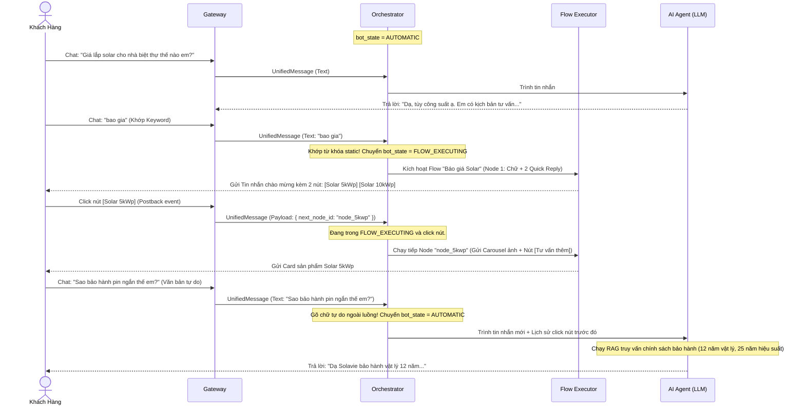

# ĐẶC TẢ CHI TIẾT TÍNH NĂNG VÀ CÁCH THỨC TRIỂN KHAI ĐA KÊNH & TỰ ĐỘNG HÓA

| Tài liệu | Đặc tả chi tiết tính năng & Quy trình triển khai Đa kênh (FB & Zalo) và Tự động hóa |
| --- | --- |
| Dự án | Hệ thống AI Chatbot kết hợp CRM & O&M cho Năng lượng mặt trời Solavie |
| Thư mục lưu | `./docs/omnichannel_channels_specification.md` |
| Phiên bản | 2.0.0 (Bổ sung cấu trúc luồng tự do và chi tiết hóa Frontend/Backend cho từng tính năng) |
| Người biên soạn | Công chúa |
| Người nhận | Hoàng tử |
| Trạng thái | Đã cập nhật chi tiết toàn diện |

---

## 1. TỔNG QUAN LỚP TRỪU TƯỢNG GATEWAY (UNIFIED ABSTRACTION LAYER)

Để triệt tiêu sự phức tạp khi xử lý các giao thức tin nhắn khác nhau của Meta và Zalo ở tầng nghiệp vụ (Chatbot, CRM, Inbox), hệ thống tự xây dựng Solavie thiết lập **Lớp trừu tượng Gateway** đóng vai trò làm bộ chuyển đổi hai chiều (Bidirectional Adapter).

```
[Facebook Graph API] ◄───┐
                         ├──► [Gateway Adapter] ◄──► Unified Interface ◄──► [Modules Nghiệp Vụ]
[Zalo OA OpenAPI]    ◄───┘
```

### 1.1. Interface Tin nhắn Nhận (`UnifiedMessage`)
*   **Ý nghĩa:** Chuẩn hóa dữ liệu đầu vào từ mọi webhook thành một định dạng chung duy nhất, giúp các module nghiệp vụ ở Backend (Livechat, AI Agent, CRM) không cần quan tâm tin nhắn đến từ nền tảng nào.
*   **Ví dụ thực tế:** Khách hàng tên "Nguyễn Văn A" gửi ảnh chụp mái nhà bị bóng râm che khuất qua Facebook Messenger hoặc Zalo.
*   **Cấu trúc dữ liệu:**
    ```typescript
    export interface UnifiedMessage {
      messageId: string;            // ID tin nhắn duy nhất từ Facebook/Zalo
      channel: 'FACEBOOK' | 'ZALO'; // Kênh mạng xã hội
      senderId: string;             // PSID của Facebook hoặc User ID của Zalo
      recipientId: string;          // ID Fanpage Facebook hoặc ID Zalo OA
      type: 'TEXT' | 'IMAGE' | 'VIDEO' | 'AUDIO' | 'DOCUMENT';
      content: string;              // Nội dung text hoặc URL tệp tin media
      timestamp: number;            // Epoch timestamp (milliseconds)
    }
    ```

### 1.2. Interface Tin nhắn Gửi (`UnifiedSendPayload`)
*   **Ý nghĩa:** Cung cấp cấu trúc gửi tin chung cho AI Agent hoặc kịch bản tự động hóa. Gateway sẽ tự dịch payload này sang API tương ứng của Meta Graph API hoặc Zalo OpenAPI.
*   **Ví dụ thực tế:** AI gửi danh mục 3 gói pin mặt trời (Carousel Card) kèm nút bấm hành động cho khách hàng.
*   **Cấu trúc dữ liệu:**
    ```typescript
    export interface UnifiedSendPayload {
      recipientId: string;       // ID người nhận tin
      channel: 'FACEBOOK' | 'ZALO';
      messageType: 'TEXT' | 'MEDIA' | 'TEMPLATE';
      text?: string;             // Văn bản gửi đi
      mediaUrl?: string;         // Link ảnh/video/tệp đính kèm
      buttons?: Array<{          // Nút bấm tương tác
        type: 'URL' | 'CALL' | 'POSTBACK' | 'REQUEST_PHONE';
        title: string;
        value: string;           // Link website, số điện thoại, hoặc payload sự kiện
      }>;
      carouselItems?: Array<{    // Hiển thị các gói sản phẩm cuộn ngang/dọc
        title: string;
        subtitle?: string;
        imageUrl: string;
        buttons: Array<{ title: string; value: string }>;
      }>;
    }
    ```

---

## 2. PHÂN HỆ FACEBOOK MESSENGER (META GRAPH API INTEGRATION)

### 2.1. Chức năng Rich Messaging
*   **Khái niệm & Ý nghĩa:** Khả năng nhận và gửi tin nhắn đa phương tiện (văn bản, ảnh, video, tài liệu PDF) cùng các cấu trúc động (Carousel ngang, nút bấm chọn nhanh) để tạo trải nghiệm tương tác trực quan sinh động.
*   **Ví dụ thực tế:** Gửi thẻ cuộn ngang giới thiệu gói "Solar Biệt Thự 5kWp" kèm ảnh thực tế mái pin và nút bấm "Nhận Báo Giá".
*   **Triển khai Backend:**
    *   *Webhook nhận:* Endpoint `POST /api/v1/gateway/webhooks/facebook`. Xác thực chữ ký `X-Hub-Signature-256` bằng khóa `FACEBOOK_APP_SECRET` qua `FacebookSignatureGuard`.
    *   *API gửi:* Gọi `POST https://graph.facebook.com/v19.0/me/messages?access_token=<PAGE_ACCESS_TOKEN>`.
    *   *Dữ liệu Carousel (Generic Template):*
        ```json
        {
          "recipient": { "id": "USER_PSID" },
          "message": {
            "attachment": {
              "type": "template",
              "payload": {
                "template_type": "generic",
                "elements": [
                  {
                    "title": "Gói Solar Biệt Thự 5kWp",
                    "image_url": "https://solavie.org/assets/package-5kwp.jpg",
                    "subtitle": "Hệ thống đề xuất cho hộ gia đình",
                    "buttons": [
                      { "type": "postback", "title": "Chọn Gói", "payload": "SELECT_5KWP" }
                    ]
                  }
                ]
              }
            }
          }
        }
        ```
*   **Triển khai Frontend:**
    *   *Giao diện Chat (Livechat UI):* Cửa sổ Inbox hiển thị các tin nhắn của khách. Tin nhắn ảnh hiển thị thumbnail xem trước; tin nhắn Carousel hiển thị dưới dạng thanh trượt cuộn ngang (Slider).
    *   *Thanh công cụ gửi (Composer Panel):* Nhân viên có nút "Gửi đính kèm" (Upload ảnh/video) và nút "Gửi Template". Click "Gửi Template" mở ra danh sách các thẻ sản phẩm Solar đã định cấu hình trước để nhân viên click chọn gửi nhanh sang cho khách.

### 2.2. Chức năng Tự động hóa Bình luận (Comments Automation)
*   **Khái niệm & Ý nghĩa:** Tự động lắng nghe bình luận trên Fanpage, lọc/ẩn các bình luận chứa thông tin nhạy cảm để tránh đối thủ cạnh tranh cướp khách (leads), đồng thời tự động phản hồi công khai và inbox riêng tư cho khách.
*   **Ví dụ thực tế:** Khách bình luận trên bài viết quảng cáo: *"Tư vấn cho tôi số 0901234567"*. Hệ thống lập tức ẩn bình luận đó, trả lời công khai: *"Solavie đã inbox tư vấn cho anh rồi ạ"*, và tự mở tin nhắn Messenger gửi bảng giá.
*   **Triển khai Backend:**
    *   *Lắng nghe:* Đăng ký Webhook sự kiện `feed` (chủ đề bài viết). Webhook nhận JSON chứa `comment_id`, `post_id`, `message` và `sender_id`.
    *   *Ẩn bình luận:* Chạy regex kiểm tra số điện thoại: `/(0[3|5|7|8|9])+([0-9]{8})\b/`. Nếu khớp, gọi API:
        `POST https://graph.facebook.com/v19.0/{comment_id}?is_hidden=true&access_token=<PAGE_ACCESS_TOKEN>`.
    *   *Phản hồi công khai:* Gọi `POST https://graph.facebook.com/v19.0/{comment_id}/comments` truyền text phản hồi lấy ngẫu nhiên từ thư viện mẫu.
    *   *Nhắn tin riêng (Comment-to-Inbox):* Gọi Send API truyền `comment_id` làm ID người nhận trong trường `recipient.comment_id`.
*   **Triển khai Frontend:**
    *   *Trang Cấu hình (Comments Settings Panel):* Đặt tại `/admin/chatbot/comments-automation`.
    *   *Thành phần giao diện:*
        *   Nút bật/tắt (Toggle) tính năng "Tự động ẩn bình luận chứa số điện thoại".
        *   Danh sách các mẫu tin nhắn phản hồi công khai (Cho phép thêm, sửa, xóa các câu trả lời ngẫu nhiên).
        *   Dropdown chọn Kịch bản luồng tin nhắn (Flow) tự động gửi vào Inbox của khách ngay khi họ bình luận.

### 2.3. Chức năng Tăng trưởng (Growth Tools - Ref Link & QR Code)
*   **Khái niệm & Ý nghĩa:** Tạo ra điểm chạm kết nối từ bên ngoài Fanpage (quảng cáo, tờ rơi, website) dẫn trực tiếp khách hàng vào một kịch bản tư vấn Solar xác định và lưu lại nguồn chiến dịch.
*   **Ví dụ thực tế:** Dán mã QR tại mặt trước của thùng bảo trì lò sấy solar. Khách hàng quét mã bằng điện thoại sẽ tự động mở ứng dụng Messenger và chạy kịch bản yêu cầu bảo trì O&M khẩn cấp.
*   **Triển khai Backend:**
    *   *Tạo link:* Sinh cấu trúc link `https://m.me/{page_id}?ref={campaign_code}`.
    *   *Xử lý Webhook:* Khi khách click link hoặc quét mã, Facebook gửi sự kiện Webhook `messaging_postbacks` chứa thuộc tính `referral.ref = {campaign_code}`. `ChatbotOrchestrator` nhận diện mã này, truy vấn DB lấy `flow_id` tương ứng để kích hoạt kịch bản, đồng thời cập nhật trường `lead_source` trong CRM.
    *   *Sinh mã QR:* Helper sử dụng thư viện `qrcode` (npm) biên dịch link trên sang Base64/PNG để tải về.
*   **Triển khai Frontend:**
    *   *Màn hình quản lý (Growth Tools Dashboard):* Bảng hiển thị danh sách Ref Link, số lượt quét.
    *   *Giao diện tương tác:*
        *   Form tạo mới: Nhập tên công cụ, mã chiến dịch (`campaign_code`), dropdown chọn Flow kịch bản.
        *   Nút "Sao chép Link" và nút "Tải mã QR" (Download PNG).

### 2.4. Quản lý chính sách Cửa sổ 24h & Gắn Thẻ tin nhắn (Message Tags)
*   **Khái niệm & Ý nghĩa:** Tuân thủ quy định của Facebook chỉ cho phép gửi tin nhắn quảng cáo trong vòng 24 giờ kể từ tương tác cuối của khách. Ngoài 24 giờ, hệ thống bắt buộc phải đính kèm các thẻ tin nhắn (Message Tags) hợp lệ để tránh bị Meta khóa trang.
*   **Ví dụ thực tế:** Gửi tin nhắn tự động nhắc khách hàng về lịch khảo sát mái pin mặt trời đã đặt trước đó 2 ngày bằng thẻ `CONFIRMED_EVENT_UPDATE`.
*   **Triển khai Backend:**
    *   Lưu trường `lastInteractionAt` trong bảng `chat_conversations`. Cập nhật timestamp mỗi khi nhận webhook tin nhắn của khách.
    *   Trước khi gọi Send API, tính toán `diff = Date.now() - conversation.lastInteractionAt`.
    *   *Nếu diff <= 24h:* Gửi tin với `messaging_type: "RESPONSE"`.
    *   *Nếu diff > 24h:*
        *   Tin quảng cáo tự động: Chặn gửi, đánh dấu trạng thái log là `SKIPPED_POLICY_VIOLATION`.
        *   Tin nhắn nhắc lịch hẹn (Booking): Gửi với `messaging_type: "MESSAGE_TAG"` và `"tag": "CONFIRMED_EVENT_UPDATE"`.
        *   Tin nhắn chat tay của nhân viên (Livechat): Gửi với `messaging_type: "MESSAGE_TAG"` và `"tag": "HUMAN_AGENT"` (Cho phép phản hồi trong vòng 7 ngày).
*   **Triển khai Frontend:**
    *   *Giao diện Chat (Inbox UI):* Hiển thị một nhãn cảnh báo thời gian trực quan (Badge) bên cạnh avatar khách hàng:
        *   Màu xanh: *"Trong cửa sổ 24h (Còn lại X giờ)"*.
        *   Màu đỏ: *"Ngoài cửa sổ 24h"*.
    *   *Chặn nhập liệu:* Khi hội thoại ngoài 24h, ô nhập text bình thường của nhân viên sẽ tạm thời bị khóa nhẹ. Nhân viên muốn chat phải click nút "Kích hoạt chat tay (Human Agent Tag)" để hệ thống đính kèm tag, hoặc chỉ cho phép chọn gửi các mẫu tin nhắn mẫu (Templates) có sẵn thẻ hợp lệ.

---

## 3. PHÂN HỆ ZALO OA (ZALO DEVELOPMENT API INTEGRATION)

### 3.1. Rich Messaging & Thu thập Số điện thoại (Phone Extraction)
*   **Khái niệm & Ý nghĩa:** Gửi nhận tin nhắn đa phương tiện, hiển thị danh sách sản phẩm cuộn dọc (Zalo List Template) và cung cấp nút bấm bảo mật yêu cầu khách hàng chia sẻ số điện thoại chính chủ để tự động đồng bộ vào CRM.
*   **Ví dụ thực tế:** Bot gửi tin: *"Để nhận bảng phân tích ROI chi tiết qua Zalo, chàng vui lòng bấm chia sẻ số điện thoại dưới đây"*. Khách bấm đồng ý, hệ thống nhận SĐT thật và lưu vào CRM.
*   **Triển khai Backend:**
    *   *Payload Zalo List Template:* Gửi API `/message/cs` chứa cấu trúc `list` với các phần tử xếp dọc (ảnh nhỏ bên trái, tiêu đề và mô tả bên phải).
    *   *Yêu cầu SĐT:* Gửi tin nhắn chứa mảng `buttons` cấu hình nút bấm có `"type": "request_phone"`.
    *   *Giải mã:* Zalo gửi webhook sự kiện `user_shared_info` chứa `token`. Backend gửi HTTP POST lên Zalo API:
        *   *URL:* `https://openapi.zalo.me/v2.0/oa/getsharedinfo`
        *   *Headers:* `access_token: <ZALO_ACCESS_TOKEN>`
        *   *Body:* `{ "data": { "token": "<TOKEN>" } }`
        *   *Xử lý kết quả:* Nhận số điện thoại (VD: `84901234567`), lưu vào CRM và kích hoạt `MergeProfileService` để gộp hồ sơ nếu trùng số điện thoại.
*   **Triển khai Frontend:**
    *   *Màn hình Chat (Livechat UI):* Trong khung chat Zalo, nhân viên hỗ trợ có một nút bấm nhanh: "Yêu cầu chia sẻ số điện thoại".
    *   *Thông tin khách hàng (CRM Sidebar):* Nếu khách hàng chưa cung cấp SĐT, hệ thống hiển thị biểu tượng cảnh báo màu vàng. Ngay khi khách bấm đồng ý chia sẻ, sidebar sẽ tự động cập nhật SĐT thời gian thực mà không cần tải lại trang.

### 3.2. Tin giao dịch ZBS Template (Chuẩn mới nhất v3.0)
*   **Khái niệm & Ý nghĩa:** Định dạng tin nhắn giao dịch có cấu trúc hiển thị bảng thông số rõ ràng (hóa đơn, kết quả phân tích, lịch hẹn), giúp khách hàng dễ dàng theo dõi thông tin quan trọng.
*   **Ví dụ thực tế:** Gửi tin nhắn thông báo kết quả tính toán ROI cho khách hàng đăng ký lắp đặt điện mặt trời: hiển thị rõ công suất đề xuất, tổng chi phí dự tính và thời gian hoàn vốn dưới dạng bảng key-value.
*   **Triển khai Backend:**
    *   Gọi API `POST https://openapi.zalo.me/v3.0/oa/message/transaction`.
    *   Body JSON bắt buộc chứa `template_type: "transaction_order"` gồm các phần tử: `header`, `text`, `table` (mảng đối tượng `{ key, value }`) và `buttons`.
*   **Triển khai Frontend:**
    *   *Trình soạn thảo tin nhắn (ZBS Composer):* Trong khung Livechat hoặc trang tạo chiến dịch Broadcasting, khi chọn gửi tin Zalo giao dịch, Frontend hiển thị một biểu mẫu nhập liệu có cấu trúc:
        *   Ô nhập Header (VD: "KẾT QUẢ PHÂN TÍCH SOLAR").
        *   Bảng nhập liệu thông số Key-Value động (Cho phép thêm dòng: Key: *"Công suất"*, Value: *"5 kWp"*).
        *   Nút bấm hành động (Tên nút và Link liên kết).
    *   *Khung xem trước (ZBS Live Preview):* Hiển thị giả lập cấu trúc tin nhắn Zalo hiển thị trên điện thoại thời gian thực để nhân viên kiểm tra trước khi gửi.

### 3.3. Zalo Notification Service (ZNS API)
*   **Khái niệm & Ý nghĩa:** Giải pháp gửi tin nhắn thông báo tự động thông qua số điện thoại của khách hàng, cho phép chủ động tiếp cận gửi tin ngoài cửa sổ tương tác 24h kể cả khi khách chưa từng quan tâm Zalo OA.
*   **Ví dụ thực tế:** Tự động gửi tin nhắn ZNS xác nhận lịch khảo sát thực tế mái nhà vào số điện thoại khách hàng trước giờ hẹn 2 tiếng.
*   **Triển khai Backend:**
    *   Gọi API `POST https://business.openapi.zalo.me/message/template` truyền `phone`, `template_id` và đối tượng `template_data` chứa các biến động.
    *   *Cơ chế Fallback:* Nếu Zalo trả về mã lỗi thông báo số điện thoại không đăng ký sử dụng Zalo, hệ thống tự động đăng ký một Job chuyển hướng sang gửi Email qua AWS SES.
*   **Triển khai Frontend:**
    *   *Màn hình cấu hình (ZNS Management):* Đặt tại `/admin/chatbot/zns-settings`.
    *   *Thành phần giao diện:*
        *   Nút "Đồng bộ Template từ Zalo OA": Gọi API lấy danh sách các Template ZNS đã được duyệt trên Zalo Cloud Account.
        *   Giao diện ánh xạ trường dữ liệu (Field Mapping): Cho phép map các biến của ZNS (VD: `customer_name`, `booking_time`) với các trường thông tin trong CRM của Solavie.

### 3.4. Cơ chế tự động làm mới Token (Zalo OA Token Sync Worker)
*   **Khái niệm & Ý nghĩa:** Tự động duy trì và làm mới Access Token của Zalo OA (hết hạn sau 25 giờ) bằng Refresh Token (chỉ được dùng 1 lần) để đảm bảo hệ thống luôn kết nối thông suốt 24/7 mà không cần con người can thiệp thủ công.
*   **Ví dụ thực tế:** Hệ thống tự động refresh token vào lúc 2 giờ sáng hàng ngày mà không làm gián đoạn trải nghiệm của khách hàng đang chat.
*   **Triển khai Backend:**
    *   Viết `ZaloTokenSyncWorker` chạy ngầm định kỳ mỗi giờ (`@Cron`).
    *   Kiểm tra trường `expires_at` trong bảng cấu hình kênh. Nếu thời gian còn lại dưới 3 giờ:
        *   Bắt đầu DB Transaction để lock bản ghi tránh xung đột ghi đè.
        *   Gọi API Zalo OAuth để lấy cặp token mới `{ access_token, refresh_token }`.
        *   Mã hóa cặp token bằng thuật toán AES-256-GCM trước khi cập nhật đè vào Database, sau đó Commit Transaction.
*   **Triển khai Frontend:**
    *   *Trang Cấu hình Kênh (Channel Connection Settings):* 
        *   Nút "Kết nối Zalo OA": Khi click sẽ chuyển hướng khách hàng sang trang đăng nhập OAuth của Zalo. Sau khi xác thực thành công, Zalo redirect về hệ thống kèm mã authorization code để backend đổi token lần đầu.
        *   Đèn báo trạng thái (Status Indicator): Màu xanh (Đã kết nối, hiển thị thời gian hết hạn token), Màu đỏ (Mất kết nối).
        *   Nút bấm thủ công "Làm mới kết nối ngay" để quản trị viên tự refresh trong tình huống khẩn cấp.

---

## 4. HỆ THỐNG GỬI TIN NHẮN HÀNG LOẠT (BROADCASTING ENGINE ARCHITECTURE)

Hệ thống gửi tin nhắn hàng loạt (Broadcasting) do Solavie tự xây dựng sử dụng kiến trúc xử lý bất đồng bộ qua hàng đợi **BullMQ** và cơ sở dữ liệu PostgreSQL để gửi tin hàng loạt an toàn, tuân thủ chính sách chống spam.

### 4.1. Thiết kế Cơ sở dữ liệu (Database Schema)

#### A. Bảng `chat_broadcast_campaigns` (Thông tin chiến dịch)
```sql
CREATE TABLE chat_broadcast_campaigns (
    id UUID PRIMARY KEY DEFAULT uuid_generate_v4(),
    name VARCHAR(255) NOT NULL,
    channel VARCHAR(50) NOT NULL, -- 'FACEBOOK' | 'ZALO'
    targeting_rules JSONB NOT NULL, -- Bộ lọc đối tượng nhận tin: Tags, Fields, Last Interaction
    message_payload JSONB NOT NULL, -- Cấu trúc tin nhắn (Text, nút bấm, carousel, tags)
    scheduled_at TIMESTAMP WITH TIME ZONE, -- null nếu gửi ngay
    status VARCHAR(50) DEFAULT 'DRAFT', -- 'DRAFT' | 'SCHEDULED' | 'PROCESSING' | 'COMPLETED' | 'CANCELLED'
    total_audience INT DEFAULT 0,
    sent_count INT DEFAULT 0,
    success_count INT DEFAULT 0,
    failed_count INT DEFAULT 0,
    created_at TIMESTAMP WITH TIME ZONE DEFAULT CURRENT_TIMESTAMP,
    updated_at TIMESTAMP WITH TIME ZONE DEFAULT CURRENT_TIMESTAMP
);
```

#### B. Bảng `chat_broadcast_logs` (Nhật ký gửi tin chi tiết)
```sql
CREATE TABLE chat_broadcast_logs (
    id UUID PRIMARY KEY DEFAULT uuid_generate_v4(),
    campaign_id UUID REFERENCES chat_broadcast_campaigns(id) ON DELETE CASCADE,
    customer_id UUID NOT NULL, -- Liên kết mềm sang crm_customers
    status VARCHAR(50) NOT NULL, -- 'SENT' | 'FAILED' | 'SKIPPED'
    error_reason TEXT, -- Lưu chi tiết mã lỗi từ Facebook/Zalo API
    sent_at TIMESTAMP WITH TIME ZONE DEFAULT CURRENT_TIMESTAMP,
    opened_at TIMESTAMP WITH TIME ZONE,
    clicked_at TIMESTAMP WITH TIME ZONE
);
CREATE INDEX idx_broadcast_logs_campaign ON chat_broadcast_logs(campaign_id);
```

### 4.2. Cơ chế Hàng đợi BullMQ Giãn Cách & Điều Phối
*   **Phân lô (Batching):** Khi chiến dịch chuyển sang trạng thái `PROCESSING`:
    *   Hệ thống truy vấn DB CRM lấy danh sách khách hàng thỏa mãn `targeting_rules`.
    *   Phân chia danh sách thành các lô nhỏ (mỗi lô 50 khách hàng).
    *   Tạo các Job tương ứng đẩy vào Queue: `facebook-broadcast-queue` (cho Facebook) hoặc `zalo-broadcast-queue` (cho Zalo).
*   **Worker Giãn cách (Rate Limiting):**
    *   *Facebook Broadcast Worker:* Đọc danh sách 50 PSID, thực hiện gửi tin Graph API. Bắt buộc chèn hàm trì hoãn **`await new Promise(resolve => setTimeout(resolve, 1000))`** (1 giây) sau mỗi request gửi tin.
    *   *Zalo Broadcast Worker:* Đọc danh sách 50 User ID, thực hiện gửi tin OA API. Chèn hàm trì hoãn **`await new Promise(resolve => setTimeout(resolve, 500))`** (0.5 giây) sau mỗi request gửi tin.
*   **Giờ giới nghiêm (Quiet Hours Guard):**
    *   Trước khi gửi tin, Worker kiểm tra giờ hệ thống hiện tại.
    *   Nếu giờ nằm trong khoảng `22:00:00` - `07:00:00`:
        *   Worker tính toán số giây trì hoãn đến `08:00:00` sáng hôm sau.
        *   Tự động dời lịch gửi Job bằng cách update delay trong BullMQ:
            `await queue.add('broadcast_batch', data, { delay: delayMs });`
        *   Ghi log hệ thống: *"Broadcast batch delayed due to quiet hours restriction."*

### 4.3. Cơ chế Tự động Ngắt bảo vệ (Circuit Breaker)
*   Trong quá trình gửi tin của một chiến dịch, nếu Worker phát hiện số tin nhắn gửi thất bại liên tiếp đạt ngưỡng **20 tin** (thường do lỗi sập Token hoặc Page bị Meta/Zalo khóa chặn):
    *   Lập tức cập nhật trạng thái chiến dịch thành `CANCELLED` trong DB để dừng toàn bộ các Job còn lại trong hàng đợi.
    *   Ghi nhận lỗi hệ thống: `Circuit breaker triggered due to consecutive failures.`
    *   Tạo Outbox Event `system.alert` để gửi thông báo khẩn cấp (Email/Telegram) cho Admin.

### 4.4. Quy trình triển khai trên Frontend (Broadcasting UI/UX)
*   **Màn hình Thiết lập Chiến dịch (Campaign Creation Wizard):** Thiết kế dạng quy trình 3 bước trực quan:
    *   *Bước 1 (Chọn đối tượng - Target Audience):* Người dùng cấu hình bộ lọc bằng các ô nhập liệu dạng Tag/Dropdown: Chọn Kênh (Facebook/Zalo), Chọn thẻ khách hàng (Tags), Lọc theo Tỉnh/Thành phố, Lọc theo thời gian tương tác (VD: Chỉ gửi khách tương tác trong 24h). Hệ thống hiển thị số lượng khách hàng dự kiến khớp bộ lọc ngay lập tức.
    *   *Bước 2 (Soạn thảo nội dung - Message Composer):* Soạn tin nhắn văn bản, chèn ảnh, hoặc chèn Zalo ZBS/Facebook Carousel. Giao diện tích hợp khung xem trước giả lập màn hình di động (Preview). Đối với Facebook ngoài 24h, bắt buộc hiển thị dropdown yêu cầu chọn Thẻ tin nhắn (Message Tag) hợp lệ.
    *   *Bước 3 (Lập lịch & Tốc độ gửi):* Chọn "Gửi ngay" hoặc "Hẹn giờ gửi" (chọn ngày và giờ qua Datetime Picker). Nhập thời gian giãn cách giữa các tin nhắn (VD: 1.5 giây/tin).
*   **Màn hình Thống kê Chiến dịch (Campaign Analytics Dashboard):**
    *   Hiển thị danh sách các chiến dịch cùng thanh tiến độ gửi (Progress bar) thời gian thực.
    *   Các biểu đồ số liệu: Tổng số khách hàng mục tiêu, Số tin gửi thành công (Success Rate - màu xanh), Số tin thất bại (Failure Rate - màu đỏ), Tỷ lệ mở xem, Tỷ lệ click vào link hành động.
    *   Bảng log chi tiết danh sách khách hàng nhận tin, hiển thị nguyên nhân lỗi cụ thể nếu gửi thất bại để quản trị viên xử lý.

---

## 5. PHÂN HỆ AUTOMATION ENGINE: THIẾT KẾ CHI TIẾT FRONTEND & BACKEND (CHO PHÉP TỰ DO TẠO LUỒNG)

Để hiện thực hóa triết lý kiến trúc tối giản "Backend-First" đã trình bày trong [architectural_rationales.md](file:///d:/workspace/project/solavie/docs/architectural_rationales.md) nhưng vẫn **đảm bảo cho phép người dùng tự do tạo luồng tin nhắn tùy ý ngay trong Phase 1**, dưới đây là mô tả chi tiết cách thức thiết kế phân hệ tự động hóa.

### 5.1. Luồng tin nhắn tự do & Khối tin nhắn (Flows & Message Nodes Composer)
*   **Ý nghĩa:** Cho phép quản trị viên tự định nghĩa các kịch bản hội thoại động không giới hạn số lượng bước, tự do rẽ nhánh, tự quyết định nội dung gửi đi và các hành động ngầm trên CRM.
*   **Ví dụ thực tế:** Người dùng tự tạo một phễu khảo sát mini:
    *   *Tạo Flow:* `Khảo sát khách hàng tiềm năng`
    *   *Node 1 (TEXT):* "Chào anh, anh muốn lắp solar cho nhà ở hay nhà xưởng?". Nút 1: `Nhà ở` (trỏ đến Node 2), Nút 2: `Nhà xưởng` (trỏ đến Node 3).
    *   *Node 2 (ACTION):* Gắn nhãn `nha_o` $\rightarrow$ Trỏ đến Node 4.
    *   *Node 3 (ACTION):* Gán nhãn `nha_xuong` $\rightarrow$ Trỏ đến Node 5.
    *   *Node 4 (TEXT):* Hỏi diện tích mái nhà. Chờ khách nhập chữ tự do $\rightarrow$ Lưu vào trường CRM `roof_area`.
*   **Cách thức triển khai Backend:**
    *   *Cơ sở dữ liệu (Database Schema):*
        *   Bảng `chat_flows`: `id` (UUID, PK), `name` (VARCHAR), `description` (TEXT), `is_active` (BOOLEAN), `created_at` (TIMESTAMP).
        *   Bảng `chat_nodes`: `id` (UUID, PK), `flow_id` (UUID, FK), `type` (VARCHAR - 'TEXT' | 'CAROUSEL' | 'ACTION' | 'CONDITION'), `payload` (JSONB - Lưu trữ cấu trúc text, hình ảnh, mảng các nút bấm cùng tham chiếu trỏ node tiếp theo), `next_node_id` (UUID, FK trỏ đến Node kế tiếp khi chạy xong), `created_at` (TIMESTAMP).
    *   *Thuật toán chạy kịch bản (FlowExecutorService):*
        *   Nhận ID hội thoại và ID node hiện tại.
        *   Đọc thuộc tính `type`:
            *   Nếu `TEXT`/`CAROUSEL`: Gửi tin nhắn qua Gateway. Nếu trong `payload` có chứa các nút bấm hành động (buttons/quick replies), mỗi nút sẽ đính kèm tham số `next_node_id` trong thuộc tính postback. Khi khách click nút, webhook bắt được sự kiện và gọi tiếp `FlowExecutorService` với ID node mới.
            *   Nếu `ACTION`: Đọc `action_type` (VD: `ADD_TAG`, `ASSIGN_STAFF`), gọi Module CRM/Inbox tương ứng để lưu thông tin, sau đó tự động gọi đệ quy chính nó với `next_node_id` để chuyển tiếp ngay sang khối tiếp theo mà khách không cảm nhận độ trễ.
*   **Cách thức triển khai Frontend (Trình Soạn Thảo Luồng Dạng Cây / Danh Sách - Form-based Flow Composer UI):**
    *   Để tránh chi phí phát triển quá lớn của canvas kéo thả đồ thị, hệ thống cung cấp giao diện quản lý **Luồng hội thoại dạng Cây danh sách động (Tree-List View)**:
        *   **Màn hình quản lý chung:** Nút "Tạo Luồng Mới" (Tạo một Flow trống).
        *   **Màn hình soạn thảo chi tiết (Composer Workspace):**
            *   **Cột bên trái (Sidebar):** Danh sách tất cả các Node hiện có trong Flow này dưới dạng các thẻ nhỏ, hiển thị tiêu đề và icon loại Node. Cho phép kéo thả thay đổi thứ tự hiển thị của các node trong danh sách để dễ theo dõi. Có nút "Thêm Khối Mới (Add Node)". Khi click, hệ thống tự động sinh một Node mới với UUID ngẫu nhiên.
            *   **Khung làm việc chính ở giữa (Node Editor Form):** Khi click vào một Node bất kỳ ở Sidebar, nội dung chi tiết của Node đó sẽ hiển thị ở khung này để chỉnh sửa:
                *   Dropdown chọn loại Node: Tin nhắn chữ (TEXT), Nhóm thẻ cuộn (CAROUSEL), Khối Hành động (ACTION).
                *   Vùng soạn thảo nội dung (nội dung chữ, ảnh tải lên).
                *   *Danh sách nút bấm tương tác (Buttons/Quick Replies Builder):* Cho phép click "Thêm nút bấm". Với mỗi nút bấm, hiển thị ô nhập Tên nút, và Dropdown hành động khi bấm:
                    *   Lựa chọn 1: *Mở liên kết URL* (Nhập đường dẫn website).
                    *   Lựa chọn 2: *Chuyển tiếp kịch bản* (Dropdown hiển thị danh sách tất cả các Node ID hiện có trong Flow này để liên kết kết nối).
                *   *Khối Hành động (nếu chọn loại Node ACTION):* Dropdown chọn hành động (Thêm nhãn, Phân công nhân viên, Tạo Lead) và ô cấu hình giá trị tương ứng.
            *   **Bộ kiểm tra hợp lệ (Flow Validation Engine - Frontend):** Nút "Kiểm tra & Lưu kịch bản". Frontend chạy thuật toán duyệt đồ thị (DFS/BFS) để kiểm tra:
                *   Có node nào bị cô lập (không có nút bấm nào trỏ đến hoặc không phải node bắt đầu và không có `next_node_id` dẫn vào) không.
                *   Có xảy ra lỗi vòng lặp vô hạn không. Nếu phát hiện lỗi, hiển thị viền đỏ cảnh báo ngay tại Node đó và khóa nút "Lưu".

### 5.2. Từ khóa (Keywords Matcher)
*   **Khái niệm & Ý nghĩa:** Nhận diện tin nhắn tự do đầu vào của khách hàng chứa các từ khóa cụ thể để ngay lập tức kích hoạt một luồng Flow tương ứng.
*   **Ví dụ thực tế:** Khách gõ tin: *"Cho anh xin báo giá lắp đặt solar nhà xưởng"*. Từ khóa `"báo giá"` được phát hiện và kích hoạt `Flow: Báo Giá`.
*   **Triển khai Backend:**
    *   *Database:* Bảng `chat_keywords` lưu từ khóa, kiểu so khớp (`EXACT`, `CONTAINS`, `STARTS_WITH`), và `flow_id` liên kết.
    *   *Logic:* `KeywordRouterService` chặn đầu tin nhắn vào, chuẩn hóa chữ, chạy truy vấn so khớp. Nếu khớp, chuyển bot state sang `FLOW_EXECUTING` và chạy Flow được liên kết.
*   **Triển khai Frontend:**
    *   Giao diện danh sách dạng bảng tại `/admin/chatbot/keywords`.
    *   Form Drawer tạo từ khóa gồm: Nhập từ khóa, Dropdown chọn loại so khớp, Dropdown chọn Flow đích (Danh sách Flow được fetch động từ API).

### 5.3. Chuỗi chăm sóc (Sequences Timeline)
*   **Khái niệm & Ý nghĩa:** Thiết lập các mốc thời gian trì hoãn để tự động gửi các tin nhắn bám đuổi/chăm sóc khách hàng sau khi họ đi vào một giai đoạn cụ thể trong phễu.
*   **Ví dụ thực tế:** Khách hàng quan tâm nhưng chưa đặt lịch hẹn. Hệ thống tự động gửi tin nhắn giới thiệu các dự án biệt thự solar đã hoàn thiện sau 24 giờ.
*   **Triển khai Backend:**
    *   *Database:* Bảng `chat_sequences` (Thông tin chuỗi), `chat_sequence_steps` (Các bước trì hoãn và Flow liên kết), `chat_sequence_subscribers` (Danh sách khách hàng đang nằm trong chuỗi).
    *   *Logic:* Khi khách hàng được add vào chuỗi, tạo dòng subscriber và tính `next_execution_at`. Đẩy delay job vào BullMQ. Worker xử lý sẽ gửi Flow của bước đó, sau đó tự động xếp lịch bước tiếp theo nếu khách hàng chưa thực hiện hành động chuyển đổi (ví dụ: chưa tạo lịch hẹn).
*   **Triển khai Frontend:**
    *   Trang quản trị hiển thị danh sách các Sequence và số lượng subscribers đang chạy.
    *   *Giao diện Timeline Builder:* Hiển thị một đường trục dọc (Timeline). Mỗi bước là một thẻ card hiển thị:
        *   Ô nhập số lượng và dropdown chọn đơn vị (Giờ / Ngày).
        *   Dropdown chọn Flow kịch bản sẽ gửi.
        *   Nút bấm "Xóa bước" và nút "Thêm bước chăm sóc mới".

### 5.4. Công cụ tăng trưởng (Growth Tools - Ref Link & QR Code Manager)
*   **Khái niệm & Ý nghĩa:** Quản lý tập trung các Ref Link và mã QR để thu hút khách hàng từ các nguồn tiếp thị ngoại tuyến và trực tuyến ngoài Facebook/Zalo.
*   **Ví dụ thực tế:** Tạo mã QR dán trên tờ rơi quảng cáo tại hội chợ năng lượng sạch, khách quét mã sẽ tự kích hoạt luồng bot tặng voucher giảm giá 5% thiết bị.
*   **Triển khai Backend:**
    *   *Database:* Bảng `chat_growth_tools` lưu tên, loại, mã chiến dịch (`campaign_code`), `flow_id` và link ảnh QR (`qr_code_url`).
    *   *Logic:* Sử dụng thư viện `qrcode` sinh mã QR từ link m.me chứa tham số ref. Webhook nhận tin nhắn chứa ref code sẽ tự kích hoạt `FlowExecutorService` chạy Flow được cấu hình.
*   **Triển khai Frontend:**
    *   Bảng quản trị tại `/admin/chatbot/growth-tools` hiển thị: Tên công cụ, Mã chiến dịch, Số lượt quét, Link sao chép nhanh.
    *   Khi click vào một dòng, hiển thị Popup Drawer chứa ảnh mã QR kích thước lớn và nút "Tải ảnh QR (PNG)".

---

## 6. LUỒNG PHỐI HỢP LAI (HYBRID ORCHESTRATION): CƠ CHẾ CHUYỂN GIAO GIỮA FLOW TĨNH & AI AGENT

Để đảm bảo AI Agent không can thiệp sai thời điểm khi khách hàng đang đi theo kịch bản tĩnh (hoặc ngược lại), hệ thống Solavie áp dụng một **Mô hình Trạng thái Hội thoại (Conversation State Machine)** và **Cây Quyết định Định tuyến (Routing Decision Tree)** tại `ChatbotOrchestratorService`.

### 6.1. Ba Trạng thái Hội thoại Cốt lõi (`chat_conversations.bot_state`)
Trạng thái của một cuộc hội thoại được lưu trong cột `bot_state` của bảng `chat_conversations` với các giá trị:
1.  **`AUTOMATIC` (AI dẫn dắt):** AI Agent (Gemini/OpenAI) toàn quyền nhận tin nhắn văn bản tự nhiên của khách, tự động RAG tìm kiếm và gọi tool trả lời.
2.  **`FLOW_EXECUTING` (Kịch bản tĩnh chạy):** Hệ thống đang chạy dở một Flow tĩnh (Flow Node Tree). AI Agent tạm thời bị khóa (bypass) để nhường chỗ cho khách click nút bấm/quick replies.
3.  **`MANUAL` (Nhân viên chat tay):** Chatbot (cả AI và Flow tĩnh) đều dừng hoạt động hoàn toàn. Hội thoại được gán cho một nhân viên cụ thể (Sales/Support) trực tuyến điều khiển.

---

### 6.2. Cây Quyết định Định tuyến Tin nhắn (Routing Decision Tree)
Mỗi khi có tin nhắn đầu vào (`UnifiedMessage`) từ Webhook, `ChatbotOrchestratorService` thực hiện định tuyến theo thuật toán tuần tự sau:

```
                            [Tin nhắn Nhận đầu vào]
                                      │
                                      ▼
                        [1. Khớp từ khóa tĩnh?] ────(Khớp)───► [Chuyển state = FLOW_EXECUTING]
                                      │                                 │
                                   (Không)                              ▼
                                      │                       [Chạy kịch bản Flow tương ứng]
                                      ▼
                      [2. Kiểm tra bot_state hội thoại]
                                      │
           ┌──────────────────────────┼──────────────────────────┐
           ▼ (State = MANUAL)         ▼ (State = FLOW_EXECUTING) ▼ (State = AUTOMATIC)
      [Bỏ qua Bot]             [3. Là Postback Click?]            [Báo cho AI Agent]
     [Đẩy WebSocket]                  │                                  │
      cho Livechat             ┌──────┴──────┐                           ▼
                               ▼ (Có)        ▼ (Không - Gõ chữ)    [AI Agent RAG & Tool]
                       [Chạy Node tiếp]  [Chuyển state = AUTOMATIC]
                                             │
                                             ▼
                                     [Báo cho AI Agent]
```

#### Chi tiết các bước quyết định:
1.  **Kiểm tra Từ khóa (Keywords Matcher):**
    *   *Ngay cả khi hội thoại đang ở trạng thái `AUTOMATIC` hay `FLOW_EXECUTING`*, nếu khách hàng gửi tin nhắn dạng văn bản khớp với một từ khóa trong bảng `chat_keywords`:
    *   Hệ thống **ngay lập tức** chuyển `bot_state = FLOW_EXECUTING`, gán `current_flow_id` và `current_node_id` vào hội thoại, rồi gọi `FlowExecutorService` để gửi đi khối Node gốc (Node 1) của Flow đó.
2.  **Định tuyến theo Bot State:**
    *   **Nếu `bot_state = MANUAL`:** Hệ thống hoàn toàn im lặng. Gateway chỉ chuyển đổi tin nhắn, đẩy sự kiện realtime qua Socket.io (`inbox.gateway`) để hiển thị lên màn hình chat của nhân viên.
    *   **Nếu `bot_state = AUTOMATIC`:** Chuyển toàn bộ nội dung tin nhắn và lịch sử hội thoại sang `AIAgentService` xử lý.
    *   **Nếu `bot_state = FLOW_EXECUTING`:** Kiểm tra loại tin nhắn:
        *   *Trường hợp A (Khách click nút bấm/Quick Reply - Postback):* Payload trả về chứa thông tin nút bấm dạng `{ "next_node_id": "UUID" }`. Hệ thống gọi `FlowExecutorService` chạy tiếp Node này. Hội thoại duy trì trạng thái `FLOW_EXECUTING`.
        *   *Trường hợp B (Khách gõ văn bản tự do - Free text):* 
            *   *Nếu Node hiện tại đang chờ nhập liệu (ví dụ: Node hỏi SĐT):* Hệ thống ghi nhận chuỗi văn bản đó là giá trị nhập vào, cập nhật vào CRM, và gọi node tiếp theo. State duy trì `FLOW_EXECUTING`.
            *   *Nếu Node hiện tại không chờ nhập liệu hoặc khách gõ lạc đề (ví dụ: đang gửi bảng giá solar nhưng khách gõ "Sao đắt thế?"):* Hệ thống lập tức đổi `bot_state = AUTOMATIC`, giải phóng kịch bản tĩnh và đẩy câu chat đó sang cho `AIAgentService` phân tích và trả lời tự nhiên.

---

### 6.3. Ví dụ Luồng Hội thoại Thực tế (Journey Example)


