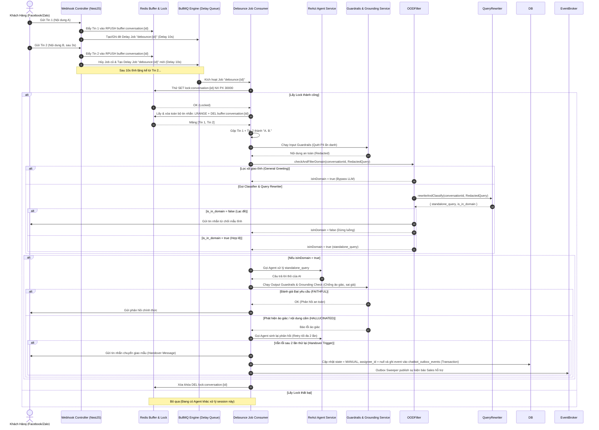
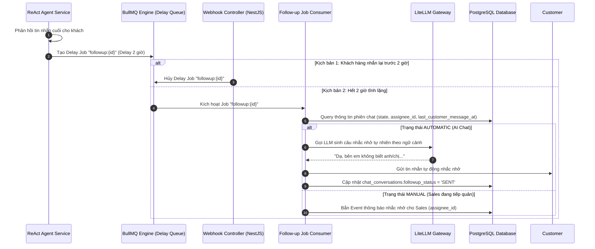

# Thiết Kế Kiến Trúc Module Chatbot (Design)

## 1. Mẫu Thiết Kế (Design Patterns)
- **LLM Gateway (Router):** Sử dụng kiến trúc định tuyến (như LiteLLM) để quản lý Multi-Provider, Load Balancing và Failover an toàn giữa các mô hình AI.
- **Adapter Pattern / Factory Pattern**: Quản lý nhiều LLM Provider (OpenAI, Gemini) thông qua Interface `BaseLLMAdapter` trong backend NestJS.
- **Registry Pattern**: Lazy Loading khởi tạo các adapter (AI Models) để tối ưu RAM. Chỉ Model nào đang hoạt động mới được load vào bộ nhớ.

## 2. Thiết Kế Database (Lược Đồ Quan Hệ)

### 2.1. Bảng `chat_conversations` (Phiên Chat)
| Tên Trường | Kiểu Dữ Liệu | Mô Tả |
| --- | --- | --- |
| `id` | UUID (PK) | Định danh phiên chat |
| `channel` | VARCHAR(50) | Kênh chat (`FACEBOOK`, `ZALO`) |
| `sender_id` | VARCHAR(255) | ID khách hàng trên MXH (PSID, Zalo User ID) |
| `state` | VARCHAR(50) | `AUTOMATIC` (AI trả lời) / `MANUAL` (Người trả lời) |
| `assignee_id` | UUID | Nhân viên tiếp quản (nếu có, soft link sang `iam_users`) |
| `customer_id` | UUID | Khách hàng sở hữu cuộc hội thoại (soft link sang `crm_customers`) |
| `last_message_at` | TIMESTAMP | Thời điểm tin nhắn cuối cùng được gửi (bất kỳ ai gửi) |
| `last_customer_message_at` | TIMESTAMP | Thời điểm tin nhắn cuối cùng của khách hàng |
| `followup_status` | VARCHAR(20) | Trạng thái nhắc nhở (`PENDING`, `SENT`, `SKIPPED`) |
| `created_at` | TIMESTAMP | Thời gian tạo |

### 2.2. Bảng `chat_messages` (Tin Nhắn)
| Tên Trường | Kiểu Dữ Liệu | Mô Tả |
| --- | --- | --- |
| `id` | UUID (PK) | Định danh tin |
| `conversation_id`| UUID (FK)| Thuộc phiên chat nào, cascade delete |
| `sender_type` | VARCHAR(50) | `CUSTOMER`, `AI`, `HUMAN_AGENT` |
| `content` | TEXT | Nội dung tin nhắn |
| `created_at` | TIMESTAMP | Thời gian nhắn |

### 2.3. Bảng `rag_documents` (Tài liệu kiến thức Solar - Phân cấp)
Hỗ trợ kiến trúc **Hierarchical Chunking** qua trường tự liên kết `parent_id` và tìm kiếm FTS tối ưu hóa qua cột sinh `tsv_content`.
| Tên Trường | Kiểu Dữ Liệu | Thuộc tính | Mô Tả |
| --- | --- | --- | --- |
| `id` | UUID (PK) | NOT NULL | Định danh chunk |
| `parent_id` | UUID (FK) | NULLABLE | Trỏ về chunk cha (nếu có), trỏ về `rag_documents.id` |
| `chunk_type` | VARCHAR(20) | NOT NULL | Phân loại chunk: `DOCUMENT` (gốc), `PARENT` (lớn), `CHILD` (nhỏ) |
| `title` | VARCHAR(255) | | Tên tài liệu hoặc link nguồn |
| `content_chunk` | TEXT | NOT NULL | Nội dung text của chunk |
| `tsv_content` | TSVECTOR | GENERATED | Generated `to_tsvector('simple', content_chunk)` stored |
| `embedding` | VECTOR(1536) | NULLABLE | Vector nhúng (chỉ bắt buộc trên `CHILD` chunk để tìm kiếm, độ dài linh hoạt 1536 hoặc 768 tùy model) |
| `created_at` | TIMESTAMP | Default NOW() | Thời gian tạo |

*Đánh chỉ mục (Index):*
- Cột `embedding` đánh index loại `HNSW` với hàm khoảng cách `cosine` để tìm kiếm ngữ nghĩa siêu tốc (chỉ index các bản ghi `CHILD` chunk).
- Cột `tsv_content` đánh index loại `GIN` hỗ trợ Full-Text Search (FTS) tiếng Việt hiệu năng cao.

### 2.4. Bảng `gw_llm_providers` (Danh sách API Keys của hãng LLM)
| Tên Trường | Kiểu Dữ Liệu | Thuộc Tính | Mô Tả |
| --- | --- | --- | --- |
| `id` | UUID | PRIMARY KEY | Định danh cấu hình |
| `name` | VARCHAR(100) | NOT NULL | Tên gợi nhớ (VD: "OpenAI Chính") |
| `provider_type` | VARCHAR(50) | NOT NULL | Hãng (`openai`, `gemini`, `anthropic`, `deepseek`, `ollama`) |
| `api_key` | TEXT | NOT NULL | API Key (mã hóa AES-256) |
| `api_base` | VARCHAR(255) | | URL custom endpoint (nếu có) |
| `priority` | INTEGER | NOT NULL | Độ ưu tiên (1 là cao nhất) |
| `status` | VARCHAR(30) | Default 'ACTIVE' | `ACTIVE`, `OUT_OF_CREDIT`, `INACTIVE` |

### 2.5. Bảng `gw_llm_provider_models` (Chi tiết các Model đồng bộ từ LiteLLM)
| Tên Trường | Kiểu Dữ Liệu | Thuộc Tính | Mô Tả |
| --- | --- | --- | --- |
| `id` | UUID | PRIMARY KEY | Định danh model |
| `provider_id` | UUID | FOREIGN KEY | Trỏ đến `gw_llm_providers.id` (Cascade) |
| `model_name` | VARCHAR(100) | NOT NULL | Tên model kỹ thuật (ví dụ: `gpt-4o-mini`) |
| `model_tier` | VARCHAR(20) | NOT NULL | Phân lớp (`LARGE` hoặc `SMALL`) |
| `max_tokens` | INTEGER | | Context Window |
| `max_input_tokens` | INTEGER | | Token đầu vào tối đa |
| `max_output_tokens`| INTEGER | | Token đầu ra tối đa |
| `input_cost_per_token`| NUMERIC(15, 12)| | Giá token đầu vào (USD) |
| `output_cost_per_token`| NUMERIC(15, 12)| | Giá token đầu ra (USD) |
| `is_active` | BOOLEAN | Default TRUE | |
| `raw_metadata` | JSONB | Default '{}' | JSON thô trả về từ LiteLLM |

*Ràng buộc:* `UNIQUE(provider_id, model_name)`.

### 2.6. Bảng `gw_llm_usecases` (Cấu hình Model cho tính năng AI)
| Tên Trường | Kiểu Dữ Liệu | Thuộc Tính | Mô Tả |
| --- | --- | --- | --- |
| `id` | UUID | PRIMARY KEY | Định danh cấu hình |
| `usecase_key` | VARCHAR(50) | UNIQUE, NOT NULL | Khóa kịch bản (`AGENT_CHAT`, `QUERY_REWRITE`, `CONVERSATION_SUMMARY`...) |
| `usecase_name` | VARCHAR(100) | NOT NULL | Tên kịch bản |
| `required_tier` | VARCHAR(20) | NOT NULL | Phân lớp khuyến nghị (`LARGE` / `SMALL`) |
| `provider_model_id`| UUID | FOREIGN KEY | Chỉ định Model cứng. Nếu NULL thì tự động lấy theo Provider số 1 |

### 2.7. Bảng `gw_llm_metrics` (Nhật ký chi tiết các cuộc gọi và chi phí AI)
| Tên Trường | Kiểu Dữ Liệu | Thuộc Tính | Mô Tả |
| --- | --- | --- | --- |
| `id` | UUID | PRIMARY KEY | Định danh duy nhất |
| `conversation_id`| UUID | NULLABLE | Trỏ về phiên chat (nếu có, soft-link) |
| `usecase_key` | VARCHAR(50) | NOT NULL | Khóa kịch bản (`AGENT_CHAT`, `QUERY_REWRITE`...) |
| `provider_id` | UUID | FOREIGN KEY | Trỏ đến `gw_llm_providers.id` |
| `model_name` | VARCHAR(100) | NOT NULL | Tên model kỹ thuật thực tế sử dụng |
| `prompt_tokens` | INTEGER | NOT NULL | Số token đầu vào |
| `completion_tokens`| INTEGER | NOT NULL | Số token đầu ra |
| `cached_tokens` | INTEGER | NOT NULL | Số token đầu vào được lấy từ cache |
| `input_cost` | NUMERIC(15, 12)| NOT NULL | Chi phí token đầu vào (USD) |
| `output_cost` | NUMERIC(15, 12)| NOT NULL | Chi phí token đầu ra (USD) |
| `total_cost` | NUMERIC(15, 12)| NOT NULL | Tổng chi phí thực tế (USD) |
| `latency_ms` | INTEGER | | Thời gian xử lý API (Mili giây) |
| `created_at` | TIMESTAMP | Default NOW() | Thời điểm cuộc gọi |

### 2.8. Bảng `chatbot_outbox_events` (Transactional Outbox)
Bảng trung gian để đảm bảo tính nhất quán giữa DB Transaction và Event Bus.
| Tên Trường | Kiểu Dữ Liệu | Thuộc Tính | Mô Tả |
| --- | --- | --- | --- |
| `id` | UUID | PRIMARY KEY | Định danh event |
| `event_type` | VARCHAR(100) | NOT NULL | Loại sự kiện (Ví dụ: `chat.handover_requested`) |
| `payload` | JSONB | NOT NULL | Dữ liệu sự kiện |
| `status` | VARCHAR(20) | Default 'PENDING' | `PENDING`, `PUBLISHED`, `FAILED` |
| `created_at` | TIMESTAMP | Default NOW() | Thời gian tạo |
| `published_at` | TIMESTAMP | NULLABLE | Thời gian publish thành công |

## 3. Kiến Trúc RAG (Retrieval-Augmented Generation) & Thuật toán RRF
Hệ thống sử dụng kiến trúc tìm kiếm lai (Hybrid Search) kết hợp với thuật toán **Reciprocal Rank Fusion (RRF)**:

### 3.1. Phép toán RRF (Reciprocal Rank Fusion)
Khi người dùng đặt câu hỏi, hệ thống thực hiện đồng thời 2 câu truy vấn:
1. **Keyword Search (Sparse):** Thực hiện Full-Text Search trên trường `content_chunk` sử dụng `tsquery` của Postgres.
2. **Semantic Search (Dense):** Tính toán cosine similarity giữa Vector truy vấn và vector cột `embedding`.

Kết quả trả về từ cả hai câu truy vấn được xếp hạng (Rank). Điểm số RRF của mỗi tài liệu $d$ được tính theo công thức:
$$RRF\_Score(d) = \sum_{m \in M} \frac{1}{k + r_m(d)}$$
*Trong đó:*
- $M$: Tập hợp các bộ truy xuất (ở đây gồm 2 bộ: Sparse và Dense).
- $r_m(d)$: Thứ hạng của tài liệu $d$ trong danh sách trả về của bộ truy xuất $m$ (bắt đầu từ 1). Nếu tài liệu không xuất hiện, $r_m(d) = \infty$ (đóng góp bằng 0).
- $k$: Hằng số làm mịn, mặc định là $60$.

Tài liệu có điểm $RRF\_Score$ cao nhất sẽ được chọn làm ngữ cảnh.

### 3.2. Luồng Hierarchical Chunking (Truy xuất phân cấp)
1. Khi có câu hỏi của người dùng, hệ thống chỉ so sánh vector truy vấn với các bản ghi có `chunk_type = 'CHILD'`.
2. Sau khi tìm được Top 3 Child Chunks có điểm số RRF cao nhất.
3. Hệ thống sẽ thực hiện truy vấn ngược lên theo `parent_id` để lấy nội dung của `PARENT` chunk tương ứng.
4. Đẩy nội dung `PARENT` chunk này làm Context đưa vào prompt của LLM. Kỹ thuật này giúp bảo toàn tính toàn vẹn thông tin (như bảng thông số kỹ thuật tấm pin), tránh việc LLM bị thiếu ngữ cảnh khi đọc một mẩu nhỏ rời rạc.

## 4. Kiến Trúc LLM Gateway Động (Dynamic Routing Proxy)
Hệ thống sử dụng LiteLLM Proxy làm stateless gateway. Việc quản lý API Key, điều phối và failover sẽ do Core Backend (NestJS) thực hiện động dựa trên dữ liệu trong Database.

### 4.1. Luồng Gửi Request Qua Gateway
NestJS sẽ gửi request HTTP POST tới LiteLLM endpoint `http://litellm-gateway:4000/v1/chat/completions` với các tham số:
- **Headers:**
  - `Authorization: Bearer <API_KEY>` (API Key lấy động từ bảng `gw_llm_providers` theo provider được chọn).
- **Body:**
  - `model`: Tên model định dạng `<provider_type>/<model_name>` (Ví dụ: `openai/gpt-4o-mini` hoặc `gemini/gemini-1.5-flash`).
  - `messages`: Mảng hội thoại.

### 4.1.1. Xử lý Payload Prompt Caching Thích Ứng (Prompt Caching Adapter Design)
Trước khi gửi body request lên LiteLLM Gateway, Core Backend sẽ đưa payload qua lớp BaseLLMAdapter tương ứng để xử lý Prompt Caching theo 4 nhóm cơ chế:
1. **Nhóm 1 (Automatic Prefix Caching - APC):**
   - *Providers:* `openai`, `deepseek`, `groq`, `mistral`, `azure`, `xai`, `together_ai`, `qwen`, `replicate`.
   - *Xử lý:* Đảm bảo System Prompt và Tools được đưa vào mảng `messages` đầu tiên. Không nhúng các biến động vào phần đầu. Đảm bảo phần đầu tĩnh đạt ít nhất 1024 tokens.
2. **Nhóm 2 (Explicit Caching Flags):**
   - *Providers:* `anthropic`, `openrouter` (Claude), `bedrock`.
   - *Xử lý:*
     - Với `anthropic`/`openrouter`: Thêm header `anthropic-beta: prompt-caching-2024-07-31` và chèn thuộc tính `"cache_control": {"type": "ephemeral"}` vào system prompt block và tool block cuối cùng.
     - Với `bedrock`: Đính kèm đối tượng `cachePoint` vào các trường system/messages/tools của Converse API.
3. **Nhóm 3 (Context Caching API):**
   - *Providers:* `google`, `vertex_ai`.
   - *Xử lý:* Nếu token dài >= 32,768, NestJS gọi API `/v1beta/cachedContents` để upload phần context tĩnh lên Google server, nhận về `cachedContent` token, sau đó chèn `"cachedContent": "cachedContents/<id>"` vào request body.
4. **Nhóm 4 (Custom Caching):**
   - *Providers:* `cohere`, `perplexity`, `voyage`.
   - *Xử lý:* Cohere tự động tối ưu hóa RAG cục bộ. Perplexity không cache (chỉ tối ưu hóa tokens). Voyage lưu trữ embeddings cục bộ.

### 4.2. API Endpoints Quản Lý Cấu Hình (Admin API)
- `GET /api/v1/gateway/providers`: Lấy danh sách provider và trạng thái.
- `POST /api/v1/gateway/providers`: Thêm mới cấu hình API Key và thiết lập priority (Yêu cầu header `Idempotency-Key`).
- `PUT /api/v1/gateway/providers/:id`: Cập nhật API Key, priority hoặc trạng thái (Yêu cầu header `Idempotency-Key`).
- `GET /api/v1/gateway/usecases`: Lấy danh sách cấu hình usecases hiện tại.
- `PATCH /api/v1/gateway/usecases/:id`: Cập nhật cấu hình chọn model (`provider_model_id`) cho kịch bản cụ thể.
- `POST /api/v1/gateway/models/sync`: API kích hoạt công việc (Sync Job) bằng tay để đồng bộ hóa danh sách Model, Context và chi phí từ LiteLLM Gateway `/public/litellm_model_cost_map`.
- **`GET /api/v1/gateway/metrics/summary`**: Thống kê tổng hợp chi phí AI theo thời gian (ngày/tuần/tháng), phân nhóm theo usecase, model hoặc provider để phục vụ vẽ chart Admin.
- **`GET /api/v1/gateway/metrics/raw`**: Lấy lịch sử chi tiết danh sách cuộc gọi AI (Hỗ trợ phân trang, lọc theo usecase, model, provider, conversation_id).
- **`POST /api/v1/chat/conversations/:id/handback`**: Bàn giao lại cuộc trò chuyện từ chế độ `MANUAL` về `AUTOMATIC` để kích hoạt lại AI Chatbot phản hồi tự động.


## 5. Thiết Kế Cơ Chế Dynamic Debounce & Khóa Đồng Thời (Redis & BullMQ)

Để gộp nhiều tin nhắn ngắn gửi liên tiếp của khách và tránh tình trạng double-texting gây race condition, hệ thống sử dụng kết hợp Redis List (làm buffer) và BullMQ (làm Delay Queue):



### 5.1. Định nghĩa Redis Keys & Queue
- **Redis Message Buffer:** `buffer:conversation:<conversation_id>` (Kiểu: `List`, chứa payload tin nhắn của khách, TTL: `300` giây).
- **Redis Lock Key:** `lock:conversation:<conversation_id>` (Value: `"locked"`, TTL: `30000` ms).
- **BullMQ Queue Name:** `chatbot-debounce`
- **Job ID:** `debounce:<conversation_id>` (Dùng Job ID cố định để BullMQ dễ dàng tìm kiếm và cập nhật/hủy job cũ).

---

## 6. Thiết Kế Cơ Chế Tự Động Nhắc Nhở (Follow-up Scheduler & Quiet Hours)

Để tương tác lại với khách hàng sau 2 giờ im lặng mà không làm phiền giấc ngủ của họ, hệ thống tích hợp bộ lọc **Quiet Hours Guard** vào luồng lập lịch nhắc nhở:



### 6.1. Chi tiết Job & Tham số
- **BullMQ Queue Name:** `chatbot-followup`
- **Job ID:** `followup:<conversation_id>`
- **Delay:** 2 giờ (`7200000` ms).
- **Cơ chế hủy Job:** Khi webhook nhận tin nhắn mới từ khách hàng, thực hiện:
  ```typescript
  const job = await this.followupQueue.getJob(`followup:${conversationId}`);
  if (job) {
    await job.remove();
  }
  ```

---

## 9. Thiết Kế Kiến Trúc Rào Chắn An Toàn (Guardrails & Hallucination Guard)

Để đảm bảo hệ thống vận hành an toàn trên môi trường Production, chatbot Solavie áp dụng kiến trúc rào chắn hai lớp (Lớp Lọc Regex & Lớp Kiểm Soát Độc Lập):

```
       [Webhook Tin Nhắn Khách]
                  │
                  ▼
      [Input PII Masking Guard] ──(Ẩn danh SĐT, Email, Số thẻ...)──> [ReAct Agent Service]
                                                                             │
                                                                             ▼
[Gửi Phản Hồi] <── [Output Guardrails & NLI Hallucination Validator] <── [Câu Trả Lời Thô]
                        │                    │
                        ├─(Quét Profanity)   ├─(Kiểm tra Grounding NLI)
                        ├─(Quét Error Codes) └─(So khớp bảng giá Solar)
                        └─(Chặn & Retry nếu lỗi)
```

### 9.1. Lớp Validator Interceptor ở NestJS
Hệ thống sử dụng các NestJS Interceptors chạy nền để bao bọc các cuộc gọi LLM Gateway:
- **`InputGuardrailInterceptor`**: Quét và che giấu thông tin nhạy cảm của khách trước khi truyền qua LLM Gateway.
- **`OutputGuardrailInterceptor`**: Đánh giá kết quả thô thu được từ LLM, nếu phát hiện lỗi hệ thống, từ cấm hoặc ảo giác về giá, sẽ chặn đứng phản hồi và ra lệnh cho Agent sinh lại (Retry Loop, tối đa 2 lần).

### 9.2. Cấu trúc CSDL Bảng Giá Cố Định (Price Configuration Reference)
Để phục vụ việc kiểm tra giá cả (Price Check) tự động ở đầu ra, hệ thống lưu trữ bảng giá Solar tham chiếu trong một biến cấu hình tĩnh (hoặc bảng chuyên dụng trong DB):
- Mảng cấu hình bảng giá dạng Key-Value hoặc JSON tĩnh (VD: `SOLAR_PRICE_MAP`), chứa các ngưỡng giá chính thức của Solavie tương ứng với từng hệ công suất (3kW, 5kW, 10kW...).
- Output Guardrail sẽ trích xuất các mẫu ký tự tiền tệ bằng Regex từ phản hồi của AI và so khớp sai số cho phép (+/- 5%) với bảng giá tham chiếu. Nếu sai số vượt quá, kích hoạt cảnh báo ảo giác.

---

## 10. Thiết Kế Bộ Lọc Ngoài Phạm Vi (Out-Of-Domain Filter Architecture)

Bộ lọc ngoài phạm vi (OOD Filter) hoạt động như một lớp cổng chặn (Gatekeeper) trước khi kích hoạt các xử lý nặng của Chatbot.

### 10.1. Cấu trúc lớp điều phối
Dịch vụ `ChatbotOodFilterService` tích hợp trực tiếp vào luồng xử lý tin nhắn của `ChatbotConsumer` (sau bước gộp tin nhắn Debounce và chạy Input Guardrails):

```
+-----------------------------------+
|          ChatbotConsumer          |
+-----------------+-----------------+
                  |
                  v
+-----------------+-----------------+
|     ChatbotOodFilterService       |
+--------+-----------------+--------+
         |                 |
         | (Greeting Match)| (Text query)
         v                 v
+--------+-------+ +-------+--------+
| ReAct Agent    | | QueryRewriter  |
| (Bypass LLM)   | | & Classifier   |
+----------------+ +-------+--------+
                           |
                           v
              { standalone_query, is_in_domain }
```

### 10.2. Các Regex và Từ khóa chào hỏi xã giao tĩnh (General Greetings)
Để tối ưu hóa chi phí API, hệ thống sử dụng một tập hợp Regex tĩnh để phát hiện nhanh các ý định chào hỏi hoặc yêu cầu chung không mang nội dung hỏi đáp kỹ thuật chuyên sâu:
- **Các từ khóa bắt đầu:** `alo`, `hi`, `hello`, `chào`, `chao ban`, `chào shop`, `ad ơi`, `admin ơi`
- **Mẫu biểu thức Regex chính:** `/^(alo|hi|hello|chào|chao ban|chào shop|ad ơi|admin ơi|chatbot)(\s|$)/i`
- Nếu khớp: Cho qua trực tiếp để ReAct Agent xử lý chào lại, không cần gọi RAG và không cần chạy qua LLM Classifier.

### 10.3. Phản hồi ngoài phạm vi mặc định (Out-of-Domain Response Template)
Nếu `is_in_domain = false`, hệ thống tự động trả về chuỗi phản hồi tĩnh cấu hình trong biến môi trường hoặc cấu hình hệ thống:
```text
Dạ, em là Trợ lý ảo chuyên tư vấn giải pháp Điện năng lượng mặt trời của Solavie. Hiện tại em chưa được đào tạo để trả lời các chủ đề ngoài lĩnh vực này. Anh/chị có câu hỏi nào về pin mặt trời, inverter hoặc chi phí lắp đặt cần em hỗ trợ không ạ?
```
Lịch sử tin nhắn từ chối tĩnh này sẽ được ghi vào cơ sở dữ liệu với `sender_type = 'AI'` để bảo toàn ngữ cảnh hội thoại.

---

## 11. Thiết Kế Hạ Tầng Redis & BullMQ (Chatbot Queue Optimizations)

Để đảm bảo hiệu năng tối ưu cho các tác vụ hàng đợi của Chatbot (Debounce tin nhắn và nhắc nhở khách hàng), hệ thống áp dụng các nguyên tắc thiết kế hạ tầng sau:

### 11.1. Phân tách Instance Redis (Redis Isolation)
*   **Kết nối:** Các hàng đợi `chatbot-debounce` và `chatbot-followup` bắt buộc kết nối tới `REDIS_QUEUE_URL` (không kết nối tới `REDIS_CACHE_URL` để tránh việc cache IAM bị xóa làm ảnh hưởng đến các job hàng đợi).
*   **Chính sách bộ nhớ:** Instance Redis này chạy ở cấu hình `maxmemory-policy noeviction` nhằm đảm bảo tính an toàn dữ liệu, không bao giờ bị mất job hàng đợi.

### 11.2. Shared Connection Pool
Để hạn chế số lượng TCP Connection kết nối đồng thời từ các Worker NestJS tới Redis Server, hệ thống thiết lập:
- Khởi tạo **một thực thể `ioredis` duy nhất** cho toàn bộ Chatbot Module.
- Thực thể này được truyền vào cấu hình của các hàng đợi `chatbot-debounce` và `chatbot-followup`.

### 11.3. Cấu hình giới hạn lưu trữ Job (Job Retention Policy)
Để tránh phình to bộ nhớ RAM của Redis, các hàng đợi áp dụng chính sách tự động xóa job sau khi xử lý:
- **Hàng đợi `chatbot-debounce`:**
  - `removeOnComplete`: `{ age: 1800, count: 50 }` (Xóa ngay sau 30 phút hoặc chỉ giữ 50 jobs completed gần nhất).
  - `removeOnFail`: `{ age: 3600, count: 100 }` (Xóa sau 1 tiếng hoặc chỉ giữ 100 jobs failed).
- **Hàng đợi `chatbot-followup`:**
  - `removeOnComplete`: `{ age: 86400, count: 200 }` (Xóa sau 24 giờ hoặc giữ tối đa 200 jobs).
  - `removeOnFail`: `{ age: 172800, count: 500 }` (Giữ tối đa 500 jobs lỗi trong 48 giờ để phục vụ debug).

---

## 12. Thiết Kế Đa Ngôn Ngữ Động (Dynamic Multilingual Response)

Để tối ưu hóa trải nghiệm khách hàng đa quốc gia mà vẫn đảm bảo tính kinh tế học token, chatbot Solavie áp dụng cơ chế tự động nhận diện ngôn ngữ và phản hồi thích ứng:

### 12.1. Bộ Nhận Diện Ngôn Ngữ Offline (Language Detector)
*   **Thư viện:** Tích hợp gói npm `languagedetect` hoặc `franc` tại backend NestJS.
*   **Hiệu năng:** Tốc độ xử lý `< 1ms` trên CPU, tiêu tốn 0 token API.
*   **Mã ngôn ngữ hỗ trợ mặc định:** `vi` (Vietnamese), `en` (English), `zh` (Chinese).
*   **Luồng hoạt động:**
    1. Khi tin nhắn gộp từ khách được trích xuất từ Debounce buffer, nội dung câu hỏi được gửi qua `LanguageDetectorService.detectLanguage(text)`.
    2. Nếu độ tin cậy thấp hoặc không phát hiện được, hệ thống tự động fallback về mã mặc định là `vi`.

### 12.2. i18n Localization cho Tin nhắn Tĩnh
*   **Cấu trúc thư mục:** `src/common/i18n/` chứa các tệp JSON bản địa hóa tĩnh:
    *   `vi.json`:
        ```json
        {
          "handover_message": "Yêu cầu tư vấn của anh/chị đã được chuyển đến kỹ sư hỗ trợ và sẽ phản hồi sớm nhất...",
          "ood_message": "Dạ, em là Trợ lý ảo chuyên tư vấn giải pháp Điện năng lượng mặt trời của Solavie. Hiện tại em chưa được đào tạo để trả lời các chủ đề ngoài lĩnh vực này..."
        }
        ```
    *   `en.json`:
        ```json
        {
          "handover_message": "Your consultation request has been forwarded to our support engineer and we will reply as soon as possible...",
          "ood_message": "Hello, I am Solavie's AI Assistant for solar energy solutions. Currently, I am only trained to answer topics in this field..."
        }
        ```
*   **Định tuyến:** Nếu tin nhắn thuộc dạng phản hồi mẫu tĩnh (OOD hoặc Handover), backend sẽ lấy bản dịch từ các tệp này dựa trên mã ngôn ngữ đã phát hiện và gửi trả ngay lập tức cho người dùng, hoàn toàn bỏ qua việc gọi LLM.

### 12.3. Dynamic Translation trong LLM Chatbot (Chỉ Thị Dịch Ngữ Động)
*   Đối với hội thoại AI, Core Prompt (tiếng Anh) và RAG Context (tiếng Việt) được gửi lên LLM. Để bắt buộc LLM trả về đúng ngôn ngữ của khách hàng mà không làm mất Prompt Caching của System Prompt tĩnh, ta chèn thêm một khối **Language Directive** ở cuối prompt:
    ```markdown
    [LANGUAGE PROTOCOL]
    - The customer is querying in: English (ISO: en).
    - You MUST generate the final response in the EXACT same language: English.
    - Translate the retrieved Vietnamese RAG Context details to English accurately for the Final Answer.
    ```
    *Lưu ý:* directive này được chèn sau điểm ngắt cache breakpoint (ở mảng tin nhắn mới nhất), giữ nguyên block System Prompt và Tools được cache KV tensors vĩnh viễn ở đầu.

---

## 13. Thiết Kế Evals Engine (LLM-as-a-Judge)

Evals Engine giúp chạy thử và chấm điểm tự động chất lượng câu trả lời của Chatbot ngoại tuyến nhằm đảm bảo prompt cập nhật không làm giảm chất lượng hệ thống.

### 13.1. Quy trình chạy Evals
1.  **Trigger API:** Admin gọi REST API `POST /api/v1/chatbot/evals/run` kèm theo `prompt_variables` cần thử nghiệm.
2.  **Khởi tạo Lượt chạy:** Tạo một mã `eval_run_id` (UUID) ngẫu nhiên.
3.  **Duyệt Dataset:** Load toàn bộ các test case từ bảng `chat_eval_datasets`.
4.  **Sinh câu trả lời thực tế:** Với mỗi test case, chạy chatbot mô phỏng (gửi câu hỏi + nạp context chuẩn + nạp variables thử nghiệm) để thu về câu trả lời thực tế (`actual_output`).
5.  **Chấm điểm tự động qua LLM Judge:** Gửi yêu cầu chấm điểm lên mô hình Judge lớn (định tuyến qua Gateway `EVALS_JUDGE` - ví dụ `gpt-4o` hoặc `claude-3-5-sonnet`) kèm prompt chấm điểm chuẩn hóa.
6.  **Ghi DB:** Chèn kết quả điểm số Grounding, Relevance, Feedback của Judge và Latency vào bảng `chat_eval_results`.

### 13.2. Prompt thiết kế cho LLM-as-a-Judge

Mô hình Judge sẽ nhận Prompt thiết kế sau để trả về kết quả định dạng JSON:

```markdown
You are an expert AI evaluator. Your job is to grade the performance of a chatbot based on the retrieved context, the user query, the ground-truth expected answer, and the actual chatbot answer.

Evaluate the chatbot response on two dimensions (each from 1.00 to 5.00):
1. **Grounding Score (Faithfulness):** How well does the actual answer stay grounded in the provided Context? If it hallucinates facts not mentioned in the Context, score it low.
2. **Relevance Score:** How well does the actual answer directly address the User Query, and how similar is its semantic meaning to the Expected Answer?

Provide your output strictly as a JSON object with the following format:
{
  "grounding_score": 4.5,
  "relevance_score": 4.0,
  "feedback": "Explain the reasoning behind your scores in 2-3 sentences."
}

[INPUTS]
- Context:
{context}

- User Query:
{query}

- Expected Answer (Ground-truth):
{expected_answer}

- Actual Chatbot Answer:
{actual_answer}
```

---

## 14. Thiết Kế Công Cụ AI Đặt Lịch Hẹn (AI Booking Tools for Chatbot ReAct Agent)

Để cho phép AI Chatbot tự động tra cứu lịch trống và tạo cuộc hẹn trực tiếp trong khi chat, ReAct Agent được tích hợp 2 công cụ (Tools) với schema chuẩn hóa như sau:

### 14.1. Công cụ Tra cứu Khung giờ Trống (`get_booking_slots`)
*   **Mô tả**: Cho phép AI Chatbot truy vấn danh sách các khung giờ trống của nhân viên Sales cho một loại sự kiện cụ thể.
*   **Function JSON Schema**:
    ```json
    {
      "name": "get_booking_slots",
      "description": "Tra cứu các khung giờ trống khả dụng để đặt lịch hẹn với nhân viên Sales.",
      "parameters": {
        "type": "object",
        "properties": {
          "event_type_slug": {
            "type": "string",
            "description": "Slug của loại sự kiện, ví dụ: 'tu-van-online' hoặc 'khao-sat-thuc-dia'."
          },
          "start_date": {
            "type": "string",
            "description": "Ngày bắt đầu tìm kiếm lịch trống (định dạng YYYY-MM-DD)."
          },
          "end_date": {
            "type": "string",
            "description": "Ngày kết thúc tìm kiếm lịch trống (định dạng YYYY-MM-DD)."
          }
        },
        "required": ["event_type_slug", "start_date", "end_date"]
      }
    }
    ```

### 14.2. Công cụ Đăng ký Lịch hẹn (`create_appointment`)
*   **Mô tả**: Cho phép AI Chatbot tự động thay mặt khách hàng đăng ký cuộc hẹn sau khi khách hàng đã chọn xong một khung giờ phù hợp.
*   **Function JSON Schema**:
    ```json
    {
      "name": "create_appointment",
      "description": "Tạo lịch hẹn chính thức giữa khách hàng và nhân viên Sales cho khung giờ đã chọn.",
      "parameters": {
        "type": "object",
        "properties": {
          "event_type_slug": {
            "type": "string",
            "description": "Slug của loại sự kiện, ví dụ: 'tu-van-online' hoặc 'khao-sat-thuc-dia'."
          },
          "start_time": {
            "type": "string",
            "description": "Thời điểm bắt đầu cuộc hẹn (định dạng ISO 8601, ví dụ: '2026-06-17T09:00:00.000Z')."
          },
          "customer_name": {
            "type": "string",
            "description": "Họ và tên của khách hàng."
          },
          "customer_phone": {
            "type": "string",
            "description": "Số điện thoại liên hệ của khách hàng."
          },
          "customer_email": {
            "type": "string",
            "description": "Địa chỉ email của khách hàng."
          },
          "notes": {
            "type": "string",
            "description": "Ghi chú bổ sung hoặc địa chỉ lắp đặt nếu là khảo sát thực địa."
          }
        },
        "required": [
          "event_type_slug",
          "start_time",
          "customer_name",
          "customer_phone",
          "customer_email"
        ]
      }
    }
    ```


