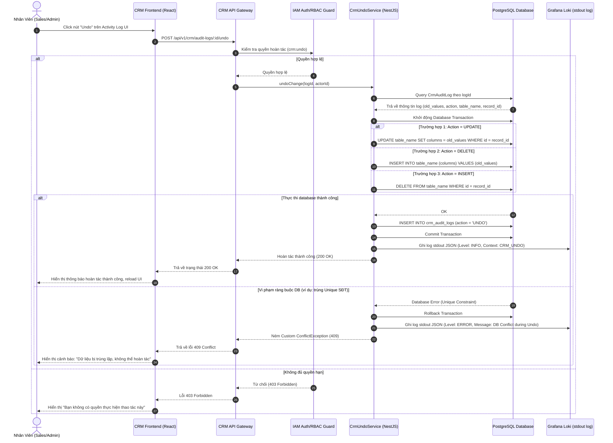

# Thiết Kế Kiến Trúc Module CRM (Design)

## 1. Thiết Kế Database (Lược Đồ Quan Hệ)
Module CRM bao gồm các bảng chính sau, sử dụng khóa chính dạng UUID và thiết kế chuẩn Microservices-ready.

### 1.1. Bảng `crm_customers` (Hồ Sơ Khách Hàng)
| Tên Trường | Kiểu Dữ Liệu | Thuộc Tính | Mô Tả |
| --- | --- | --- | --- |
| `id` | UUID | PRIMARY KEY | Định danh khách hàng duy nhất |
| `full_name` | VARCHAR(255) | | Họ tên khách hàng |
| `phone_number` | VARCHAR(50) | | Số điện thoại |
| `email` | VARCHAR(255) | | Địa chỉ email |
| `stage_id` | UUID | FOREIGN KEY | Trạng thái hiện tại trong Pipeline |
| `location` | VARCHAR(100) | | Tỉnh/Thành phố lắp đặt |
| `assignee_id` | UUID | | Sales phụ trách (Soft link tới IAM) |
| `lead_score` | INTEGER | Default 0 | Điểm tiềm năng tính toán động |
| `lead_temperature`| VARCHAR(20) | Default 'COLD' | Phân nhóm tiềm năng (`COLD`, `WARM`, `HOT`) |
| `custom_fields` | JSONB | Default '{}' | Các thông số nhu cầu Solar động |
| `roi_estimation` | JSONB | Default '{}' | Ước tính sản lượng, công suất, hoàn vốn |
| `facebook_psid` | VARCHAR(255) | | Liên kết với định danh Messenger |
| `zalo_user_id` | VARCHAR(255) | | Liên kết với định danh Zalo |

### 1.2. Bảng `crm_field_definitions` (Định nghĩa trường động)
| Tên Trường | Kiểu Dữ Liệu | Thuộc Tính | Mô Tả |
| --- | --- | --- | --- |
| `id` | UUID | PRIMARY KEY | Định danh trường |
| `field_key` | VARCHAR(50) | UNIQUE, NOT NULL | Khóa kỹ thuật (ví dụ: `roof_area`) |
| `label` | VARCHAR(100) | NOT NULL | Nhãn hiển thị |
| `data_type` | VARCHAR(30) | NOT NULL | Kiểu dữ liệu (`TEXT`, `NUMBER`, `SELECT`...) |
| `is_required` | BOOLEAN | Default FALSE | Bắt buộc nhập hay không |

### 1.3. Bảng `crm_stages` (Cấu hình trạng thái Pipeline)
| Tên Trường | Kiểu Dữ Liệu | Thuộc Tính | Mô Tả |
| --- | --- | --- | --- |
| `id` | UUID | PRIMARY KEY | Định danh trạng thái |
| `name` | VARCHAR(100) | NOT NULL | Tên hiển thị (VD: "Khảo sát") |
| `color_code` | VARCHAR(30) | | Mã màu giao diện |
| `sort_order` | INTEGER | NOT NULL | Thứ tự trên Kanban Board |
| `win_probability`| INTEGER | NOT NULL | Tỷ lệ thành công (%) |
| `required_fields`| JSONB | | Mảng các field bắt buộc nhập để vào stage này |
| `is_system` | BOOLEAN | Default FALSE | Trạng thái do AI hay do con người |

### 1.4. Bảng `crm_scoring_rules` (Luật tính điểm)
| Tên Trường | Kiểu Dữ Liệu | Thuộc Tính | Mô Tả |
| --- | --- | --- | --- |
| `id` | UUID | PRIMARY KEY | Định danh quy tắc |
| `criteria_key` | VARCHAR(50) | NOT NULL | Thuộc tính so sánh (`monthly_bill`...) |
| `operator` | VARCHAR(30) | NOT NULL | Toán tử (`GREATER_THAN`, `NOT_EMPTY`...) |
| `comparison_value`| VARCHAR(255) | | Giá trị so sánh đối chiếu |
| `score_weight` | INTEGER | NOT NULL | Số điểm cộng/trừ |
| `is_active` | BOOLEAN | Default TRUE | Kích hoạt |

### 1.5. Bảng `crm_customer_notes` (Ghi chú khách hàng)
| Tên Trường | Kiểu Dữ Liệu | Thuộc Tính | Mô Tả |
| --- | --- | --- | --- |
| `id` | UUID | PRIMARY KEY, Default gen_random_uuid() | Định danh ghi chú |
| `customer_id` | UUID | NOT NULL (Soft link `crm_customers.id`) | Liên kết khách hàng |
| `created_by` | UUID | NOT NULL (Soft link `iam_users.id`) | Người tạo ghi chú |
| `content` | TEXT | NOT NULL | Nội dung ghi chú (Markdown) |
| `is_pinned` | BOOLEAN | Default FALSE | Cờ ghim lên đầu |
| `created_at` | TIMESTAMP | Default NOW() | Thời gian tạo |
| `updated_at` | TIMESTAMP | Default NOW() | Thời gian cập nhật |

### 1.6. Bảng đệm sự kiện (Transactional Outbox)
| Tên Trường | Kiểu Dữ Liệu | Thuộc Tính | Mô Tả |
| --- | --- | --- | --- |
| `id` | UUID | PRIMARY KEY | Định danh event |
| `event_type`| VARCHAR(100) | NOT NULL | VD: `lead.assigned` |
| `payload` | JSONB | NOT NULL | Chứa `eventId` và data |
| `status` | VARCHAR(20) | Default 'PENDING' | `PENDING`, `PROCESSED`, `FAILED` |

## 2. Thiết Kế API Endpoints (RESTful)

### 2.1. Customer Management
- `GET /api/v1/crm/customers`: Lấy danh sách khách hàng (Hỗ trợ phân trang, lọc theo stage, score).
- `GET /api/v1/crm/customers/:id`: Lấy chi tiết khách hàng và timeline.
- `POST /api/v1/crm/customers`: Tạo hồ sơ mới.
- `PUT /api/v1/crm/customers/:id`: Cập nhật thông tin.
- `PATCH /api/v1/crm/customers/:id/stage`: Cập nhật trạng thái Pipeline.

### 2.2. Configuration Management (Admin Only)
- `GET/POST/PUT /api/v1/crm/settings/fields`: Quản lý Custom Fields.
- `GET/POST/PUT /api/v1/crm/settings/stages`: Quản lý Pipeline Stages.
- `GET/POST/PUT /api/v1/crm/settings/scoring-rules`: Quản lý Scoring Rules.

### 2.3. Solar Logic
- `POST /api/v1/crm/customers/:id/roi-calculate`: Tính toán lại ROI dựa trên custom_fields mới.

### 2.4. Audit Log & Undo API
- `GET /api/v1/crm/audit-logs`: Lấy danh sách lịch sử thay đổi dữ liệu (Hỗ trợ phân trang, lọc theo `table_name`, `record_id`, `actor_id`).
- `POST /api/v1/crm/audit-logs/:id/undo`: Hoàn tác thay đổi dữ liệu về trạng thái trước đó dựa trên ID của log audit.

### 2.5. Customer Notes API
- `GET /api/v1/crm/customers/:id/notes`: Lấy danh sách ghi chú của khách hàng (Hỗ trợ phân trang, sắp xếp ghim `is_pinned DESC, created_at DESC`).
- `POST /api/v1/crm/customers/:id/notes`: Tạo ghi chú mới.
- `PUT /api/v1/crm/notes/:noteId`: Sửa nội dung ghi chú (Chỉ người tạo hoặc Admin).
- `DELETE /api/v1/crm/notes/:noteId`: Xóa ghi chú (Chỉ người tạo hoặc Admin).
- `PATCH /api/v1/crm/notes/:noteId/pin`: Ghim hoặc bỏ ghim ghi chú.

---

## 3. Kiến Trúc Luồng Hoàn Tác (Undo Sequence Diagram)

Dưới đây là luồng xử lý chi tiết khi người dùng nhấn nút "Undo" để hoàn tác một sự thay đổi trong CRM:



### 3.1. Thiết kế Bảng `crm_audit_logs` (Lịch Sử Thay Đổi & Hoàn Tác)
| Tên Trường | Kiểu Dữ Liệu | Thuộc Tính | Mô Tả |
| --- | --- | --- | --- |
| `id` | UUID | PRIMARY KEY | Định danh log duy nhất |
| `table_name` | VARCHAR(100) | NOT NULL | Tên bảng bị thay đổi (ví dụ: `crm_customers`) |
| `record_id` | UUID | NOT NULL | ID bản ghi bị thay đổi |
| `action` | VARCHAR(20) | NOT NULL | Hành động: `INSERT`, `UPDATE`, `DELETE`, `UNDO` |
| `old_values` | JSONB | | Snapshot dữ liệu cũ (chỉ có khi UPDATE hoặc DELETE) |
| `new_values` | JSONB | | Snapshot dữ liệu mới (chỉ có khi INSERT hoặc UPDATE) |
| `actor_id` | UUID | | Người thực hiện hành động (Soft link tới IAM) |
| `trace_id` | UUID | | Trace ID để theo dấu logs Promtail/Loki |
| `created_at` | TIMESTAMP | Default NOW() | Thời gian thực hiện |

---

## 4. Thiết Kế Khóa Phân Tán (Distributed Redis Lock)

Để giải quyết bài toán xung đột dữ liệu khi gộp trùng hồ sơ (Merge Profile) chạy song song, hệ thống áp dụng cơ chế khóa phân tán dựa trên hạ tầng Redis.

### 4.1. Thiết kế Cấu trúc Key Lock
- **Tên Key (Redis Key):** `lock:merge:${phone_number}`
- **Giá trị Key:** Một chuỗi UUID ngẫu nhiên sinh ra cho mỗi request (`request_uuid`), dùng để đảm bảo giải phóng khóa an toàn (chỉ client sở hữu khóa mới được xóa khóa).
- **Thời gian hết hạn (TTL):** Thiết lập mặc định **10,000 ms (10 giây)** để tránh tình trạng deadlock nếu tiến trình bị sập giữa chừng.

### 4.2. Cơ chế Acquiring & Releasing Lock
Hệ thống sử dụng lệnh Redis nguyên tử (Atomic Commands) thông qua thư viện `ioredis`:

1.  **Chiếm khóa (Acquire Lock):**
    ```
    SET lock:merge:${phone_number} ${request_uuid} NX PX 10000
    ```
    - `NX`: Chỉ thiết lập key nếu chưa tồn tại.
    - `PX 10000`: Thiết lập TTL là 10,000 mili-giây.

2.  **Giải phóng khóa (Release Lock) bằng Script Lua:**
    Đảm bảo tính nguyên tử và chỉ xóa khóa nếu giá trị khớp với UUID của request ban đầu.
    ```lua
    if redis.call("get", KEYS[1]) == ARGV[1] then
        return redis.call("del", KEYS[1])
    else
        return 0
    end
    ```

3.  **Cơ chế Chờ khóa (Retry/Backoff):**
    - Nếu không chiếm được khóa ngay lập tức: Chờ **1,000 ms** (1 giây) rồi thực hiện thử lại (Retry) tối đa 3 lần.
    - Nếu sau 3 lần vẫn thất bại: Hủy bỏ tiến trình gộp, ghi log cảnh báo và trả về HTTP 409 Conflict hoặc bỏ qua (đối với webhook trùng lặp).


