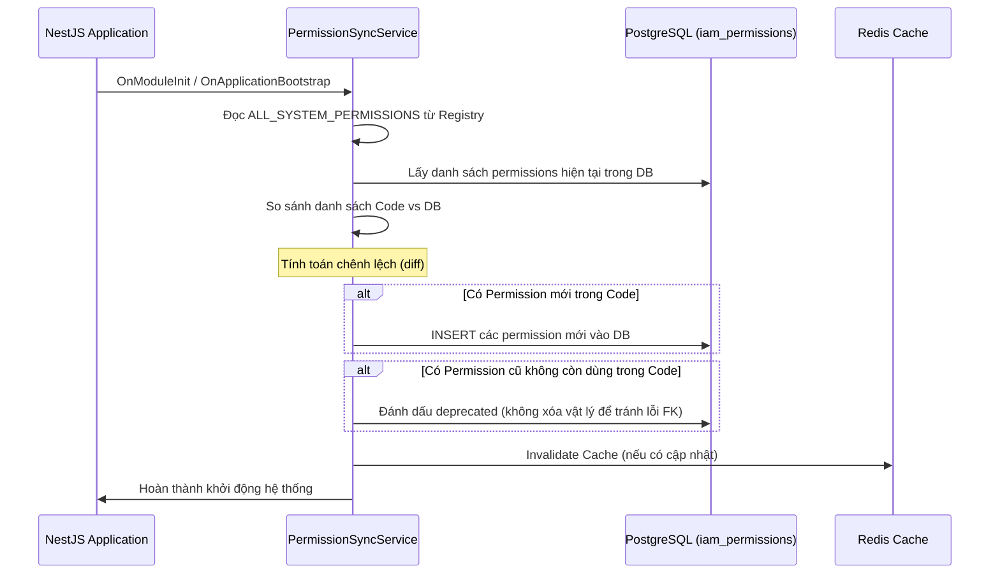

# Đặc Tả Kiến Trúc Phân Quyền & Đồng Bộ Hệ Thống (Permissions & Sync Architecture)

Tài liệu này đặc tả phương án thiết kế tối ưu cho hệ thống quản lý, đồng bộ quyền hạn (Permissions) và cơ chế phòng chống tự khóa (Anti-Lockout) áp dụng toàn hệ thống Solavie.

---

## 1. Kiến Trúc Quản Lý Permission Đa Module (Decentralized Registry)

Để đảm bảo nguyên lý **Loosely Coupled** (Liên kết lỏng lẻo) và **Single Responsibility** (Đơn nhiệm) giữa các module, hệ thống Solavie KHÔNG sử dụng một file permission tập trung ở Core. Thay vào đó, mỗi module sẽ tự quản lý quyền hạn của riêng mình.

### 1.1. Cấu trúc khai báo tại Module
Mỗi module (ví dụ: `iam`, `booking`, `crm`) sẽ tự khai báo file permission riêng:

```typescript
// src/modules/iam/constants/iam.permissions.ts
export const IamPermissions = {
  USERS_READ: 'iam.users.read',
  USERS_CREATE: 'iam.users.create',
  USERS_UPDATE: 'iam.users.update',
  ROLES_ASSIGN: 'iam.roles.assign',
  ROLES_REMOVE: 'iam.roles.remove',
} as const;
```

```typescript
// src/modules/booking/constants/booking.permissions.ts
export const BookingPermissions = {
  BOOKING_READ: 'booking.read',
  BOOKING_CREATE: 'booking.create',
  BOOKING_UPDATE: 'booking.update',
  BOOKING_CANCEL: 'booking.cancel',
} as const;
```

### 1.2. Cơ chế Gom Tụ & Đăng Ký (Permission Registry)
Tại tầng Core của ứng dụng, chúng ta xây dựng một `PermissionRegistry` để đăng ký các hằng số này:

```typescript
// src/core/database/permission-registry.ts
import { IamPermissions } from '../../modules/iam/constants/iam.permissions';
import { BookingPermissions } from '../../modules/booking/constants/booking.permissions';

export const ALL_SYSTEM_PERMISSIONS = {
  ...IamPermissions,
  ...BookingPermissions,
};

export type SystemPermission = typeof ALL_SYSTEM_PERMISSIONS[keyof typeof ALL_SYSTEM_PERMISSIONS];
```

---

## 2. Cơ Chế Tự Động Đồng Bộ Vào Database (Auto-Sync Engine)

Để triệt tiêu hoàn toàn việc viết script SQL insert bằng tay gây rủi ro sai sót giữa môi trường Development và Production, hệ thống áp dụng cơ chế **Auto-Sync** khi khởi chạy ứng dụng (Application Bootstrap).



### 2.1. Mã giả của Dịch vụ Đồng bộ (PermissionSyncService)
Dịch vụ này được kích hoạt ở pha `onApplicationBootstrap` của NestJS:

```typescript
@Injectable()
export class PermissionSyncService implements OnApplicationBootstrap {
  constructor(
    @InjectRepository(PermissionEntity)
    private readonly permissionRepo: Repository<PermissionEntity>,
    private readonly permissionService: PermissionService,
  ) {}

  async onApplicationBootstrap() {
    const codePermissions = Object.values(ALL_SYSTEM_PERMISSIONS);
    const dbPermissions = await this.permissionRepo.find();
    const dbActionList = dbPermissions.map(p => p.action);

    const newPermissions = codePermissions.filter(p => !dbActionList.includes(p));

    if (newPermissions.length > 0) {
      const entities = newPermissions.map(p => this.permissionRepo.create({
        action: p,
        description: `Auto-generated permission for ${p}`
      }));
      await this.permissionRepo.save(entities);
      console.log(`[PermissionSync] Inserted ${newPermissions.length} new permissions to DB.`);
      
      // Xoá toàn bộ cache Redis để nạp lại
      await this.permissionService.invalidateAllPermissionCaches();
    }
  }
}
```

---

## 3. Cơ Chế Phòng Chống Tự Khóa (Anti-Lockout & Super Admin Bypass)

Đối với rủi ro Admin tự tước quyền của chính mình (ví dụ: gỡ quyền sửa role hoặc gỡ role ADMIN khỏi chính tài khoản của mình), hệ thống áp dụng các lớp phòng vệ nghiêm ngặt:

### 3.1. Lớp 1: Cấu hình Super Admin Bypass (Hardcoded trong Guard)
Trong `PermissionsGuard`, chúng ta định nghĩa cơ chế bỏ qua kiểm tra quyền (Bypass) đối với tài khoản tối cao hoặc vai trò tối cao:

1. **Bypass qua Vai trò Cố định:** Nếu User mang vai trò `SUPER_ADMIN` (được cấu hình cứng tại hệ thống), Guard sẽ tự động trả về `true` mà không cần kiểm tra quyền chi tiết trong Database hay Redis.
2. **Bypass qua ID Cố định:** Nếu ID của User trùng khớp với ID của Super Admin đầu tiên (được định nghĩa trong biến môi trường `.env` qua `SUPER_ADMIN_ID`), Guard sẽ tự động cho qua.

*Mã nguồn đề xuất trong [permissions.guard.ts](file:///d:/workspace/project/solavie/backend/src/modules/iam/guards/permissions.guard.ts):*

```typescript
// Trong canActivate(context) của PermissionsGuard:
const request = context.switchToHttp().getRequest();
const user = request.user;

// 1. Kiểm tra ID Super Admin từ Env
const superAdminId = this.configService.get<string>('SUPER_ADMIN_ID');
if (user && superAdminId && user.id === superAdminId) {
  return true; // Bypass hoàn toàn
}

// 2. Kiểm tra Role SUPER_ADMIN
const userRoles = await this.getUserRoles(user.id); // Đọc từ cache/DB
if (userRoles.includes('SUPER_ADMIN')) {
  return true; // Bypass hoàn toàn
}
```

### 3.2. Lớp 2: Chặn tước quyền ở tầng API (Self-Lockout Prevention)
Khi Admin thực hiện cập nhật chính sách của một Role hoặc gỡ Role của một User, hệ thống kiểm tra các điều kiện nghiệp vụ:

1. **Không cho phép tự gỡ Role của chính mình:**
   Tại API `DELETE /iam/users/:userId/roles/:roleCode`, nếu `:userId` trùng với ID của Admin đang thực hiện request $\rightarrow$ Ném lỗi `400 Bad Request`.
2. **Chặn chỉnh sửa quyền của Role `SUPER_ADMIN`:**
   Tại các API cập nhật chính sách cho Role (`POST/DELETE /iam/roles/:roleCode/policies`), nếu `:roleCode` là `SUPER_ADMIN` $\rightarrow$ Chặn ngay lập tức và báo lỗi. Vai trò `SUPER_ADMIN` là bất khả xâm phạm và luôn luôn có đầy đủ mọi quyền của hệ thống.
3. **Chặn xóa các Quyền cốt lõi của Role `ADMIN`:**
   Nếu Admin sửa đổi chính sách của Role `ADMIN`, hệ thống sẽ kiểm tra xem các quyền tối quan trọng như `iam.roles.update`, `iam.permissions.read`, `iam.users.update` có bị xóa hay không. Nếu có $\rightarrow$ Báo lỗi ngăn chặn.

---

## 4. Tổng Kết Phương Án Tối Ưu Cho Toàn Hệ Thống

| Hạng mục | Giải pháp hiện thực | Lợi ích mang lại |
| --- | --- | --- |
| **Khai báo Quyền** | Phân tán tại từng Module (`*.permissions.ts`) và gom tụ tại `PermissionRegistry` ở Core. | Đảm bảo tính Modular Monolith, code độc lập dễ bảo trì. |
| **Đồng bộ Database** | `PermissionSyncService` thực hiện so khớp và `UPSERT` khi start app. | Không cần chạy script SQL bằng tay, đồng bộ tuyệt đối giữa code và DB. |
| **Phòng chống Lockout** | Kết hợp `SUPER_ADMIN` bypass trong Guard + Chặn tự tước quyền ở API validation. | Đảm bảo hệ thống không bao giờ bị khóa chết ngoài ý muốn bởi sai sót của người quản trị. |
| **Hiệu năng Check quyền** | Cache Redis `user:permissions:${userId}` với TTL 1h + Invalidation real-time khi sửa đổi. | Thời gian check quyền siêu nhanh (< 2ms), đảm bảo tính real-time của phân quyền. |
